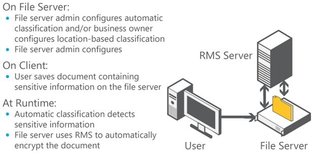

# Scenario: Classification-Based Encryption for Office Documents

>Applies To: Windows Server Technical Preview

Protection of sensitive information is mainly about mitigating risk for the organization. Various compliance regulations, such as the Health Insurance Portability and Accountability Act (HIPAA) and Payment Card Industry Data Security Standard (PCI-DSS), dictate encryption of information, and there are numerous business reasons to encrypt sensitive business information. However, encrypting information is expensive, and it might impair business productivity. Thus, organizations tend to have different approaches and priorities for encrypting their information.  
  
## Scenario description  
 Windows Server 2012  provides the ability to automatically encrypt sensitive Microsoft Office files, based on their classification. This is done through file management tasks that invoke Active Directory Rights Management Services (AD RMS) protection for sensitive documents a few seconds after the file is identified as being a sensitive file on the file server. This is facilitated by continuous file management tasks on the file server.  
  
AD RMS encryption provides another layer of protection for files. Even if a person with access to a sensitive file inadvertently sends that file through email, the file is protected by the AD RMS encryption. Users who want to access the file must first authenticate themselves to an AD RMS server to receive the decryption key. The following figure shows this process.  
  
  
  
**Figure 6** Classification-based RMS protection  
  
Support for non-Microsoft file formats is available through non-Microsoft vendors. After a file has been protected by AD RMS encryption, data management features such as search- or content-based classification are no longer available for that file.  
  
## In this scenario  
Following is the guidance that is available for this scenario:  
  
-   [Planning Considerations for Encryption of Office Documents](assetId:///14714ba6-d6a2-45e4-aae5-d3318817e52a)  
  
-   [Deploy Encryption of Office Files &#40;Demonstration Steps&#41;](Deploy-Encryption-of-Office-Files--Demonstration-Steps-.md)  
  
-   [Dynamic Access Control: Scenario Overview](Dynamic-Access-Control--Scenario-Overview.md)  
  
## Roles and features included in this scenario  
The following table lists the roles and features that are part of this scenario and describes how they support it.  
  
|Role/feature|How it supports this scenario|  
|-----------------|---------------------------------|  
|Active Directory Domain Services role (AD DS)|AD DS provides a distributed database that stores and manages information about network resources and application-specific data from directory-enabled applications. In this scenario, AD DS in  Windows Server 2012  introduces a claims-based authorization platform that enables the creation of user claims and device claims, compound identity (user plus device claims), a new central access policies model, and the use of file-classification information in authorization decisions.|  
|File and Storage Services role  File Server Resource Manager|File and Storage Services provides technologies to help you set up and manage one or more file servers that provide central locations on your network where you can store files and share them with users. If your network users need access to the same files and applications, or if centralized backup and file management are important to your organization, you should set up one or more computers as a file server by adding the File and Storage Services role and the appropriate role services to the computers. In this scenario, file server administrators can configure file management tasks that invoke AD RMS protection for sensitive documents a few seconds after the file is identified as being a sensitive file on the file server (continuous file management tasks on the file server).|  
|Active Directory Rights Management Services (AD RMS) role|AD RMS enables individuals and administrators (through Information Rights Management (IRM) policies) to specify access permissions to documents, workbooks, and presentations. This helps prevent sensitive information from being printed, forwarded, or copied by unauthorized people. After permission for a file has been restricted by using IRM, the access and usage restrictions are enforced no matter where the information is, because the permission to a file is stored in the document file itself. In this scenario, AD RMS encryption provides another layer of protection for files. Even if a person with access to a sensitive file inadvertently sends that file through email, the file is protected by the AD RMS encryption. Users who want to access the file must first authenticate themselves to an AD RMS server to receive the decryption key.|  
  

