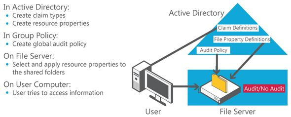

# Scenario: File Access Auditing

>Applies To: Windows Server Technical Preview

Security Auditing is one of the most powerful tools to help maintain the security of an enterprise. One of the key goals of security audits is regulatory compliance. Industry standards such as Sarbanes Oxley, Health Insurance Portability and Accountability Act (HIPAA), and Payment Card Industry (PCI) require enterprises to follow a strict set of rules related to data security and privacy. Security audits help establish the presence of such policies and prove compliance with these standards. Additionally, security audits help detect anomalous behavior, identify and mitigate gaps in security policies, and deter irresponsible behavior by creating a trail of user activity that can be used for forensic analysis.  
  
Audit policy requirements are typically driven at the following levels:  
  
-   **Information security.** File access audit trails are often used for forensic analysis and intrusion detection. Being able to get targeted events about access to high-value information lets organizations considerably improve their response time and investigation accuracy.  
  
-   **Organizational policy.** For example, organizations regulated by PCI standards could have a central policy to monitor access to all files that are marked as containing credit card information and personally identifiable information (PII).  
  
-   **Departmental policy.** For example, the finance department may require that the ability to modify certain finance documents (such as a quarterly earnings report) be restricted to the finance department, and thus the department would want to monitor all other attempts to change these documents.  
  
-   **Business policy.** For example, business owners may want to monitor all unauthorized attempts to view data that belongs to their projects.  
  
Additionally, the compliance department may want to monitor all changes to central authorization policies and policy constructs such as user, computer, and resource attributes.  
  
One of the biggest considerations of security audits is the cost of collecting, storing, and analyzing audit events. If the audit policies are too broad, the volume of audit events collected rises, and this increases costs. If the audit policies are too narrow, you risk missing important events.  
  
With  Windows Server 2012 , you can author audit policies by using claims and resource properties. This leads to richer, more targeted, and easier-to-manage audit policies. It enables scenarios that, until now, were impossible or too difficult to perform. The following are examples of audit policies that administrators can author:  
  
-   Audit everyone who does not have a high-security clearance and tries to access an HBI document. For example, Audit | Everyone | All-Access | Resource.BusinessImpact=HBI AND User.SecurityClearance!=High.  
  
-   Audit all vendors when they try to access documents that are related to projects that they are not working on. For example, Audit | Everyone | All-Access | User.EmploymentStatus=Vendor AND User.Project Not_AnyOf Resource.Project.  
  
These policies help regulate the volume of audit events and limit them to only the most relevant data or users.  
  
After administrators have created and applied the audit policies, the next consideration for them is gleaning meaningful information from the audit events that they collected. Expression-based audit events help reduce the volume of audits. However, users need a way to query these events for meaningful information and ask questions such as, “Who is accessing my HBI data?” or “Was there an unauthorized attempt to access sensitive data?”  
  
 Windows Server 2012  enhances existing data access events with user, computer, and resource claims. These events are generated on a per-server basis. To provide a full view of events across the organization, Microsoft is working with partners to provide event collection and analysis tools, such as the Audit Collection Services in System Center Operation Manager .  
  
Figure 4 shows an overview of a central audit policy.  
  
  
  
**Figure 4** Central auditing experiences  
  
Setting up and consuming security audits typically involves the following general steps:  
  
1.  Identify the correct set of data and users to monitor  
  
2.  Create and apply appropriate audit policies  
  
3.  Collect and analyze audit events  
  
4.  Manage and monitor the policies that were created  
  
## In this scenario  
The following topics provide additional guidance for this scenario:  
  
-   [Plan for File Access Auditing](Plan-for-File-Access-Auditing.md)  
  
-   [Deploy Security Auditing with Central Audit Policies &#40;Demonstration Steps&#41;](Deploy-Security-Auditing-with-Central-Audit-Policies--Demonstration-Steps-.md)  
  
## Roles and features included in this scenario  
The following table lists the roles and features that are part of this scenario and describes how they support it.  
  
|Role/feature|How it supports this scenario|  
|-----------------|---------------------------------|  
|Active Directory Doman Services role|AD DS in  Windows Server 2012  introduces a claims-based authorization platform that enables creating user claims and device claims, compound identity, (user plus device claims), new central access policies (CAP) model, and the use of file classification information in authorization decisions.|  
|File and Storage Services role|File servers in  Windows Server 2012  provide a user interface where administrators can view the effective permissions for users for a file or folder and troubleshoot access issues and grant access as required.|  
  

