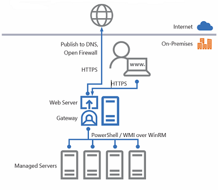

# What is Windows Admin Center?

[Content goes here]

[TODO:legacy-content-begin]

## What is Honolulu?

Honolulu is a locally deployed, browser-based, management tool set that enables on-premises administration of Windows Servers with no Azure or cloud dependency. Honolulu gives IT Admins full control over all aspects of their Server infrastructure, and is particularly useful for management on private networks that are not connected to the Internet.

Honolulu is the modern evolution of "in-box" management tools, like Server Manager and MMC. It is complementary to System Center and Operations Management Suite, and is not intended to replace these products and services.

## How does Honolulu work?

The Honolulu app runs in a web browser. The app manages Windows Server 2016, Windows Server 2012 R2, and Windows Server 2012 nodes through the Honolulu gateway that you can install on Windows Server 2016 or Windows 10. The gateway manages servers via Remote PowerShell and WMI over WinRM. The app and gateway both install from a single lightweight .msi package that you can download from this link: [https://aka.ms/HonoluluDownload](https://aka.ms/HonoluluDownload)

Publishing the web server to DNS and setting up the corporate firewall can allow you to access Honolulu from the public internet, enabling you to connect to, and manage, your servers from anywhere with Microsoft Edge or Google Chrome (other browsers' compatibility has not been tested).

## What does Honolulu do?

[TODO:legacy-content-end]
