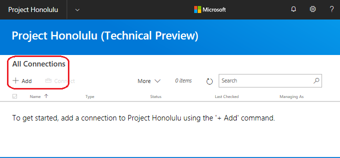

# Manage Windows Server with Project Honolulu #

>Applies To: Windows Server (Semi-Annual Channel), Windows Server 2016, Windows Server 2012 R2, Windows Server 2012, Windows 10

This article describes the management capabilities of Honolulu, and how to connect to your Windows Server nodes so you can start managing them with Honolulu.

# What Windows Server features can Honolulu manage?

Honolulu does not yet completely replace the Microsoft Management Console (MMC). Here are its current capabilities:

-   Displaying resources and resource utilization
-   Certificate Management
-   Event Viewer
-   File Explorer
-   Firewall Management
-   Configuring Local Users and Groups
-   Network Settings
-   Viewing/Ending Processes and Creating Process Dumps
-   Registry Editing
-   Managing Windows Services
-   Enabling/Disabling Roles & Features
-   Managing Hyper-V VMs & Virtual Switches
-   Managing Storage
-   Managing Windows Update

## Prerequisite: Install WMF version 5.0 or higher on Windows Server 2012 and 2012 R2 ##

Project Honolulu requires PowerShell features that are not included in Windows Server 2012 and 2012 R2. If you will manage Windows Server 2012 or 2012 R2 with Honolulu, you will need to install WMF version 5.0 or higher on those servers. 

Type `$PSVersiontable` in PowerShell to verify that WMF is installed,
and that the version is 5.0 or higher. 

If it is not installed, you can [download and install WMF 5.1](https://www.microsoft.com/en-us/download/details.aspx?id=54616).

## Connecting to managed nodes and clusters ##

After you have completed the installation of Project Honolulu, you can add servers or clusters to manage from the main overview page.

 **Add a single server or a cluster as a managed node**

 1. Click **+ Add** under **All Connections**.

    

 2. Choose to add a Server, Failover Cluster or Hyper-Converged Cluster connection:
    
    

 3. Type the name of the server or cluster to manage and click **Submit**. The server or cluster will be added to your connection list on the overview page.

    

   **-- OR --**  

**Bulk import multiple servers**

 1. On the **Add Server Connection** page, choose the **Import Servers** tab.

    

 2. Click **Browse** and select a text file that contains a comma, or new line separated, list of FQDNs for the servers you want to add.

## Authenticate with the managed node ##

Honolulu supports several mechanisms for authenticating with a managed node. Single sign-on is the default.

**Single Sign-on**

You can use your current Windows credentials to authenticate with the managed node. This is the default, and Honolulu attempts the sign-on when you add a server. If a server shows **Online** status after being added, then single sign-on was successful:

**Single sign-on when deployed as a Service on Windows Server**

If you have installed Honolulu on Windows 10, single sign-on needs no additional configuration. 

However, if you have installed Honolulu on Windows Server, you must have some form of Kerberos delegation enabled in your environment, configured with the gateway machine trusted to delegate to the target node. 

To configure [Resource-based constrained delegation](http://windowsitpro.com/security/how-windows-server-2012-eases-pain-kerberos-constrained-delegation-part-1) in your environment, use the following PowerShell code (requires a Windows Server 2012 or higher Domain Controller):

     $gateway = "HonoluluGW"
     $node = "ManagedNode"
     $gatewayObject = Get-ADComputer -Identity $gateway
     $nodeObject = Get-ADComputer -Identity $node
     Set-ADComputer -Identity $nodeObject -PrincipalsAllowedToDelegateToAccount $gatewayObject

In this example, the Honolulu gateway is installed on server **HonoluluGW**, and the target
node name is **ManagedNode**.

To remove this relationship, use the following command:

    Set-ADComputer -Identity $nodeObject -PrincipalsAllowedToDelegateToAccount $null

**-- OR --**

**Use *Manage As* to Specify credentials**

Under **All Connections**, select a server from the list and choose **Manage As** to specify the credentials that you will use to authenticate to the managed node:

If Honolulu is running in service mode on Windows Server, but you do not have Kerberos delegation configured, you must re-enter your Windows credentials:

You may apply the credentials to all connections, which will cache them for that
specific browser session. If you reload your browser, you must re-enter your
**Manage As** credentials.

**Local Administrator Password Solution (LAPS)**

If your environment uses [LAPS](https://technet.microsoft.com/en-us/mt227395.aspx), you can use LAPS credentials to authenticate with the managed node. **If you test this scenario, please** [provide feedback](http://aka.ms/HonoluluFeedback).

