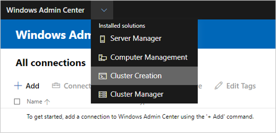
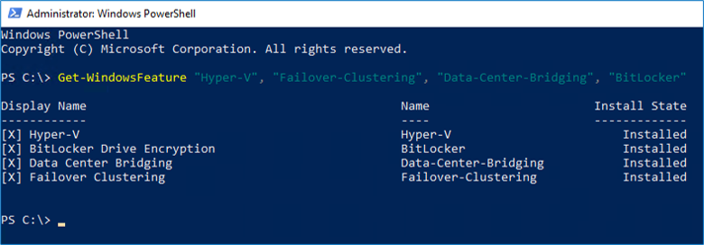
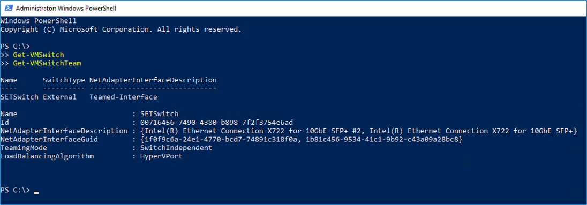
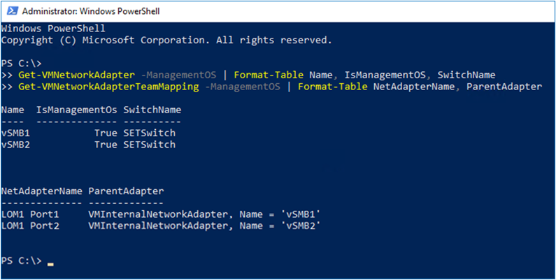
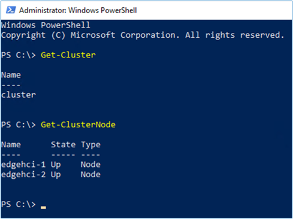

# Deploy hyperconverged infrastructure with Windows Admin Center

> Applies to: Windows Admin Center, Windows Admin Center Preview

You can use Windows Admin Center [version 1910](https://docs.microsoft.com/windows-server/manage/windows-admin-center/understand/windows-admin-center) or later to deploy hyperconverged infrastructure using two or more suitable Windows Servers. This new feature takes the form of a multi-stage workflow that guides you through installing features, configuring networking, creating the cluster, and deploying Storage Spaces Direct and/or software-defined networking (SDN) if selected.


  > [!Important]
  > This feature is under active development. It's available in Preview so you can try it early and share your feedback.

## Preview the workflow

### 1. Prerequisites

The cluster creation workflow in Windows Admin Center doesn't perform bare-metal operating system installation, so you need to install Windows Server on each server first. The supported versions are Windows Server 2016, Windows Server 2019, and Windows Server Insider Preview. You also need to join each server to the same Active Directory domain as where Windows Admin Center is running before you start the workflow.

### 2. Install Windows Admin Center
 
Follow the instructions to [download and install](https://docs.microsoft.com/windows-server/manage/windows-admin-center/understand/windows-admin-center) the latest version of Windows Admin Center.

### 3. Install the Cluster Creation extension

The cluster creation workflow is delivered and updated through the Windows Admin Center extension feed. This is so we can address your feedback and make improvements more rapidly during the Preview phase. In the future, it will be included in the main installer.

To install the extension, launch Windows Admin Center and then:

1.	In the upper right, select the Settings icon
2.	Navigate to Extensions
3.	Find the Cluster Creation extension
4.	Select Install


Once installed, select the Cluster Creation extension from the dropdown in the upper left:



## Limitations of the preview release

The cluster creation workflow is under active development – in other words, it's not finished.

Here are some limitations of the current Preview release:

1.	**Domain requirements.** The workflow currently requires that every server you add must already be joined to the same Active Directory domain as where Windows Admin Center is running. We intend to loosen these requirements in the future.
2.	**Show script.** With the current Preview release, you can't see the scripts the workflow runs using the Show Script functionality in Windows Admin Center, nor can you download a full report of everything that happened at the end. We know this is important for many users – stay tuned. In the meantime, use the cmdlets provided below to [see what's happening](#see-what's-happening).
3.	**Resume or start over.** Although you can exit partway through the workflow, the current Preview release does not handle resuming where you left off nor can it completely clean up before starting over. If you want to deploy repeatedly on the same servers for testing, use the cmdlets provided below to [undo and start over](#undo-and-start-over).
4.	**Remote direct memory access (RDMA).** The current Preview release can't enable RDMA networking, which is commonly used with hyperconverged infrastructure. For now, complete the workflow without enabling RDMA, and then use other tools to enable RDMA just as you would otherwise do.

Beyond addressing these limitations, there are countless potential features that could be added in future releases: applying Windows updates, configuring a witness for cluster quorum, importing virtual machines, and so on. To help us prioritize the features you want, please [share feedback](#feedback) as described below.

## See what's happening

Use these Windows PowerShell cmdlets to follow along and see what the workflow is doing.

To see which Windows features are installed, use the `Get-WindowsFeature` cmdlet. For example:

```PowerShell
Get-WindowsFeature "Hyper-V", "Failover-Clustering", "Data-Center-Bridging", "BitLocker"
```



  > [!Note]
  > Which features get installed depends on the type of cluster you select.

To see network adapters and their properties such as Name, IPv4 addresses, and VLAN ID:

```PowerShell
Get-NetAdapter | Where Status -Eq "Up" | Sort InterfaceAlias | Format-Table Name, InterfaceDescription, Status, LinkSpeed, VLANID, MacAddress
Get-NetAdapter | Where Status -Eq "Up" | Get-NetIPAddress -AddressFamily IPv4 -ErrorAction SilentlyContinue | Sort InterfaceAlias | Format-Table InterfaceAlias, IPAddress, PrefixLength
```


To see Hyper-V virtual switches and how physical network adapters are teamed:

```PowerShell
Get-VMSwitch
Get-VMSwitchTeam
```



To see host virtual network adapters, if any, run:

```PowerShell
Get-VMNetworkAdapter -ManagementOS | Format-Table Name, IsManagementOS, SwitchName
Get-VMNetworkAdapterTeamMapping -ManagementOS | Format-Table NetAdapterName, ParentAdapter
```



To see the current failover cluster and its member nodes, run:

```PowerShell
Get-Cluster
Get-ClusterNode
```



To see whether Storage Spaces Direct is enabled and the default storage pool that's created automatically:

```PowerShell
Get-ClusterStorageSpacesDirect
Get-StoragePool -IsPrimordial $False
```


## Undo and start over

Use these Windows PowerShell cmdlets to undo changes made by the workflow and start over.

### Remove virtual machines or other clustered resources

If you created any virtual machines or other clustered resources, such as the network controllers for software-defined networking, remove them first.

For example, to remove resources by name, use:

```PowerShell
Get-ClusterResource -Name "<NAME>" | Remove-ClusterResource
```

### Undo the Storage steps

If you enabled Storage Spaces Direct, disable it with this script:

> [!Warning]
> These cmdlets permanently delete any data in Storage Spaces Direct volumes. This can't be undone.

```PowerShell
Get-VirtualDisk | Remove-VirtualDisk
Get-StoragePool -IsPrimordial $False | Remove-StoragePool
Disable-ClusterS2D
```

### Undo the Clustering steps

If you created a cluster, remove it with this cmdlet:

```PowerShell
Remove-Cluster -CleanUpAD
```

To also remove cluster validation reports, run this cmdlet on every server that was part of the cluster:

```PowerShell
Get-ChildItem C:\Windows\cluster\Reports\ | Remove-Item
```

### Undo the Networking steps

Run these cmdlets on every server that was part of the cluster.

If you created a Hyper-V virtual switch:

```PowerShell
Get-VMSwitch | Remove-VMSwitch
```

> [!Note]
> The `Remove-VMSwitch` cmdlet automatically removes any virtual adapters and undoes switch-embedded teaming of physical adapters.

If you modified network adapter properties such as name, IPv4 address, and VLAN ID:

> [!Warning]
> These cmdlets remove network adapter names and IP addresses. Make sure you have the information you need to connect afterward, such as an adapter for management that is excluded from the script below. Also make sure that you know how the servers are connected in terms of physical properties like MAC Address, not just the adapter's name in Windows.

```PowerShell
Get-NetAdapter | Where Name -Ne "Management" | Rename-NetAdapter -NewName $(Get-Random)
Get-NetAdapter | Where Name -Ne "Management" | Get-NetIPAddress -ErrorAction SilentlyContinue | Where AddressFamily -Eq IPv4 | Remove-NetIPAddress
Get-NetAdapter | Where Name -Ne "Management" | Set-NetAdapter -VlanID 0
```

You're now ready to start the workflow.

## Feedback

This preview release is all about your feedback. Here are some ways you can reach our team:

- [Submit and vote for feature requests on UserVoice](https://windowsserver.uservoice.com/forums/295071/category/319162?query=%5Bhci%5D)
- [Join the Windows Admin Center forum on Microsoft Tech Community](https://techcommunity.microsoft.com/t5/Windows-Server-Management/bd-p/WindowsServerManagement)
- Email hci-deployment [at] microsoft.com
- Tweet to [@servermgmt](https://twitter.com/servermgmt)

## Report an issue

Use the channels listed above to report an issue with the cluster creation workflow.

If possible, include the following information to help us quickly reproduce and resolve your issue:

- Type of cluster you selected (example: *"Hyperconverged"*)
- Step where you encountered the issue (example: *"3.2 Create cluster"*)
- Version of the cluster creation extension. Go to **Settings** > **Extensions** > **Installed extensions** and see the **Version** column (example: *"1.0.30"*).
- Error messages, whether on screen or in the browser console, which you can open by pressing **F12**.
- Any other relevant information about your environment 

## See also

- [Hello, Windows Admin Center](https://docs.microsoft.com/windows-server/manage/windows-admin-center/understand/windows-admin-center)
- [Deploy Storage Spaces Direct](https://docs.microsoft.com/windows-server/storage/storage-spaces/deploy-storage-spaces-direct)
