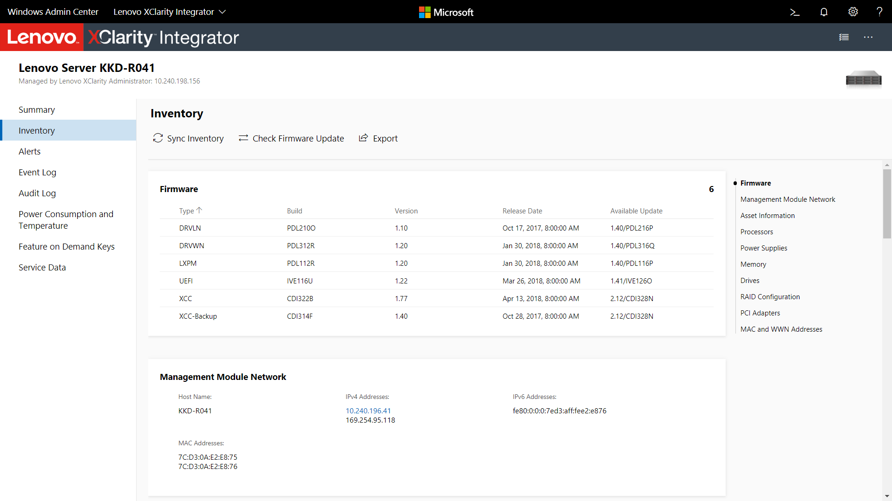
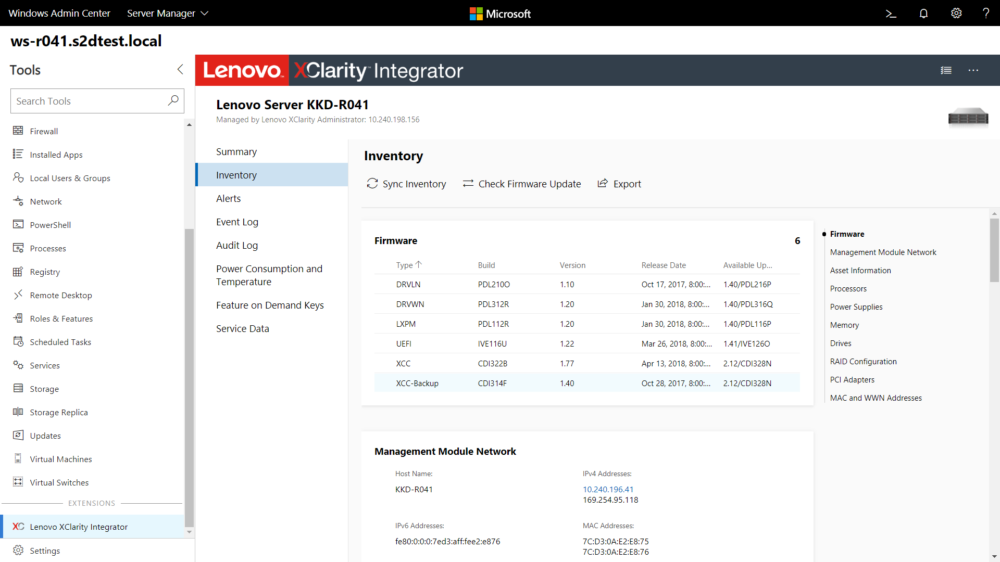
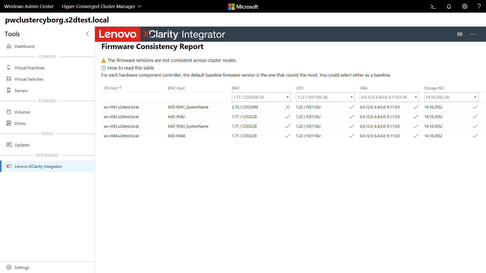
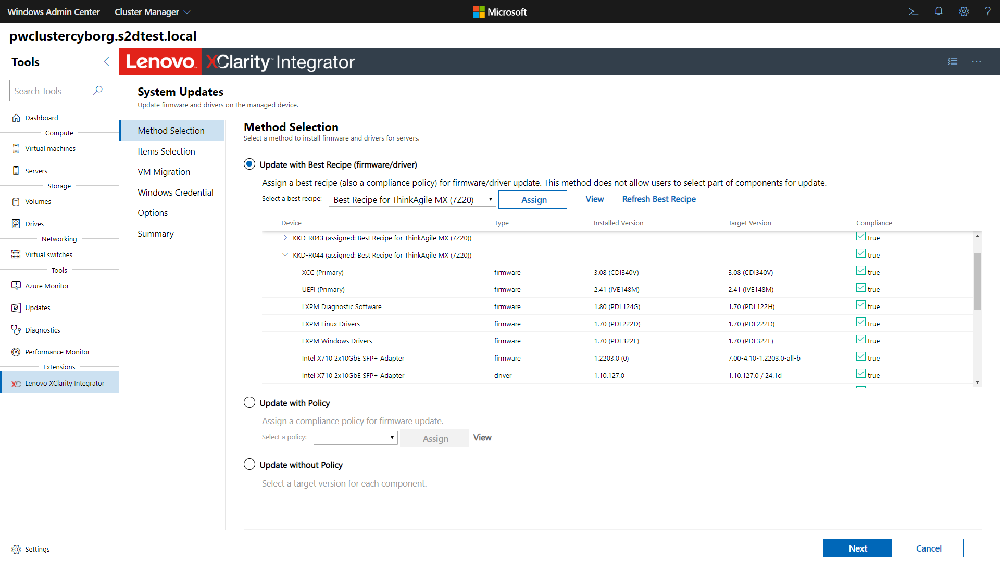
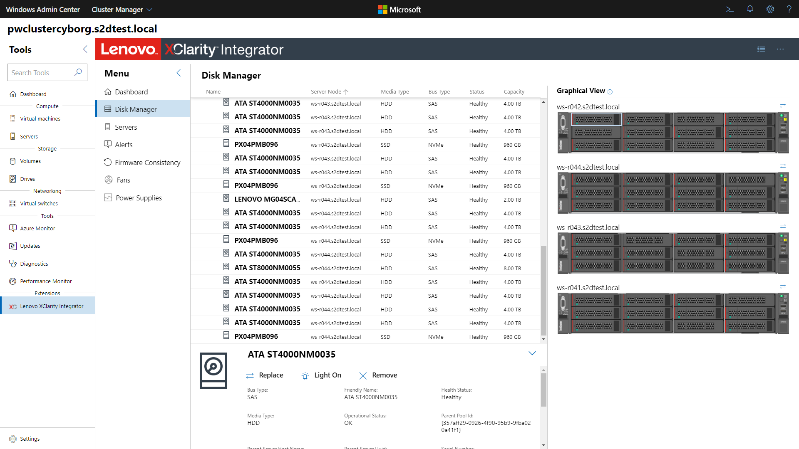

# Lenovo XClarity Integrator Extension

## Integrated hardware management everywhere!

The [Lenovo XClarity Integrator](https://www.lenovo.com/us/en/data-center/software/systems-management/XClarity-Integrator/p/WMD00000370) extension for Windows Admin Center provides administrators a seamless experience to manage Lenovo infrastructure directly from Windows Admin Center. The XClarity Integrator extension includes a standalone solution extension and also extends the existing Server Manager, Failover Cluster Manager, and Hyper-Converged Cluster Manager solutions in a single, unified UI to enable simple server management. 

The solution extension included in the XClarity Integrator extension allows connecting to a Lenovo XClarity Administrator, Lenovo rack or tower servers, or all the servers in an entire chassis at once. Once the servers are added, you can see the overall health status for all added nodes.

By selecting a server, you can view the server's hardware inventory, available firmware updates, alerts, events, logs, power consumption and temperature. You can also run operations such as Remote Control and power on/off.

The same tools are available as a tool extension when managing servers within Windows Admin Center as well, allowing you to seamlessly switch between managing your infrastructure software and hardware.

The tool extension for failover clusters and hyper-converged clusters provides a dashboard displaying overall cluster hardware health status, status alerts, firmware consistency status and report, power consumption and temperature, and fan and power supply health status.

The solution extension and tool extensions for Windows servers and clusters provide the rolling (cluster-aware) server update functions. This can prevent any workload interruption during server updates. Currently, the extensions support individual firmware updates and compliance policy firmware updates for any Lenovo servers. They also support best recipe firmware/driver updates for Lenovo ThinkAgile MX HCI cluster servers.

The tool extension for hyper-converged clusters provides the disk/storage pool management functions for Lenovo ThinkAgile MX HCI cluster servers. These functions include the server rear/front graphic view to present server and disk status. With the help of both the wizard and graphic view, operations like adding a disk to the storage pool, removing a disk from the storage pool, replacing a disk, or locating a server/disk by lighting on the server/disk location LEDs become much easier.

In version 2.1, Lenovo extensions introduced role-based access control capabilities. These capabilities are enabled if Lenovo XClarity Administrator is applied for hardware management.

Learn more about the Lenovo XClarity Integrator offerings for Windows Admin Center on the [Lenovo website](https://support.lenovo.com/us/en/solutions/ht507549).