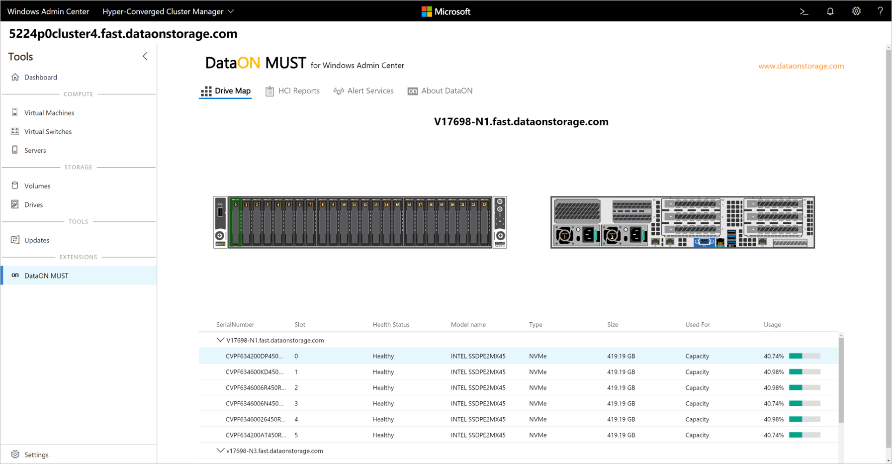
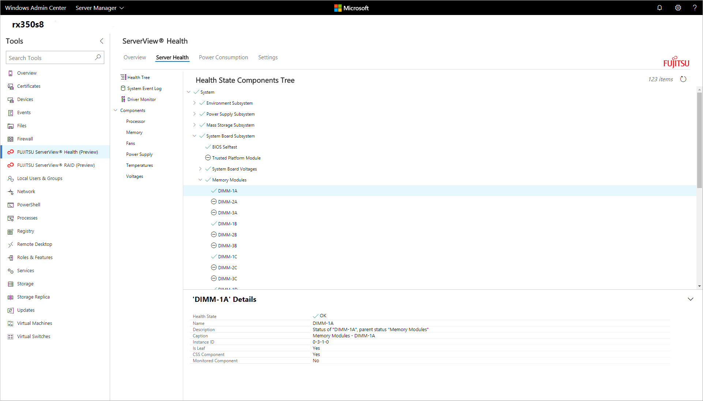
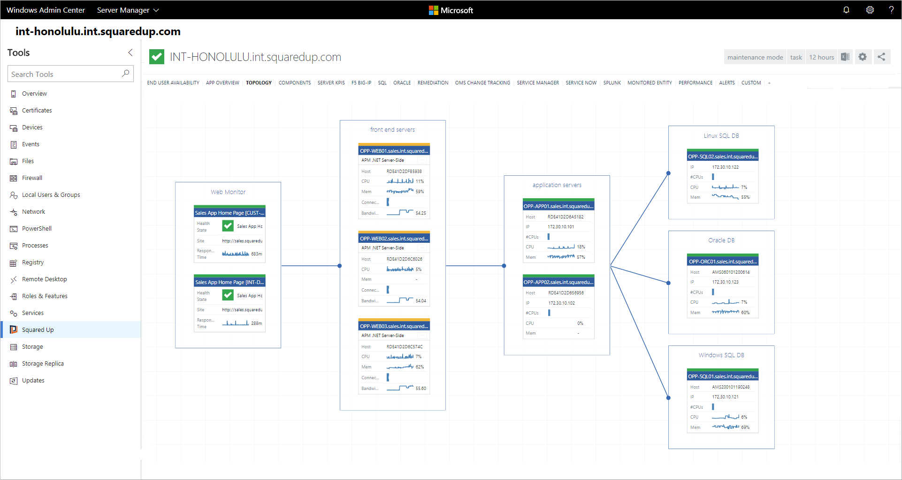

# Extensions for Windows Admin Center

>Applies To: Windows Admin Center, Windows Admin Center Preview

Windows Admin Center is built as an extensible platform to enable partners and developers to leverage existing capabilities within Windows Admin Center, seamlessly integrate with other IT administration products and solutions, and provide additional value to customers. Each solution and tool in Windows Admin Center is built as an extension using the same extensibility features available to partners and developers, so you can build powerful tools just like the ones available in Windows Admin Center today.

Windows Admin Center extensions are built using modern web technologies including HTML5, CSS, Angular, TypeScript and jQuery, and can manage target servers via PowerShell or WMI. You can also manage target servers, services or devices over different protocols such as REST by building a Windows Admin Center gateway plugin.

## Why you should consider developing an extension for Windows Admin Center

Here’s the value you can bring to your product and customers by developing extensions for Windows Admin Center:

- **Integrate with Windows Admin Center tools:** Integrate your products and services with server and cluster management tools in Windows Admin Center and deliver unified and seamless, end-to-end monitoring, management, troubleshooting experiences to your customers.
- **Leverage platform security, identity and management capabilities:** Enable Azure Active Directory (AAD) support, Multi-Factor Authentication, Role-Based Access Control (RBAC), logging, auditing for your product and services by leveraging Windows Admin Center platform capabilities to meet the complex requirements of today’s IT organizations.
- **Develop using the latest web technologies:** Quickly build stunning user experiences using modern web technologies including HTML5, CSS, Angular, TypeScript and jQuery, and rich, powerful UI controls included in the Windows Admin Center SDK.
- **Extend product outreach:** Become a part of the new Windows Admin Center ecosystem with outreach to our quickly growing customer base and leverage the Windows Server 2019 launch momentum later this year.

## Start developing with the Windows Admin Center SDK

Getting started with Windows Admin Center development is easy!  Sample code can be found for [tool](develop-tool.md), [solution](develop-solution.md), and [gateway plugin](develop-gateway-plugin.md) extension types in our SDK documentation. There you will leverage the Windows Admin Center CLI to build a new extension project, then follow the individual guides to customize your project to meet your needs.

We've made a Windows Admin Center [SDK design toolkit](https://github.com/Microsoft/windows-admin-center-sdk/blob/master/WindowsAdminCenterDesignToolkit.zip) available to help you rapidly mock up extensions in PowerPoint using Windows Admin Center styles, controls, and page templates. See what your extension can look like in Windows Admin Center before you start coding!

We also have sample code hosted on GitHub: [Developer Tools](https://aka.ms/wacsdk) is a sample solution extension containing a rich collection of controls that you can browse and use in your own extension. Developer Tools is a fully functioning extension that can be side-loaded into Windows Admin Center in Developer Mode.

See the topics below to learn more about the SDK and get started:

- [Understand how extensions work](understand-extensions.md)
- [Develop an extension](developing-extensions.md)
- [Guides](guides.md)
- [Publish your extension](publish-extensions.md)

## Partner Spotlight

See the amazing value our partners have started to bring to the Windows Admin Center ecosystem and try these extensions out today. Learn more on [how to install extensions](../configure/using-extensions.md) from Windows Admin Center.

### DataON

DataON MUST is a browser-based solution for monitoring and managing DataON hyper-converged infrastructure running Windows Server. The [DataON MUST extension](http://www.dataonstorage.com/must/windows-admin-center/) provides unique value to customers such as historical data reporting, disk mapping, system alerts and call home service, complementing the Windows Admin Center server and hyper-converged infrastructure management capabilities, through a seamless, unified experience. [Learn more about DataON's MUST extension and their development experience](case-studies/dataon.md).

### Fujitsu

Fujitsu’s ServerView Health and RAID Health extensions for Windows Admin Center provide in-depth monitoring and management of critical hardware components such as processors, memory, power and storage subsystems for Fujitsu PRIMERGY servers. By utilizing the Windows Admin Center UX design patterns and UI controls, Fujitsu has brought us a huge step towards our vision of end-to-end insight into server roles and services, to operating system, and to hardware management through the Windows Admin Center platform. [Learn more about Fujitsu's extensions and their development experience](case-studies/fujitsu.md).

### Lenovo

Lenovo's XClarity Integrator extension takes hardware management to the next level by seamlessly integrating into various experiences within Windows Admin Center. The XClarity Integrator solution provides a high-level view of all your Lenovo servers, and different tool extensions provide hardware details whether you are connected to a single server, failover cluster or a hyper-converged cluster. [Learn more about the Lenovo XClarity Integrator extension](case-studies/lenovo.md).

### Pure Storage

Pure Storage provides enterprise, all-flash data storage solutions that deliver data-centric architecture to accelerate your business for a competitive advantage. The Pure Storage extension for Windows Admin Center provides a single-pane view into Pure FlashArray products and empowers users to conduct monitoring tasks, view real-time performance metrics, and manage storage volumes and initiators through a single UI experience. [Learn more about Pure's extensions and their development experience](case-studies/purestorage.md).

### Squared Up

Squared Up provides a best-in-class monitoring experience based on System Center Operations Manager and integrating with Azure Log Analytics, Application Insights and other monitoring solutions. The [Squared Up extension](https://squaredup.com/product/honolulu/windows-admin-center-extension/?utm_source=microsoft-docs&utm_medium=public-relations&utm_campaign=honolulu) brings historical performance data and live application topologies and dependencies into the context of server and cluster management that Windows Admin Center provides, and early customers have acclaimed the value of bringing immense data from many disparate sources into a single experience. [Learn more about Squared Up's extension and their development experience](case-studies/squared-up.md).

