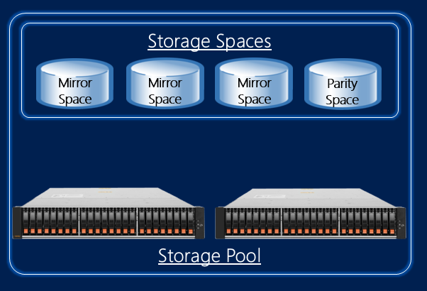
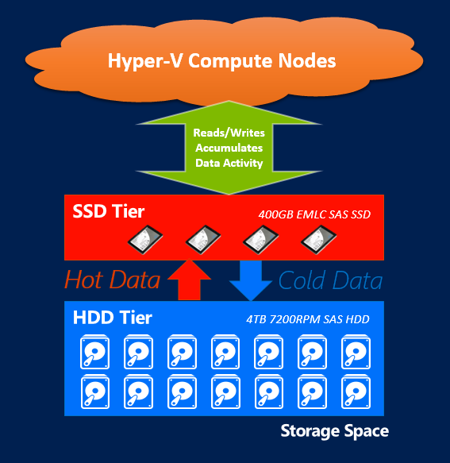
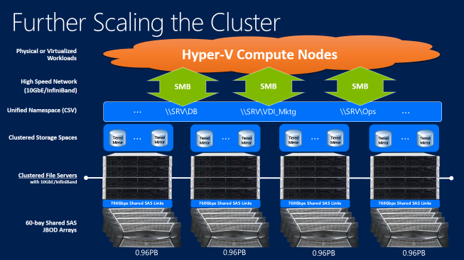

# Using Storage Spaces for Storage Subsystem Performance


Windows Server 2012 introduced a new technology, called Storage Spaces, which provides flexible configuration options and supports a range of hardware choices, while providing the user with similar sophisticated storage features that were previously available only with more traditional storage solutions.

With Storage Spaces, there are two basic primitives which are used to manage the deployment:

-   **Storage Pool** Aggregates and isolates any set of physical disks into a single point of management. A Storage Pool can contain up to 240 disks across number of enclosures, as long as the storage node has persistent communication with all the disks in the pool.

-   **Storage Space** Carved out from the Storage Pool given a number of options, including most basically the desired resiliency setting and the desired capacity. The Storage Spaces driver determines the optimal physical data layout on the physical disks given these options to optimize for performance and resiliency (if resiliency was desired). Storage space is the unit of data access for the workload, and it is presented to Windows as a normal disk which can be initialized and formatted with a file system, such as NTFS or ReFS.

The following is a high-level diagram on Storage Spaces:



**In this topic:**

-   [Storage Spaces resiliency options](#resiliency)

-   [Storage Spaces write-back cache (WBC)](#wbc)

-   [Storage Spaces automated data tiering (tiered storage)](#bkmk-tieredstorage)

-   [Storage Spaces enclosure awareness](#enclosure)

-   [Storage Spaces clustering and continuous availability](#avail)

-   [Storage Spaces advanced configuration options](#advanced)

## <a href="" id="resiliency"></a>Storage Spaces resiliency options


Storage Spaces provides a number of resiliency options and mechanisms to protect against physical disk loss

<table>
<colgroup>
<col width="50%" />
<col width="50%" />
</colgroup>
<thead>
<tr class="header">
<th>Resiliency option</th>
<th>Description</th>
</tr>
</thead>
<tbody>
<tr class="odd">
<td><p>Simple (no resiliency)</p></td>
<td><p>Data layout with this resiliency option is similar to striping as described in a prior section.</p></td>
</tr>
<tr class="even">
<td><p>Mirror (resilient to one or two disk failures)</p></td>
<td><p>Data layout with this resiliency option is similar to striped mirroring as described in a prior section.</p>
<p>Storage Spaces further has dirty region tracking for mirrored spaces to ensure that upon power failure, any in-flight updates to metadata are logged to ensure that the storage space can redo/undo operations to bring the storage space back into a resilient and consistent manner when power is restored and the system comes back up. This mechanism does not require battery backup.</p></td>
</tr>
<tr class="odd">
<td><p>Parity (resilient to one or two disk failures)</p></td>
<td><p>Data layout with single disk parity resiliency option is similar to parity as described in a prior section.</p>
<p>With dual disk parity, conceptually the data layout is similar as described in a prior section, however the layout algorithm is different and is more optimal for single disk rebuild times than with many existing dual parity implementations.</p>
<div class="alert">
<strong>Note</strong>  
<p>The dual parity resiliency option is new with Windows Server 2012 R2 and Windows 8.1</p>
</div>
<div>
 
</div>
<p>With either single or dual parity resiliency option, Storage Spaces maintains an on-disk journal which stages operations to the storage space which protects against power failures without the need for a battery. Larger sized journals, up to 16GB, can be configured in the presence of sufficient SSDs, and can be used to stage all writes which will improve performance of the virtual disk. Single-parity requires 2 SSDs, and dual-parity requires 3 SSDs.</p></td>
</tr>
</tbody>
</table>

 

## <a href="" id="wbc"></a>Storage Spaces write-back cache (WBC)


Many enterprise workloads have bursts of random write I/O which can result in periodically high latencies to the underlying storage. For simple and mirrored spaces, a per-space persistent cache can be configured which uses available SSD capacity in the pool to stage these small write bursts, which are then destaged to the HDDs in a more optimal sequential manner.

By default, the system will configure a simple or mirrored storage space with 1GB of WBC (if there are sufficient SSDs and capacity in the storage pool). By using Windows PowerShell, you can choose an alternate WBC size at create time through the following option. It is recommended to keep the size of the WBC under 10GB in clustered deployments, and under 16GB in non-clustered deployments.

``` syntax
New-VirtualDisk <other settings> -WriteCacheSize 4GB
```

This capability is new with Windows Server 2012 R2 and Windows 8.1, and the size of the WBC cannot be changed after the Storage Space is created.

## <a href="" id="bkmk-tieredstorage"></a>Storage Spaces automated data tiering (tiered storage)


Many enterprise workloads comprise of a large data set, where a majority of the data is not in active use, and only minority of the data is in active use (the working set). The working set changes over time. Given these characteristics, it is then natural to match the types of drives available in the market to the workload:

-   Near-line drives with 7200 RPM rotational rate provide high capacity at low cost are natural to match with the majority cold data. Using these drives bring the $/TB of the deployment down.

-   Solid state drives with flash memory provide high performance, and are natural to match a small number of these drives at higher cost to the minority working set. Using these types of drives increase the IOPS/$ of the deployment.



Having a mix of these types of drives will provide both capacity and performance for workloads, at far lower costs than can be achieved separately.

With Windows Server 2012 R2, Storage Spaces includes the capabilities to automatically place data onto the appropriate tier of storage according to its measured data activity, where frequently accessed data is placed on the SSD device tier, and less frequently accessed data is placed on the HDD device tier. The data activity is transparently measured by the file system (supported on NTFS or ReFS), and the data movement and tier processing is a configurable scheduled task which by default occurs at 1AM daily.

You can override the automatic placement based on heat, and assign whole files to be placed on the SSD or the HDD tier. Example workload scenarios for this would be a pooled virtual machine, where the parent VHD is placed on the SSD tier which improves boot times. This override is done by using Windows PowerShell:

``` syntax
Set-FileStorageTier –DesiredStorageTierFriendlyName Mirror_VD1_SSD_Tier –FilePath C:\ClusterStorage\Volume1\VHD\parent.vhdx
```

While processing of this request occurs automatically during the daily configurable 1AM scheduled task, users can immediately start processing of the tiered volume with the following Windows Powershell command:

``` syntax
Optimize-Volume –DriveLetter D -TierOptimize
```

Users can also determine the efficiency of tiering by looking at the Tiering Analysis report that is outputted when the command completes.

The task is configurable by using Task Scheduler:

``` syntax
Task scheduler -> \Microsoft\Windows\Storage Tiers Management\Storage Tiers Optimization task
```

When purchasing storage for a tiered deployment, we recommend the following number of SSDs in a completely full disk enclosure of different bay capacities in order to achieve optimal performance for a diverse set of workloads:

Minimum number of SSDs Recommended for Different Resiliency Settings

| Disk enclosure slot count | Simple space | 2-way mirror space | 3-way mirror space |
| - | - | - | - |
| 12 bay | 2 | 4 | 6|
| 24 bay | 2| 4 | 6 |
| 60 bay | 4 | 8 | 12|
| 70 bay | 4 | 8 | 12|

For more information on using Windows PowerShell cmdlets to manage Storage Tiering, see [Step-by-step for Storage Spaces Tiering in Windows Server 2012 R2](http://blogs.technet.com/b/josebda/archive/2013/08/24/step-by-step-for-storage-spaces-tiering-in-windows-server-2012-r2.aspx).

Storage Tiering is not supported with parity spaces or thinly provisioned volumes. Storage Tiering is only available with Windows Server 2012 R2, and is not available for Windows 8.1

## <a href="" id="enclosure"></a>Storage Spaces enclosure awareness


When creating a resilient virtual disk (mirrored or parity), Storage Spaces can further place separate data copies on separate enclosures to ensure resiliency to an entire enclosure failing. This capability is called Enclosure Awareness, and is available to Storage Spaces certified enclosures. For a list of Storage Space certified enclosures, see the [Windows Server Catalog](http://www.windowsservercatalog.com).

## <a href="" id="avail"></a>Storage Spaces clustering and continuous availability


By using Failover Clustering and Windows File and Storage Services, Storage Spaces provides continuously available storage deployments for clusters of virtualized workload.


As workload needs increase, you can expand the storage deployment by adding more storage nodes, or by adding more JBODs and then adding the physical disks to the large pool. The cluster shared volume namespace unifies data accesses across separate storage units in the cluster, where separate storage pools would have access to other pool’s data through the high-speed cluster network.



## <a href="" id="advanced"></a>Storage Spaces advanced configuration options


Storage Spaces provides multiple configuration options when creating a storage space which can be tuned according to your workload needs. For most workloads, it is recommended that users utilize the intelligent defaults. For more advanced guidance, see [Storage Spaces - Designing for Performance](http://social.technet.microsoft.com/wiki/contents/articles/15200.storage-spaces-designing-for-performance.aspx).
