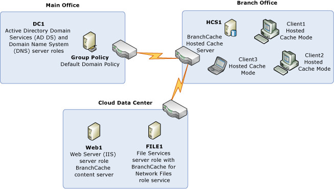

# BranchCache Hosted Cache Mode Deployment Overview

>Applies To: Windows Server (Semi-Annual Channel), Windows Server 2016, Windows Server 2012 R2, Windows Server 2012

You can use this guide to deploy a BranchCache hosted cache server in a branch office where computers are joined to a domain. You can use this topic to gain an overview of the BranchCache Hosted Cache Mode deployment process.

This overview includes the BranchCache infrastructure that you need, as well as a simple step-by-step overview of deployment.

## Hosted Cache Server deployment infrastructure

In this deployment, the hosted cache server is deployed by using service connection points in Active Directory Domain Services \(AD DS\), and you have the option with BranchCache in Windows Server 2016, Windows Server 2012 R2, and Windows Server 2012, to prehash the shared content on Web and file based content servers, then preload the content on hosted cache servers.

The following illustration shows the infrastructure that is required to deploy a BranchCache hosted cache server.

> [!IMPORTANT]
> Although this deployment depicts content servers in a cloud data center, you can use this guide to deploy a BranchCache hosted cache server regardless of where you deploy your content servers – in your main office or in a cloud location.

### HCS1 in the branch office

You must configure this computer as a hosted cache server. If you choose to prehash content server data so that you can preload the content on your hosted cache servers, you can import data packages that contain the content from your Web and file servers.

### WEB1 in the cloud data center

WEB1 is a BranchCache\-enabled content server. If you choose to prehash content server data so that you can preload the content on your hosted cache servers, you can prehash the shared content on WEB1, then create a data package that you copy to HCS1.

### FILE1 in the cloud data center

FILE1 is a BranchCache\-enabled content server. If you choose to prehash content server data so that you can preload the content on your hosted cache servers, you can prehash the shared content on FILE1, then create a data package that you copy to HCS1.
  
### DC1 in the main office

DC1 is a domain controller, and you must configure the Default Domain Policy, or another policy that is more appropriate for your deployment,  with BranchCache Group Policy settings to enable Automatic Hosted Cache Discovery by Service Connection Point.

When client computers in the branch have Group Policy refreshed and this policy setting is applied, they automatically locate and begin to use the hosted cache server in the branch office.

### Client computers in the branch office

You must refresh Group Policy on client computers to apply new BranchCache Group Policy settings and to allow clients to locate and use the hosted cache server.

## Hosted Cache Server deployment process overview

>[!NOTE]
>The details of how to perform these steps are provided in the section [BranchCache Hosted Cache Mode Deployment](4-Bc-Hcm-Deployment.md).

The process of deploying a BranchCache Hosted Cache Server occurs in these stages:

>[!NOTE]
>Some of the steps below are optional, such as those steps that demonstrate how to prehash and preload content on hosted cache servers. When you deploy BranchCache in hosted cache mode, you are not required to prehash content on your Web and file content servers, to create a data package, and to import the data package in order to preload your hosted cache servers with content. The steps are noted as optional in this section and in the section [BranchCache Hosted Cache Mode Deployment](4-Bc-Hcm-Deployment.md) so that you can skip them if you prefer.

1. On HCS1, use Windows PowerShell commands to configure the computer as a hosted cache server and to register a Service Connection Point in Active Directory.

2. \(Optional\) On HCS1, if the BranchCache default values do not match your deployment goals for the server and the hosted cache, configure the amount of disk space that you want to allocate for the hosted cache. Also configure the disk location that you prefer for the hosted cache.

3. \(Optional\) Prehash content on content servers, create data packages, and preload content on the hosted cache server.

    > [!NOTE]
    > Prehashing and preloading content on your hosted cache server is optional, however if you choose to prehash and preload, you must perform all of the steps below that are applicable to your deployment. \(For example, if you do not have Web servers, you do not need to perform any of the steps related to prehashing and preloading Web server content.\)

    1. On WEB1, prehash Web server content and create a data package.

    2. On FILE1, prehash file server content and create a data package.

    3. From WEB1 and FILE1, copy the data packages to the hosted cache server HCS1.

    4. On HCS1, import the data packages to preload the data cache.

4. On DC1, configure domain joined branch office client computers for hosted cache mode by configuring Group Policy with BranchCache policy settings.

5. On client computers, refresh Group Policy.

To continue with this guide, see [BranchCache Hosted Cache Mode Deployment Planning](3-Bc-Hcm-Plan.md).