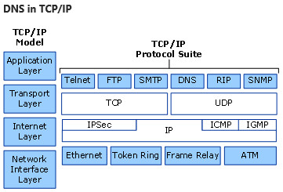

# Domain Name System (DNS)
Domain Name System \(DNS\) is one of the industry\-standard suite of protocols that comprise TCP\/IP, and together the DNS Client and DNS Server provide computer name\-to\-IP address mapping name resolution services to computers and users.  
  
> [!NOTE]  
> In addition to this topic, the following DNS content is available.  
>   
> -   [What's New in DNS Client in Windows Server Technical Preview](What-s-New-in-DNS-Client.md)  
> -   [What's New in DNS Server](What-s-New-in-DNS-Server-in-Windows-Server-Technical-Preview.md)  
> -   [DNS Policy Scenario Guide](deploy/DNS-Policy-Scenario-Guide.md)  
> -   Video: [Windows Server 2016: DNS management in IPAM](https://channel9.msdn.com/Blogs/windowsserver/Windows-Server-2016-DNS-management-in-IPAM)  
  
In Windows Server® 2016 Technical Preview, DNS is a server role that you can install by using Server Manager or Windows PowerShell commands. If you are installing a new Active Directory forest and domain, DNS is automatically installed with Active Directory as the Global Catalogue server for the forest and domain.  
  
Active Directory Domain Services \(AD DS\) uses DNS as its domain controller location mechanism. When any of the principal Active Directory operations is performed, such as authentication, updating, or searching, computers use DNS to locate Active Directory domain controllers. In addition, domain controllers use DNS to locate each other.  
  
The DNS Client service is included in all client and server versions of the Windows operating system, and is running by default upon operating system installation. When you configure a TCP\/IP network connection with the IP address of a DNS server, the DNS Client queries the DNS server to discover domain controllers, and to resolve computer names to IP addresses. For example, when a network user with an Active Directory user account logs in to an Active Directory domain, the DNS Client service queries the DNS server to locate a domain controller for the Active Directory domain. When the DNS server responds to the query and provides the domain controller's IP address to the client, the client contacts the domain controller and the authentication process can begin.  
  
The Windows Server 2016 Technical Preview DNS Server and DNS Client services use the DNS protocol that is included in the TCP\/IP protocol suite. DNS is part of the application layer of the TCP\/IP reference model, as shown in the following illustration.  
  
  
  

