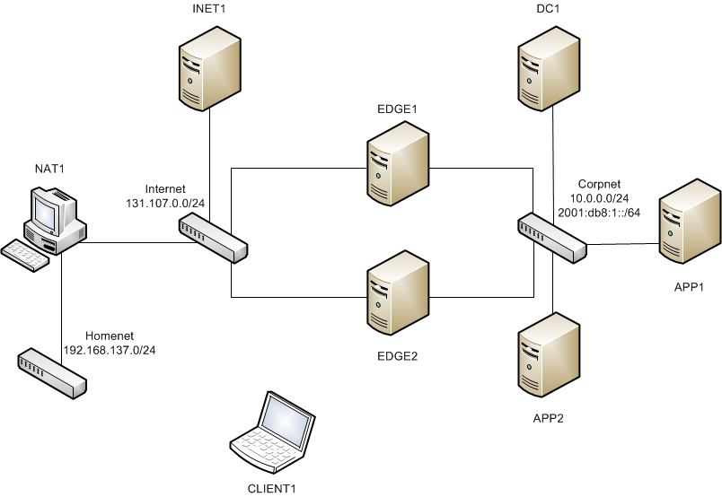

# Overview of the DirectAccess Cluster-NLB Test Lab Scenario

>Applies To: Windows Server&reg; 2016

In this test lab scenario, DirectAccess is deployed with:  
  
-   **DC1**-A server that is configured as a domain controller, Domain Name System (DNS) server, and Dynamic Host Configuration Protocol (DHCP) server.  
  
-   **EDGE1**-A server on the internal network that is configured as the first Remote Access server in a Remote Access server cluster. This server has two network adapters; one connected to the internal network, and the other connected to the external network.  
  
-   **EDGE2**-A server on the internal network that is configured as the second Remote Access server in a Remote Access server cluster. This server has two network adapters; one connected to the internal network, and the other connected to the external network.  
  
-   **APP1**-A server on the internal network that is configured as a web and file server, and as an enterprise root certification authority (CA)  
  
-   **APP2**-A computer on the internal network that is configured as an IPv4 only web and file server. This computer is used to highlight the NAT64/DNS64 capabilities.  
  
-   **INET1**-A server that is configured as an Internet DNS and DHCP server.  
  
-   **NAT1**-A client computer that is configured as a network address translator (NAT) device using Internet Connection Sharing.  
  
-   **CLIENT1**-A client computer that is configured as a DirectAccess client that will be used to test DirectAccess connectivity when moving between the internal network, the simulated Internet, and a home network.  
  
The test lab consists of three subnets that simulate the following:  
  
-   A home network named Homenet (192.168.137.0/24) connected to the Internet by a NAT.  
  
-   The external network represented by the Internet subnet (131.107.0.0/24).  
  
-   An internal network named Corpnet (10.0.0.0/24; 2001:db8:1::/64) separated from the Internet by the Remote Access server.  
  
Computers on each subnet connect using either a physical or virtual hub or switch, as shown in the following figure.  
  
  
  

