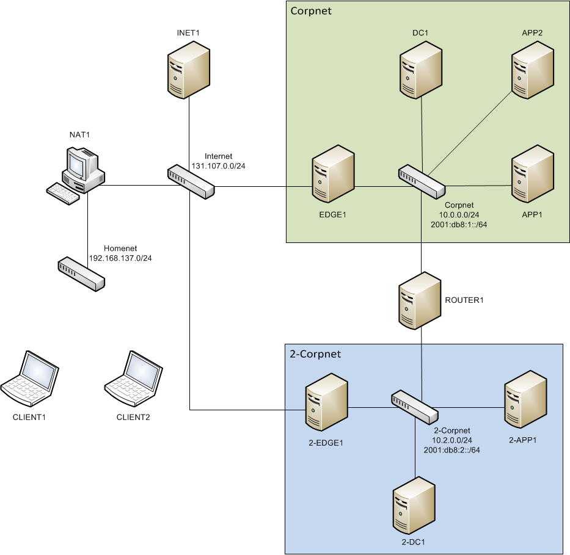

# Overview of the Test Lab Scenario

>Applies To: Windows Server Technical Preview

In this test lab scenario, DirectAccess is deployed with:  
  
-   **DC1**—A server that is configured as a domain controller, DNS server, and DHCP server for the corp.contoso.com domain.  
  
-   **2-DC1**—A server that is configured as a domain controller and DNS server for the corp2.corp.contoso.com domain.  
  
-   **EDGE1 and 2-EDGE1**—Two servers on the internal network that are configured as Remote Access servers. Each server has two network adapters; one connected to the internal network, and the other connected to the external network.  
  
-   **APP1 and 2-APP1**—Two servers on the internal network that are configured as web and file servers.  
  
-   **APP2**—A computer on the internal network that is configured as an IPv4 only web and file server. This computer is used to highlight the NAT64/DNS64 capabilities.  
  
-   **ROUTER1**—A server that is configured to provide routing between the two corporate internal networks.  
  
-   **INET1**—A server that is configured as an Internet DNS and DHCP server.  
  
-   **NAT1**—A client computer that is configured as a network address translator (NAT) device using Internet Connection Sharing.  
  
-   **CLIENT1 and CLIENT2**—Two client computers that are configured as DirectAccess clients that will be used to test DirectAccess connectivity when moving between the internal network, the simulated Internet, and a home network. **CLIENT2** is a  Windows 7&reg;  client.  
  
The test lab consists of four subnets that simulate the following:  
  
-   A home network named Homenet (192.168.137.0/24) connected to the Internet by a NAT.  
  
-   The external network represented by the Internet subnet (131.107.0.0/24).  
  
-   An internal network named Corpnet (10.0.0.0/24; 2001:db8:1::/64) separated from the Internet by the EDGE1 Remote Access server.  
  
-   An internal network named 2-Corpnet1 (10.2.0.0/24; 2001:db8:2::/64) separated from the Internet by the 2-EDGE1 Remote Access server.  
  
Computers on each subnet connect using either a physical or virtual hub or switch, as shown in the following figure.  
  
  
  

