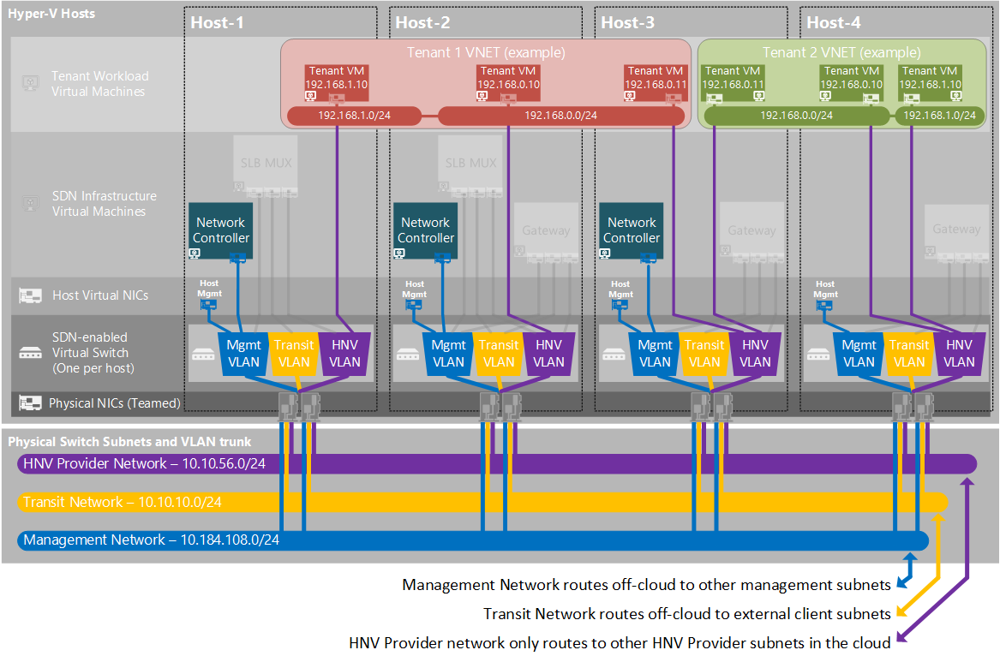
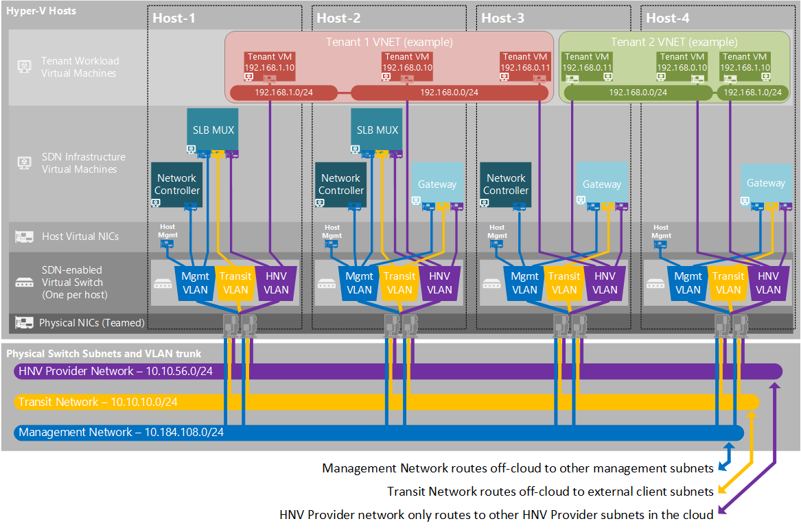

# Requirements for Deploying Network Controller

> Applies to: Windows Server 2019, Windows Server 2016

Prepare your datacenter for Network Controller deployment, which requires one or more computers or VMs and one computer or VM. Before you can deploy Network Controller, you must configure the security groups, log file locations (if needed), and dynamic DNS registration.

## Network Controller requirements

Network Controller deployment requires one or more computers or VMs that serve as the Network Controller, and one computer or VM to serve as a management client for Network Controller.

- All VMs and computers planned as Network Controller nodes must be running Windows Server 2019 or 2016 Datacenter edition.
- Any computer or virtual machine (VM) upon which you install Network Controller must be running Windows Server 2019 or 2016 Datacenter edition.
- The management client computer or VM for Network Controller must be running Windows 10.

## Configuration requirements

Before deploying Network Controller, you must configure the security groups, log file locations (if needed), and dynamic DNS registration.

### Step 1. Configure your security groups

The first thing you want to do is create two security groups for Kerberos authentication.

You create groups for users who have permission to:

1. Configure Network Controller
You can name this group Network Controller Admins, for example.
2. Configure and manage the network by using Network Controller
You can name this group Network Controller Users, for example. Use Representational State Transfer (REST) to configure and manage Network Controller.

> [!NOTE]
> All of the users you add must be members of the Domain Users group in Active Directory Users and Computers.

### Step 2. Configure log file locations if needed

The next thing you want to do is configure the file locations to store Network Controller debug logs either on the Network Controller computer or VM or on a remote file share.

> [!NOTE]
> If you store the logs in a remote file share, ensure that the share is accessible from the Network Controller.

### Step 3. Configure dynamic DNS registration for Network Controller

Finally, the next thing you want to do is deploy Network Controller cluster nodes on the same subnet or different subnets.

| If... | Then... |
|--|--|
| On the same subnet, | You must provide the Network Controller REST IP address. |
| On different subnets, | You must provide the Network Controller REST DNS name, which you create during the deployment process. You must also do the following:<ul><li>Configure DNS dynamic updates for the Network Controller DNS name on the DNS server.</li><li>Restrict the DNS dynamic updates to Network Controller nodes only.</li></ul> |

> [!NOTE]
> Membership in **Domain Admins**, or equivalent, is the minimum required to perform these procedures.

1. Allow DNS dynamic updates for a zone.

   a. Open DNS Manager, and in the console tree, right-click the applicable zone, and then click **Properties**.

   b. On the **General** tab, verify that the zone type is either **Primary** or **Active Directory-integrated**.

   c. In **Dynamic updates**, verify that **Secure only** is selected, and then click **OK**.

2. Configure DNS zone security permissions for Network Controller nodes

   a.  Click the **Security** tab, and then click **Advanced**.

   b. In **Advanced Security Settings**, click **Add**.

   c. Click **Select a principal**.

   d. In the **Select User, Computer, Service Account, or Group** dialog box, click **Object Types**.

   e. In **Object Types**, select **Computers**, and then click **OK**.

   f. In the **Select User, Computer, Service Account, or Group** dialog box, type the NetBIOS name of one of the Network Controller nodes in your deployment, and then click **OK**.

   g. In **Permission Entry**, verify the following values:

      - **Type** = Allow
      - **Applies to** = This object and all descendant objects

   h. In **Permissions**, select **Write all properties** and **Delete**, and then click **OK**.

3. Repeat for all computers and VMs in the Network Controller cluster.

### Step 4. Configure Service Principal Name if using Kerberos based authentication

If Network Controller is using Kerberos-based authentication for communication with management clients, you must configure a Service Principal Name (SPN) for Network Controller in Active Directory. The Network Controller automatically configures the SPN. All you need to do is to provide permissions for the Network Controller machines to register and modify the SPN. For more details, see [Configure Service Principal Names (SPN)](../security/kerberos-with-spn.md#configure-service-principal-names-spn).

## Deployment options

### Network Controller deployment

The setup is highly available with three Network Controller nodes  configured on virtual machines. Also shown is two tenants with Tenant 2's virtual network broken into two virtual subnets to simulate a web tier and a database tier.

### Network controller and software load balancer deployment

For high availability, there are two or more SLB/MUX nodes.

### Network Controller, Software Load Balancer, and RAS Gateway deployment

There are three gateway virtual machines; two are active, and one is redundant.

> [!IMPORTANT]
> If you deploy using VMM, ensure your infrastructure virtual machines (VMM Server, AD/DNS, SQL Server, etc.) are not hosted on any of the four hosts shown in the diagrams.

## Next steps

[Plan a Software Defined Network Infrastructure](./plan-a-software-defined-network-infrastructure.md).

## Related topics

- [Network Controller](../technologies/network-controller/Network-Controller.md)

- [Network Controller High Availability](../technologies/network-controller/network-controller-high-availability.md)

- [Deploy Network Controller using Windows PowerShell](../deploy/Deploy-Network-Controller-using-Windows-PowerShell.md)

- [Install the Network Controller server role using Server Manager](../technologies/network-controller/Install-the-Network-Controller-server-role-using-Server-Manager.md)