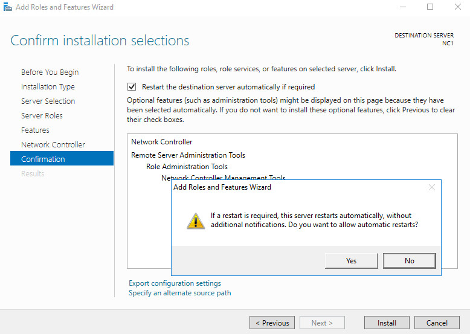
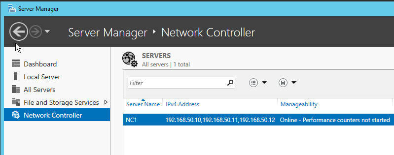

# Install the Network Controller Server Role Using Server Manager

> Applies to: Windows Server 2019, Windows Server 2016

This topic provides instructions on how to install the Network Controller server role by using Server Manager.

> [!IMPORTANT]
> Do not deploy the Network Controller server role on physical hosts. To deploy Network Controller, you must install the Network Controller server role on a Hyper-V virtual machine \(VM\) that is installed on a Hyper-V host. After you have installed Network Controller on VMs on three different Hyper\-V hosts, you must enable the Hyper\-V hosts for Software Defined Networking \(SDN\) by adding the hosts to Network Controller using the Windows PowerShell command **New-NetworkControllerServer**. By doing so, you are enabling the SDN Software Load Balancer to function. For more information, see [New-NetworkControllerServer](https://docs.microsoft.com/powershell/module/networkcontroller/new-networkcontrollerserver).

After you install Network Controller, you must use Windows PowerShell commands for additional Network Controller configuration. For more information, see [Deploy Network Controller using Windows PowerShell](../../deploy/Deploy-Network-Controller-using-Windows-PowerShell.md).

### To install Network Controller

1. In Server Manager, click **Manage**, and then click **Add Roles and Features**. The Add Roles and Features wizard opens. Click **Next**.

2. In **Select Installation Type**, keep the default setting and click **Next**.

3. In **Select Destination Server**, choose the server where you want to install Network Controller, and then click **Next**.

4. In **Select Server Roles**, in **Roles**, click **Network Controller**.

    

5. The **Add features that are required for Network Controller** dialog box opens. Click **Add Features**.

    

6. In **Select Server Roles**, click **Next**.

    

7. In **Select Features**, click **Next**.

8. In **Network Controller** click **Next**.

9. In **Confirm installation selections**, review your choices. Installation of Network Controller requires that you restart the computer after the wizard runs. Because of this, click **Restart the destination server automatically if required**. The **Add Roles and Features Wizard** dialog box opens. Click **Yes**.

    

10. In **Confirm installation selections**, click **Install**.

11. The Network Controller server role installs on the destination server, and then the server restarts.

12. After the computer restarts, log on to the computer and verify Network Controller installation by viewing Server Manager.

    

## See Also
[Network Controller](Network-Controller.md)
