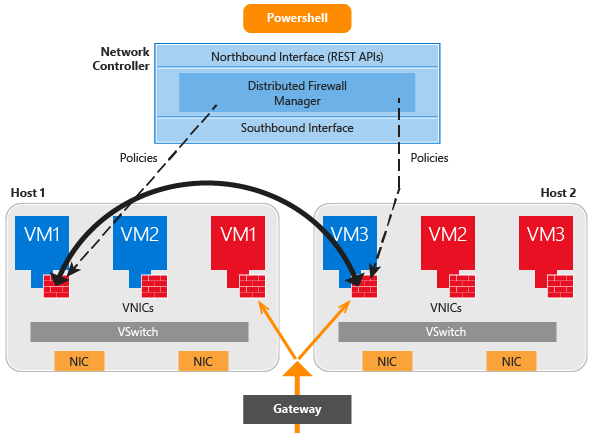

# Datacenter Firewall Overview
Datacenter Firewall is a new service included with Windows Server® 2016 Technical Preview. It is a network layer, 5-tuple (protocol, source and destination port numbers, source and destination IP addresses), stateful, multitenant firewall. When deployed and offered as a service by the service provider, tenant administrators can install and configure firewall policies to help protect their virtual networks from unwanted traffic originating from Internet and intranet networks.  
  
  
  
The service provider administrator or the tenant administrator can manage the Datacenter Firewall policies via the network controller and the northbound APIs.  
  
The Datacenter Firewall offers the following advantages for cloud service providers:  
  
-   A highly scalable, manageable, and diagnosable software-based firewall solution that can be offered to tenants  
  
-   Freedom to move tenant virtual machines to different compute hosts without breaking tenant firewall policies  
  
    -   Deployed as a vSwitch port host agent firewall  
  
    -   Tenant virtual machines get the policies assigned to their vSwitch host agent firewall  
  
    -   Firewall rules are configured in each vSwitch port, independent of the actual host running the virtual machine  
  
-   Offers protection to tenant virtual machines independent of the tenant guest operating system  
  
The Datacenter Firewall offers the following advantages for tenants:  
  
-   Ability to define firewall rules to help protect Internet facing workloads on virtual networks  
  
-   Ability to define firewall rules to help protect traffic between virtual machines on the same L2 virtual subnet as well as between virtual machines on different L2 virtual subnets  
  
-   Ability to define firewall rules to help protect and isolate network traffic between tenant on premise networks and their virtual networks at the service provider  
  

