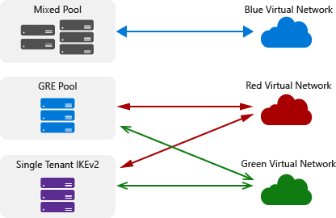
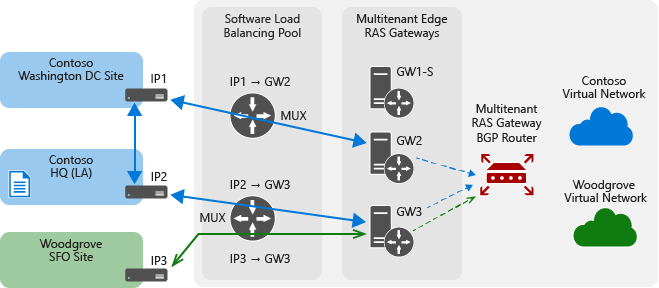
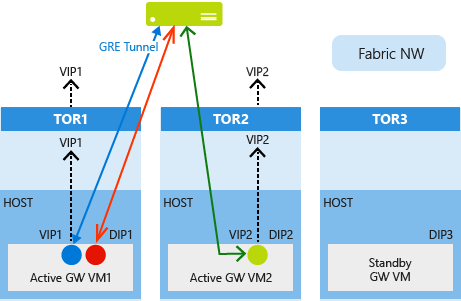

# RAS Gateway High Availability
You can use this topic to learn about high availability configurations for the RAS Multitenant Gateway for Software Defined Networking \(SDN\).  
  
This topic contains the following sections.  
  
-   [RAS Gateway Overview](#bkmk_overview)  
  
-   [Gateway Pools Overview](#bkmk_pools)  
  
-   [RAS Gateway Deployment Overview](#bkmk_deployment)  
  
-   [RAS Gateway Integration with Network Controller](#bkmk_integration)  
  
## RAS Gateway Overview  
If your organization is a Cloud Service Provider \(CSP\) or an Enterprise with multiple tenants, you can deploy RAS Gateway in multitenant mode to provide network traffic routing to and from virtual and physical networks, including the Internet.  
  
You can deploy RAS Gateway in multitenant mode as an edge gateway to route tenant customer network traffic to tenant virtual networks and resources.  
  
When you deploy multiple instances of RAS Gateway VMs that provide high availability and failover, you are deploying a gateway pool. In Windows Server® 2012 R2, all the gateway VMs formed a single pool, which made a logical separation of the gateway deployment a little difficult.  Windows Server 2012 R2  gateway  offered a 1:1 redundancy deployment for the gateway VMs, which resulted in under\-utilization of the available capacity for site\-to\-site \(S2S\) VPN connections.  
  
This issue is resolved in Windows Server® 2016 Technical Preview, which provides multiple Gateway Pools \- which can be of different types for logical separation. The new mode of M\+N redundancy allows for a more efficient failover configuration.  
  
For more overview information about RAS Gateway, see [RAS Gateway](../../../remote-access/ras-gateway/RAS-Gateway.md).  
  
## Gateway Pools Overview  
In Windows Server 2016 Technical Preview, you can deploy gateways in one or more pools.  
  
The following illustration shows different types of gateway pools that provide traffic routing between virtual networks.  
  
  
  
Each pool has the following properties.  
  
-   Each pool is M\+N redundant. This means that an  ‘M’ number of active gateway VMs are backed up by an ‘N’ number of standby gateway VMs. The value of N \(standby gateways\) is always less than or equal to M \(active gateways\).  
  
-   A pool can perform any of the individual gateway functions \- Internet Key Exchange version 2 \(IKEv2\) S2S, Layer 3 \(L3\), and Generic Routing Encapsulation \(GRE\) \- or the pool can perform all of these functions.  
  
-   You can assign a single public IP address to all pools or to a subset of pools. Doing so greatly reduces the number of public IP addresses that you must use, because it is possible to have all tenants connect to the cloud on a single IP address. The section below on High Availability and Load balancing describes how this works.  
  
-   You can easily scale a gateway pool up or down by adding or removing gateway VMs in the pool. Removal or addition of gateways does not disrupt the services that are provided by a pool. You can also add and remove entire pools of gateways.  
  
-   Connections of a single tenant can terminate on multiple pools and multiple gateways in a pool. However, if a tenant has connections terminating in an **All** type gateway pool, it cannot subscribe to other **All** type or individual type gateway pools.  
  
Gateway pools also provide the flexibility to enable additional scenarios:  
  
-   Single\-tenant pools – you can create one pool for use by one tenant.  
  
-   If you are selling cloud services through partner \(reseller\) channels, you can create separate sets of pools for every reseller.  
  
-   Multiple pools can provide the same gateway function but different capacities. For example, you can create a gateway pool that supports both high throughput and low throughput IKEv2 S2S connections.  
  
## RAS Gateway Deployment Overview  
The following illustration demonstrates a typical Cloud Service Provider \(CSP\) deployment of RAS Gateway.  
  
  
  
With this type of deployment, the gateway pools are deployed behind a Software Load Balancing \(SLB\), which enables the CSP to assign a single public IP address for the entire deployment. Multiple gateway connections of a tenant can terminate on multiple gateway pools \- and also on multiple gateways within a pool. This is illustrated through IKEv2 S2S connections in the above diagram, but the same is applicable to other gateway functions too, such as L3 and GRE gateways.  
  
In the illustration, the MT BGP device is a RAS Multitenant Gateway with BGP. Multitenant BGP is used for dynamic routing. The routing for a tenant is centralized \- a single point, called the route reflector \(RR\), handles the BGP peering for all tenant sites. The RR itself is distributed across all gateways in a pool. This results in a configuration where the connections of a tenant \(data path\) terminate on multiple gateways, but the RR for the tenant \(BGP peering point \- control path\) is on only one of the gateways.  
  
The BGP router is separated out in the diagram to depict this centralized routing concept. The gateway BGP implementation also provides transit routing, which enables the cloud to act as a transit point for routing between two tenant sites. These BGP capabilities are applicable to all gateway functions.  
  
## RAS Gateway Integration with Network Controller  
RAS Gateway is fully integrated with Network Controller in Windows Server 2016 Technical Preview. When RAS Gateway and Network Controller are deployed, Network Controller performs the following functions.  
  
-   Deployment of the gateway pools  
  
-   Configuration of tenant connections on each gateway  
  
-   Switching network traffic flows to a standby gateway in the event of a gateway failure  
  
The following sections provide detailed information about RAS Gateway and Network Controller.  
  
-   [Provisioning and Load balancing of Gateway Connections (IKEv2, L3, and GRE)](#bkmk_provisioning)  
  
-   [High Availability for IKEv2 S2S](#bkmk_ike)  
  
-   [High Availability for GRE](#bkmk_gre)  
  
-   [High Availability for L3 Forwarding Gateways](#bkmk_l3)  
  
### Provisioning and Load Balancing of Gateway Connections \(IKEv2, L3, and GRE\)  
When a tenant requests a gateway connection, the request is sent to  Network Controller. Network Controller is configured with information about all of the gateway pools, including the capacity of each pool and every gateway in every pool. Network Controller selects the correct pool and gateway for the connection. This selection is  based on the bandwidth requirement for the connection. Network Controller uses a "best fit" algorithm to pick connections efficiently in a pool. The BGP peering point for the connection is also designated at this time if this is the first connection of the tenant.  
  
After Network Controller selects a RAS Gateway for the connection, Network Controller provisions the necessary configuration for the connection on the gateway. If the connection is an IKEv2 S2S connection, Network Controller also provisions a Network Address Translation \(NAT\) rule on the SLB pool; this NAT rule on the SLB pool directs connection requests from the tenant to the designated gateway. Tenants are differentiated by the source IP, which is expected to be unique.  
  
> [!NOTE]  
> L3 and GRE connections bypass the SLB and connect directly with the designated RAS Gateway.  These connections require that the remote endpoint router \(or other third party device\) must be correctly configured to connect with the RAS Gateway.  
  
If BGP routing is enabled for the connection, then BGP peering is initiated by RAS Gateway \- and routes are exchanged between on\-premises and cloud gateways. The routes that are learned by BGP \(or that are statically configured routes if BGP is not used\) are sent to Network Controller. Network Controller then plumbs the routes down to the Hyper\-V hosts upon which the tenant VMs are installed. At this point, tenant traffic can be routed to the correct on\-premises site. Network Controller also creates associated Hyper\-V Network Virtualization policies that specify gateway locations, and plumbs them down to the Hyper\-V hosts.  
  
### High Availability for IKEv2 S2S  
A RAS Gateway in a pool consists of both connections and BGP peering of different tenants. Every pool has ‘M’ active gateways and ‘N’ standby gateways.  
  
Network Controller handles the failure of gateways in the following manner.  
  
-   Network Controller constantly pings the gateways in all pools and can detect a gateway that is failed or failing. Network Controller can detect the following types of RAS Gateway failures.  
  
    -   RAS Gateway VM failure  
  
    -   Failure of the Hyper\-V host upon which the RAS Gateway is running  
  
    -   RAS Gateway service failure  
  
    Network Controller stores the configuration of all deployed active gateways. Configuration consists of connection settings and routing settings.  
  
-   When a gateway fails, it impacts tenant connections on the gateway, as well as tenant connections that are located  on other gateways but whose RR resides on the failed gateway. The down time of the latter connections is less than the former. When Network Controller detects a failed gateway, it performs the following tasks.  
  
    -   Removes the routes of the impacted connections from the compute hosts.  
  
    -   Removes the Hyper\-V Network Virtualization policies on these hosts.  
  
    -   Selects a standby gateway, converts it into an active gateway, and configures the gateway.  
  
    -   Changes the NAT mappings on the SLB pool to point connections to the new gateway.  
  
-   Simultaneously, as the configuration comes up on the new active gateway, the IKEv2 S2S connections and BGP peering are re\-established. The connections and BGP peering can be initiated by either the cloud gateway or the on\-premises gateway. The gateways refresh their routes and send them to Network Controller. After Network Controller learns the new routes discovered by the gateways, Network Controller sends the routes and the associated Hyper\-V Network Virtualization policies to the Hyper\-V hosts where the VMs of the failure\-impacted tenants reside. This Network Controller activity is similar to the circumstance of a new connection setup, only it occurs on a larger scale.  
  
### High Availability for GRE  
The process of RAS Gateway failover response by Network Controller \- including failure detection, copying connection and routing configuration to the standby gateway, failover of BGP\/static routing of the impacted connections \(including the withdrawal and re\-plumbing of routes on compute hosts and BGP re\-peering\), and reconfiguration of Hyper\-V Network Virtualization policies on compute hosts \-  is the same for GRE gateways and connections. The re\-establishment of GRE connections happens differently, however, and the high availability solution for GRE has some additional requirements.  
  
  
  
At the time of gateway deployment, every RAS Gateway VM is assigned a Dynamic IP address \(DIP\). In addition, every gateway VM is also assigned a virtual IP address \(VIP\) for GRE high availability. VIPs are assigned only to gateways in pools that can accept GRE connections, and not to non\-GRE pools. The VIPs assigned are advertised to the top of rack \(TOR\) switches using BGP, which then further advertises the VIPs into the cloud physical network. This makes the gateways reachable from the remote routers or third party devices where the other end of the GRE connection resides. This BGP peering is different than the tenant\-level BGP peering for the exchange of tenant routes.  
  
At the time of GRE connection provisioning, Network Controller selects a gateway, configures a GRE endpoint on the selected gateway, and returns back the VIP address of the assigned gateway. This VIP is then configured as the destination GRE tunnel address on the remote router.  
  
When a gateway fails, Network Controller copies the VIP address of the failed gateway and other configuration data to the standby gateway. When the standby gateway becomes active, it advertises the VIP to its TOR switch and further into the physical network. Remote routers continue to connect GRE tunnels to the same VIP and the routing infrastructure ensures that packets are routed to the new active gateway.  
  
### High Availability for L3 Forwarding Gateways  
A Hyper\-V Network Virtualization L3 forwarding gateway is a bridge between the physical infrastructure in the datacenter and the virtualized infrastructure in the Hyper\-V Network Virtualization cloud. On a multitenant L3 forwarding gateway, each tenant uses its own VLAN tagged logical network for connectivity with the tenant’s physical network.  
  
When a new tenant creates a new L3 gateway, Network Controller Gateway Service Manager selects an available gateway VM and configures a new tenant interface with a highly available Customer Address \(CA\) space IP address \(from the tenant’s VLAN tagged logical network\). The IP address is used as the peer IP address on the remote \(physical network\) gateway, and is the Next\-Hop to reach the tenant’s Hyper\-V Network Virtualization network.  
  
Unlike IPsec or GRE network connections, the TOR switch will not learn the tenant’s VLAN tagged network dynamically. The routing for the tenant’s VLAN tagged network needs to be configured on the TOR switch and all the intermediate switches and routers between physical infrastructure and the gateway to ensure end to end connectivity.  Following is an example CSP Virtual Network configuration as depicted in the illustration below.  
  
|Network|Subnet|VLAN ID|Default Gateway|  
|-----------|----------|-----------|-------------------|  
|Contoso L3 Logical Network|10.127.134.0\/24|1001|10.127.134.1|  
|Woodgrove L3 Logical Network|10.127.134.0\/24|1002|10.127.134.1|  
  
Following are example tenant gateway configurations as depicted in the illustration below.  
  
|Tenant Name|L3 gateway IP Address|VLAN ID|Peer IP Address|  
|---------------|-------------------------|-----------|-------------------|  
|Contoso|10.127.134.50|1001|10.127.134.55|  
|Woodgrove|10.127.134.60|1002|10.127.134.65|  
  
Following is the illustration of these configurations in a CSP datacenter.  
  
  
  
The gateway failures, failure detection, and the gateway failover process in the context of an L3 forwarding gateway is similar to the processes for IKEv2 and GRE RAS Gateways. The differences are in the way the external IP addresses are handled.  
  
When the gateway VM state becomes unhealthy, Network Controller selects one of the standby gateways from the pool and re\-provisions the network connections and routing on the standby gateway. While moving the connections, the L3 Forwarding gateway’s highly available CA space IP address is also moved to the new gateway VM along with the CA space BGP IP address of the tenant.  
  
Because the L3 Peering IP address is moved to the new gateway VM during the failover, the remote physical infrastructure is again able to connect to this IP address and, subsequently, reach the Hyper\-V Network Virtualization workload. For BGP dynamic routing, as the CA space BGP IP address is moved to the new gateway VM, the remote BGP Router can re\-establish peering and learn all Hyper\-V Network Virtualization routes again.  
  
> [!NOTE]  
> You must separately configure the TOR switches and all of the intermediate routers in order to use the VLAN tagged logical network for tenant communication. In addition, L3 failover is restricted to only the racks which are configured in this way. Because of this, the L3 gateway pool must be carefully configured and manual configuration must be completed separately.  
  

