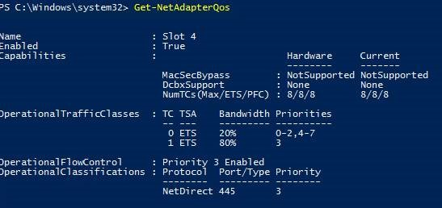
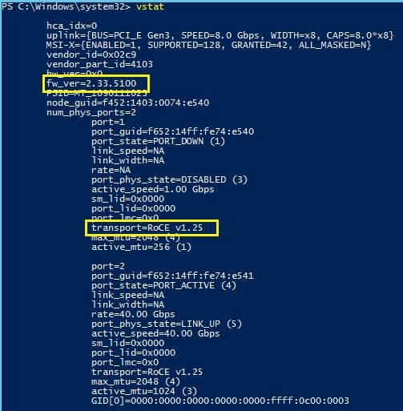
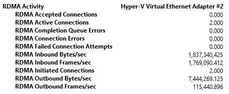

# Troubleshooting Converged NIC Configurations

>Applies to: Windows Server (Semi-Annual Channel), Windows Server 2016

You can use the following script to verify whether the RDMA configuration is correct on the Hyper-V host.

- [Download script Test-Rdma.ps1](https://github.com/Microsoft/SDN/blob/master/Diagnostics/Test-Rdma.ps1)

You can also use the following Windows PowerShell commands to troubleshoot and verify the configuration of your converged NICs.

## Get-NetAdapterRdma

To verify your network adapter RDMA configuration, run the following Windows PowerShell command on the Hyper-V server.

```powershell
Get-NetAdapterRdma | fl *
```

You can use the following expected and unexpected results to identify and resolve issues after you run this command on the Hyper-V host.

### Get-NetAdapterRdma expected results

Host vNIC and the physical NIC show non-zero RDMA capabilities.


### Get-NetAdapterRdma unexpected results

Perform the following steps if you receive unexpected results when you run the **Get-NetAdapterRdma** command.

1. Make sure the Mlnx miniport and Mlnx bus drivers are latest. For Mellanox, use at least drop 42.
2. Verify that Mlnx miniport and bus drivers match by checking the driver version through Device Manager. The bus driver can be found in System Devices. The name should start with Mellanox Connect-X 3 PRO VPI, as illustrated in the following screen shot of network adapter properties.


4. Make sure Network Direct (RDMA) is enabled on both the physical NIC and host vNIC.
5. Make sure vSwitch is created over the right physical adapter by checking its RDMA capabilities.
6. Check EventViewer System log and filter by source “Hyper-V-VmSwitch”.

## Get-SmbClientNetworkInterface

As an additional step to verify your RDMA configuration, run the following Windows PowerShell command on the Hyper-V server.

```powershell
Get-SmbClientNetworkInterface
```

### Get-SmbClientNetworkInterface expected results

The host vNIC should appear as RDMA capable from SMB's perspective as well.


### Get-SmbClientNetworkInterface unexpected results

1. Make sure the Mlnx miniport and Mlnx bus drivers are latest. For Mellanox, use at least drop 42.
2. Verify that Mlnx miniport and bus drivers match by checking the driver version through Device Manager. The bus driver can be found in System Devices. The name should start with Mellanox Connect-X 3 PRO VPI, as illustrated in the following screen shot of network adapter properties.
3. Make sure Network Direct (RDMA) is enabled on both the physical NIC and host vNIC.
4. Make sure the Hyper-V Virtual Switch is created over the right physical adapter by checking its RDMA capabilities.
5. Check EventViewer logs for “SMB Client” in **Application And Services | Microsoft | Windows**.

## Get-NetAdapterQos

You can view the network adapter quality of service \(QoS\) configuration by running the following Windows PowerShell command.

```powershell
Get-NetAdapterQos
```

### Get-NetAdapterQos expected results

Priorities and traffic classes should be displayed according to the first configuration step that you performed using this guide.



### Get-NetAdapterQos unexpected results

If your results are unexpected, perform the following steps.

1. Ensure that the physical network adapter supports Data Center Bridging \(DCB\) and QoS
2. Ensure that the network adapter drivers are up to date.

## Get-SmbMultiChannelConnection

You can use the following Windows PowerShell command to verify that the remote node's IP address is RDMA\-capable.

```powershell
Get-SmbMultiChannelConnection
```

### Get-SmbMultiChannelConnection expected results

Remote node's IP address is shown as RDMA capable.


### Get-SmbMultiChannelConnection unexpected results

If your results are unexpected, perform the following steps.

1. Make sure ping works both ways.
2. Make sure the firewall is not blocking SMB connection initiation. Specifically, enable the firewall rule for SMB Direct port 5445 for iWARP and 445 for ROCE.

## Get-SmbClientNetworkInterface

You can use the following command to verify that the virtual NIC you enabled for RDMA is reported as RDMA\-capable by SMB.

```powershell
Get-SmbClientNetworkInterface
```

### Get-SmbClientNetworkInterface expected results

Virtual NIC that was enabled for RDMA must be seen as RDMA capable by SMB.


### Get-SmbClientNetworkInterface unexpected results

If your results are unexpected, perform the following steps.

1. Make sure ping works both ways.
2. Make sure firewall is not blocking SMB connection initiation.

## vstat \(Mellanox specific\)

If you are using Mellanox network adapters, you can use the **vstat** command to verify the RDMA over Converged Ethernet \(RoCE\) version on Hyper-V nodes.

### vstat expected results

The RoCE version on both nodes must be the same. This is also a good way to verify that the firmware version on both nodes is latest.



### vstat unexpected results

If your results are unexpected, perform the following steps.

1. Set correct RoCE version using Set-MlnxDriverCoreSetting
2. Install the latest firmware from Mellanox website.

## Perfmon Counters

You can review counters in Performance Monitor to verify the RDMA activity of your configuration.



## Related topics

- [Converged NIC Configuration with a Single Network Adapter](cnic-single.md)
- [Converged NIC Teamed NIC Configuration](cnic-datacenter.md)
- [Physical Switch Configuration for Converged NIC](cnic-app-switch-config.md)
