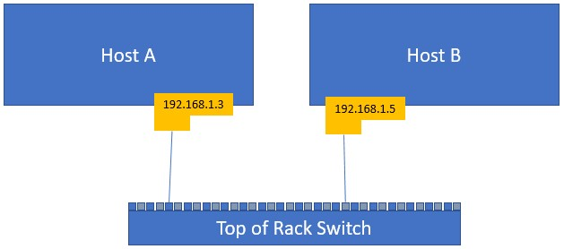
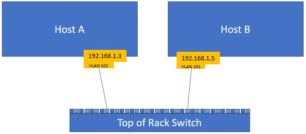
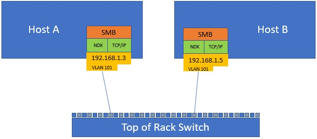
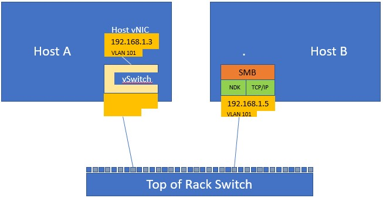

# Converged NIC Configuration with a Single Network Adapter

>Applies to: Windows Server (Semi-Annual Channel), Windows Server 2016

The following sections provide instructions for configuring Converged NIC with a single NIC in your Hyper-V host.

The example configuration in this guide depicts two Hyper-V hosts, **Hyper-V Host A**, and **Hyper-V Host B**.

## Test Connectivity Between Source and Destination

This section provides the steps required to test connectivity between source and destination Hyper-V Hosts.

The following illustration depicts two Hyper-V Hosts, **Hyper-V Host A** and **Hyper-V Host B**. 

Both servers have a single physical NIC (pNIC) installed, and the NICs are connected to a top of rack \(ToR\) physical switch. In addition, the servers are located on the same subnet, which is 192.168.1.x/24.

### Test NIC Connectivity to the Hyper\-V Virtual Switch

By using this step, you can ensure that the physical NIC, for which you will later create a Hyper\-V Virtual Switch, can connect to the destination host. 

This test demonstrates connectivity by using Layer 3 \(L3\) - or the IP layer - as well as Layer 2 \(L2\).

You can use the following Windows PowerShell command to obtain the properties of the network adapter.

    Get-NetAdapter
     
Following are example results of this command.

|Name|InterfaceDescription|ifIndex|Status|MacAddress|LinkSpeed|
|-----|--------------------|-------|-----|----------|---------|
|
|M1|Mellanox ConnectX-3 Pro ...| 4| Up|7C-FE-90-93-8F-A1|40 Gbps|

You can use one of the following commands to obtain additional adapter properties, including the IP address.

    Get-NetAdapter M1 | fl *

Following are edited example results of this command.
    
    MacAddress   : 7C-FE-90-93-8F-A1
    Status   : Up
    LinkSpeed: 40 Gbps
    MediaType: 802.3
    PhysicalMediaType: 802.3
    AdminStatus  : Up
    MediaConnectionState : Connected
    DriverInformation: Driver Date 2016-08-28 Version 5.25.12665.0 NDIS 6.60
    DriverFileName   : mlx4eth63.sys
    NdisVersion  : 6.60
    ifOperStatus : Up
    ifAlias  : M1
    InterfaceAlias   : M1
    ifIndex  : 4
    ifDesc   : Mellanox ConnectX-3 Pro Ethernet Adapter
    ifName   : ethernet_32773
    DriverVersion: 5.25.12665.0
    LinkLayerAddress : 7C-FE-90-93-8F-A1
    Caption  :
    Description  :
    ElementName  :
    InstanceID   : {39B58B4C-8833-4ED2-A2FD-E105E7146D43}
    CommunicationStatus  :
    DetailedStatus   :
    HealthState  :
    InstallDate  :
    Name : M1
    OperatingStatus  :
    OperationalStatus:
    PrimaryStatus:
    StatusDescriptions   :
    AvailableRequestedStates :
    EnabledDefault   : 2
    EnabledState : 5
    OtherEnabledState:
    RequestedState   : 12
    TimeOfLastStateChange:
    TransitioningToState : 12
    AdditionalAvailability   :
    Availability :
    CreationClassName: MSFT_NetAdapter
    

### Ensure that Source and Destination Can Communicate

You can use this step to verify bi-directional communication \(ping from source to destination and vice-versa on both systems\).  In the following example, the **Test-NetConnection** Windows PowerShell command is used, but if you prefer you can use the **ping** command. 

>[!NOTE]
>If you're certain that your hosts can communicate with each other, you can skip this step.

    Test-NetConnection 192.168.1.5

Following are example results of this command.

|Parameter|Value|
|---------|-----|
|
|ComputerName|192.168.1.5|
|RemoteAddress|192.168.1.5|
|InterfaceAlias|M1|
|SourceAddress|192.168.1.3|
|PingSucceeded|True|
|PingReplyDetails \(RTT\)|0 ms|

In some cases, you might need to disable Windows Firewall with Advanced Security to successfully perform this test. If you disable the firewall, keep security in mind and ensure that your configuration meets your organization's security requirements.

The following example command allows you to disable all firewall profiles.

    Set-NetFirewallProfile -All -Enabled False
    
After you disable the firewall, you can use the following command to test the connection.

    Test-NetConnection 192.168.1.5

Following are example results of this command.

|Parameter|Value|
|---------|-----|
|
|ComputerName|192.168.1.5|
|RemoteAddress|192.168.1.5|
|InterfaceAlias|Test-40G-1|
|SourceAddress|192.168.1.3|
|PingSucceeded|False|
|PingReplyDetails \(RTT\)|0 ms|

## Configure VLANs \(Optional\)

Many network configurations make use of VLANs. If you are planning to use VLANs in your network, you must repeat the previous test with VLANs configured. \(If you are planning to use RoCE for RDMA services you must enable VLANs.\)

For this step, the NICs are in **ACCESS** mode. However when you create a Hyper-V Virtual Switch \(vSwitch\) later in this guide, the VLAN properties are applied at the vSwitch port level. 

Because a switch can host multiple VLANs, it is necessary for the Top of Rack \(ToR\) physical switch to have the port that the host is connected to configured in Trunk mode.

>[!NOTE]
>Consult your ToR switch documentation for instructions on how to configure Trunk mode on the switch.

The following illustration depicts two Hyper-V hosts, each with one physical network adapter, and each configured to communicate on VLAN 101.

### Configure the VLAN ID

You can use this step to configure the VLAN IDs for NICs installed in your Hyper-V hosts.

#### Configure NIC M1

With the following commands, configure the VLAN ID for the first NIC, M1, then view the resulting configuration.

>[!IMPORTANT]
>Do not run this command if you are connected to the host remotely over this interface, because doing so will result in loss of access to the host.
    
    Set-NetAdapterAdvancedProperty -Name M1 -RegistryKeyword VlanID -RegistryValue "101"
    Get-NetAdapterAdvancedProperty -Name M1 | Where-Object {$_.RegistryKeyword -eq "VlanID"} 
    
Following are example results of this command.

|Name |DisplayName| DisplayValue| RegistryKeyword |RegistryValue|
|----|-----------|------------|---------------|-------------|
|
|M1|VLAN ID|101|VlanID|{101}|

Ensure that the VLAN ID takes effect independent of the network adapter implementation by using the following command to restart the network adapter.

    Restart-NetAdapter -Name "M1"

You can use the following command to ensure that the network adapter status is **Up** before proceeding.

    Get-NetAdapter -Name "M1"

Following are example results of this command.

|Name|InterfaceDescription|ifIndex| Status|MacAddress|LinkSpeed|
|----|--------------------|-------|------|----------| ---------|
|
|M1|Mellanox ConnectX-3 Pro Ethernet Ada...|4|Up|7C-FE-90-93-8F-A1|40 Gbps|

Ensure that you perform this step on both the local and destination servers. If the destination server is not configured with the same VLAN ID as the local server, the two cannot communicate.

### Verify Connectivity

You can use this section to verify connectivity after the network adapters are restarted. You can confirm connectivity after applying the VLAN tag to both adapters. If connectivity fails, you can inspect the switch VLAN configuration or destination participation in the same VLAN. 

>[!IMPORTANT]
>After you perform the steps in the previous section, it might take several seconds for the device to restart and become available on the network.

#### Verify connectivity for NIC Test-40G-1

To verify connectivity for the first NIC, you can run the following command.

    Test-NetConnection 192.168.1.5
    
## Configure Data Center Bridging \(DCB\)

The next step is to configure DCB and Quality of Service \(QoS\), which requires that you first install the Windows Server 2016 feature DCB.

>[!NOTE]
>You must perform all of the following DCB and QoS configuration steps on all servers that are intended to communicate with each other.

### Install Data Center Bridging \(DCB\)

You can use this step to install and enable DCB. 

>[!IMPORTANT]
>- Installing and configuring DCB is **optional** for network configurations that use iWarp for RDMA services.
>- Installing and configuring DCB is **required** for network configurations that use RoCE \(any version\) for RDMA services.

You can use the following command to install DCB on each of your Hyper-V hosts. 

    Install-WindowsFeature Data-Center-Bridging

### Set the QoS policies for SMB-Direct 

You can use the following command to configure QoS policies for SMB Direct.

>[!IMPORTANT]
>- This step is optional for network configurations that use iWarp.
>- This step is required for network configurations that use RoCE.
>- In the example command below, the value “3” is arbitrary. You can use any value between 1 and 7 as long as you consistently use the same value throughout the configuration of QoS policies.

    New-NetQosPolicy "SMB" -NetDirectPortMatchCondition 445 -PriorityValue8021Action 3

Following are example results of this command.

|Parameter|Value|
|---------|-----|
|
|Name |SMB|
|Owner|Group Policy \(Machine\)|
|NetworkProfile|All|
|Precedence|127|
|JobObject|&nbsp;| 
|NetDirectPort|445
|PriorityValue|3

### For RoCE Deployments Turn on Priority Flow Control for SMB traffic 

If you are using RoCE for your RDMA services, you can use the following commands to enable SMB flow control and to view the results. Priority Flow Control is required for RoCE, but is unnecessary when you are using iWarp.

    Enable-NetQosFlowControl -priority 3
    Get-NetQosFlowControl

Following are example results of the **Get-NetQosFlowControl** command.

|Priority|Enabled|PolicySet|IfIndex|IfAlias|
|---------|-----|--------- |-------| -------|
|
|0 |False |Global|&nbsp;|&nbsp;|
|1 |False |Global|&nbsp;|&nbsp;|
|2 |False |Global|&nbsp;|&nbsp;|
|3 |True  |Global|&nbsp;|&nbsp;|
|4 |False |Global|&nbsp;|&nbsp;|
|5 |False |Global|&nbsp;|&nbsp;|
|6 |False |Global|&nbsp;|&nbsp;|
|7 |False |Global|&nbsp;|&nbsp;|

### Enable QoS for the local and destination network adapters
With this step you can enable DCB on specific network adapters.

>[!IMPORTANT]
>-	This step is not needed for network configurations that use iWarp.
>-	This step is required for network configurations that use RoCE.

#### Enable QoS for NIC M1

You can use the following commands to enable QoS and view the results of your configuration.

    Enable-NetAdapterQos -InterfaceAlias "M1"
    Get-NetAdapterQos -Name "M1"

Following are example results of this command.

**Name**: M1
**Enabled**: True
**Capabilities**:   

|Parameter|Hardware|Current|
|---------|--------|-------|
|
|MacSecBypass|NotSupported|NotSupported|
|DcbxSupport|None|None|
|NumTCs(Max/ETS/PFC)|8/8/8|8/8/8|
 
**OperationalTrafficClasses**: 

|TC|TSA|Bandwidth|Priorities|
|----|-----|--------|-------|
|
|0| ETS|70%|0-2,4-7|
|1|ETS|30%|3

**OperationalFlowControl**: Priority 3 Enabled
**OperationalClassifications**:

|Protocol|Port/Type|Priority|
|--------|---------|--------|
|
|Default|&nbsp;|0|
|NetDirect| 445|3|

### Reserve a percentage of the Bandwidth for SMB Direct \(RDMA\)

You can use the following command to reserve a percentage of the bandwidth for SMB Direct.  

In this example, a 30% bandwidth reservation is used. You should select a value that represents what you expect your storage traffic will require. 

    New-NetQosTrafficClass "SMB" -Priority 3 -BandwidthPercentage 30 -Algorithm ETS

Following are example results of this command.

|Name|Algorithm |Bandwidth(%)| Priority |PolicySet |IfIndex |IfAlias |
|----|---------| ------------ |--------| ---------|------- |------- |
|
|SMB | ETS     | 30 |3 |Global |&nbsp;|&nbsp;|                                      
 
You can use the following command to view bandwidth reservation information.

    Get-NetQosTrafficClass

Following are example results of this command.
 
|Name|Algorithm |Bandwidth(%)| Priority |PolicySet |IfIndex |IfAlias |
|----|---------| ------------ |--------| ---------|------- |------- |
|
|[Default]|ETS|70 |0-2,4-7| Global|&nbsp;|&nbsp;| 
|SMB      |ETS|30 |3 |Global|&nbsp;|&nbsp;| 

## Remove Debugger Conflict \(Mellanox adapter only\)

If you are using an adapter from Mellanox you need to perform this step to configure the debugger. By default, when a Mellanox adapter is used, the attached debugger blocks NetQos. You can use the following command to override the debugger.

    
    Set-ItemProperty HKLM:"\SYSTEM\CurrentControlSet\Services\NDIS\Parameters" AllowFlowControlUnderDebugger -type DWORD -Value 1 –Force
    

## Test RDMA (Native host)

You can use this step to ensure that the fabric is correctly configured prior to creating a vSwitch and transitioning to RDMA \(Converged NIC\).

The following illustration depicts the current state of the Hyper-V hosts.

To verify the RDMA configuration, you can run the following command.

    Get-NetAdapterRdma

Following are example results of this command.

|Name |InterfaceDescription |Enabled|
|----|--------------------|-------|
|
|M1| Mellanox ConnectX-3 Pro Ethernet Adapter |True|

### Download DiskSpd.exe and a PowerShell Script

To continue, you must first download the following items.

- Download the DiskSpd.exe utility and extract the utility into C:\TEST\ 
[Diskspd Utility: A Robust Storage Testing Tool (superseding SQLIO)](https://gallery.technet.microsoft.com/DiskSpd-a-robust-storage-6cd2f223)

- Download the Test-RDMA powershell script to C:\TEST\ 
[https://github.com/Microsoft/SDN/blob/master/Diagnostics/Test-Rdma.ps1](https://github.com/Microsoft/SDN/blob/master/Diagnostics/Test-Rdma.ps1)

### Determine the ifIndex value of your target adapter

You can use the following command to discover the ifIndex value of the target adapter. You can use this value in subsequent steps when you are running the script you've downloaded.

    Get-NetIPConfiguration -InterfaceAlias "M*" | ft InterfaceAlias,InterfaceIndex,IPv4Address

Following are example results of this command.

|InterfaceAlias |InterfaceIndex |IPv4Address|
|-------------- |-------------- |-----------|
|
|M2 |14 |{192.168.1.5}|

### Run the PowerShell script

When you run the Test-Rdma.ps1 Windows PowerShell script, you can pass the ifIndex value to the script, along with the IP address of the remote adapter on the same VLAN.

You can use the following example command to run the script with an ifIndex of 14 on the network adapter 192.168.1.5.
    
    C:\TEST\Test-RDMA.PS1 -IfIndex 14 -IsRoCE $true -RemoteIpAddress 192.168.1.5 -PathToDiskspd C:\TEST\Diskspd-v2.0.17\amd64fre\
    
    VERBOSE: Diskspd.exe found at C:\TEST\Diskspd-v2.0.17\amd64fre\\diskspd.exe
    VERBOSE: The adapter M2 is a physical adapter
    VERBOSE: Underlying adapter is RoCE. Checking if QoS/DCB/PFC is configured on each physical adapter(s)
    VERBOSE: QoS/DCB/PFC configuration is correct.
    VERBOSE: RDMA configuration is correct.
    VERBOSE: Checking if remote IP address, 192.168.1.5, is reachable.
    VERBOSE: Remote IP 192.168.1.5 is reachable.
    VERBOSE: Disabling RDMA on adapters that are not part of this test. RDMA will be enabled on them later.
    VERBOSE: Testing RDMA traffic now for. Traffic will be sent in a parallel job. Job details:
    VERBOSE: 0 RDMA bytes written per second
    VERBOSE: 0 RDMA bytes sent per second
    VERBOSE: 662979201 RDMA bytes written per second
    VERBOSE: 37561021 RDMA bytes sent per second
    VERBOSE: 1023098948 RDMA bytes written per second
    VERBOSE: 8901349 RDMA bytes sent per second
    VERBOSE: Enabling RDMA on adapters that are not part of this test. RDMA was disabled on them prior to sending RDMA traffic.
    VERBOSE: RDMA traffic test SUCCESSFUL: RDMA traffic was sent to 192.168.1.5
    

>[!NOTE]
>If the RDMA traffic fails, for the RoCE case specifically, consult your ToR Switch configuration for proper PFC/ETS settings that should match the Host settings. Refer to the QoS section in this document for reference values.

## Remove the Access VLAN setting

In preparation for creating the Hyper-V switch you must remove the VLAN settings you installed above.  You can use the following command to remove the ACCESS VLAN Setting from the physical NIC. This action prevents the NIC from auto-tagging the egress traffic with the incorrect VLAN ID, and also prevents it from filtering ingress traffic that doesn’t match the ACCESS VLAN ID.

    
    Set-NetAdapterAdvancedProperty -Name M1 -RegistryKeyword VlanID -RegistryValue "0"
    

You can use the following example command to confirm the VlanID setting and view the results, which show that the VLAN ID value is zero.

    
    Get-NetAdapterAdvancedProperty -name m1 | Where-Object {$_.RegistryKeyword -eq 'VlanID'} 
    

## Create a Hyper-V Virtual Switch

You can use this section to create a Hyper-V Virtual Switch \(vSwitch\) on your Hyper-V hosts.

The following illustration depicts Hyper-V Host 1 with a vSwitch.

### Create an External Hyper-V Virtual Switch

You can use this section to create an external vSwitch in Hyper-V on Hyper-V Host A.

You can use the following example command to create a switch named VMSTEST.

>[!NOTE]
>The parameter **AllowManagementOS** in the following command creates a Host vNIC that inherits the MAC address and IP address of the physical NIC.

    New-VMSwitch -Name VMSTEST -NetAdapterName "M1" -AllowManagementOS $true

Following are example results of this command.

|Name |SwitchType |NetAdapterInterfaceDescription|
|---- |---------- |------------------------------|
|VMSTEST |External |Mellanox ConnectX-3 Pro Ethernet Adapter|

You can use the following command to view the properties of the network adapter.

    Get-NetAdapter | ft -AutoSize

Following are example results of this command.

|Name |InterfaceDescription | ifIndex |Status |MacAddress |LinkSpeed|
|---- |-------------------- |-------| ------|----------|---------|
|
|vEthernet \(VMSTEST\) |Hyper-V Virtual Ethernet Adapter #2|27 |Up |E4-1D-2D-07-40-71 |40 Gbps|

You can manage a Host vNIC in two ways. One method is the **NetAdapter** view, which operates based upon the "vEthernet \(VMSTEST\)" name.

The other method is the **VMNetworkAdapter** view, which drops the "vEthernet" prefix and simply uses the vmswitch name.

The **VMNetworkAdapter** view displays some network adapter properties that are not displayed with the **NetAdapter** command.

You can use the following command to view the results of the **VMNetworkAdapter** method.

    Get-VMNetworkAdapter –ManagementOS | ft -AutoSize

Following are example results of this command.

|Name |IsManagementOs |VMName |SwitchName |MacAddress |Status |IPAddresses|
|----|-------------- |------ |----------|----------|------ |-----------|
|
|CORP-External-Switch |True |CORP-External-Switch| 001B785768AA |{Ok} |&nbsp;|
|VMSTEST |True |VMSTEST | E41D2D074071| {Ok} | &nbsp;| 

### Test the connection

You can use the following example command to test the connection and view the results.
    
    Test-NetConnection 192.168.1.5

    ComputerName   : 192.168.1.5
    RemoteAddress  : 192.168.1.5
    InterfaceAlias : vEthernet (CORP-External-Switch)
    SourceAddress  : 192.168.1.3
    PingSucceeded  : True
    PingReplyDetails (RTT) : 0 ms
    
You can use the following example commands to assign and view network adapter VLAN settings.
    
    Set-VMNetworkAdapterVlan -VMNetworkAdapterName "VMSTEST" -VlanId "101" -Access -ManagementOS
    Get-VMNetworkAdapterVlan -ManagementOS -VMNetworkAdapterName "VMSTEST"
    

|VMName |VMNetworkAdapterName |Mode |VlanList|
|------ |-------------------- |---- |--------|
|
|&nbsp;|VMSTEST |Access |101     
 
### Test the connection

Recall that the change may take a few seconds to complete before you can successfully ping the other adapter.

You can use the following example command to test the connection and view the results.
    
    Test-NetConnection 192.168.1.5
     
    ComputerName   : 192.168.1.5
    RemoteAddress  : 192.168.1.5
    InterfaceAlias : vEthernet (VMSTEST)
    SourceAddress  : 192.168.1.3
    PingSucceeded  : True
    PingReplyDetails (RTT) : 0 ms
    

## Test Hyper-V Virtual Switch RDMA (Mode 2)

The following illustration depicts the current state of your Hyper-V hosts, including the vSwitch on Hyper-V Host 1.

### Set Priority tagging on the Host vNIC

You can use the following example commands to set priority tagging on the Host vNIC and view the results of your actions.
    
    Set-VMNetworkAdapter -ManagementOS -Name "VMSTEST" -IeeePriorityTag on
    Get-VMNetworkAdapter -ManagementOS -Name "VMSTEST" | fl Name,IeeePriorityTag
    
    Name: VMSTEST
    IeeePriorityTag : On
    
You can use the following example command to view network adapter RDMA information. In the results, when the parameter **Enabled** has the value **False**, it means that RDMA is not enabled.
    
    Get-NetAdapterRdma
    
|Name |InterfaceDescription |Enabled |
|---- |-------------------- |-------|
|
|vEthernet \(VMSTEST\)| Hyper-V Virtual Ethernet Adapter #2|False|

### Enable RDMA on the Host vNIC

You can use the following example commands to view network adapter properties, enable RDMA for the adapter, and then view the network adapter RDMA information.
    
    Get-NetAdapter
    
|Name |InterfaceDescription |ifIndex |Status |MacAddress |LinkSpeed|
|----|--------------------|-------|------|----------|---------|
|
|vEthernet (VMSTEST)|Hyper-V Virtual Ethernet Adapter #2|27|Up|E4-1D-2D-07-40-71|40 Gbps|

    Enable-NetAdapterRdma -Name "vEthernet (VMSTEST)"
    Get-NetAdapterRdma -Name "vEthernet (VMSTEST)"

In the following results, when the parameter **Enabled** has the value **True**, it means that RDMA is enabled.

|Name |InterfaceDescription |Enabled |
|---- |-------------------- |-------|
|
|vEthernet \(VMSTEST\)| Hyper-V Virtual Ethernet Adapter #2|True|

    
    Get-NetAdapter 
    

|Name |InterfaceDescription |ifIndex |Status |MacAddress |LinkSpeed|
|----|--------------------|-------|------|----------|---------|
|
|vEthernet (VMSTEST)|Hyper-V Virtual Ethernet Adapter #2|27|Up|E4-1D-2D-07-40-71|40 Gbps|

### Perform RDMA traffic test by using the script

You can use the following command to run the script you downloaded and view the results.
    
    C:\TEST\Test-RDMA.PS1 -IfIndex 27 -IsRoCE $true -RemoteIpAddress 192.168.1.5 -PathToDiskspd C:\TEST\Diskspd-v2.0.17\amd64fre\
    VERBOSE: Diskspd.exe found at C:\TEST\Diskspd-v2.0.17\amd64fre\\diskspd.exe
    VERBOSE: The adapter vEthernet (VMSTEST) is a virtual adapter
    VERBOSE: Retrieving vSwitch bound to the virtual adapter
    VERBOSE: Found vSwitch: VMSTEST
    VERBOSE: Found the following physical adapter(s) bound to vSwitch: TEST-40G-1
    VERBOSE: Underlying adapter is RoCE. Checking if QoS/DCB/PFC is configured on each physical adapter(s)
    VERBOSE: QoS/DCB/PFC configuration is correct.
    VERBOSE: RDMA configuration is correct.
    VERBOSE: Checking if remote IP address, 192.168.1.5, is reachable.
    VERBOSE: Remote IP 192.168.1.5 is reachable.
    VERBOSE: Disabling RDMA on adapters that are not part of this test. RDMA will be enabled on them later.
    VERBOSE: Testing RDMA traffic now for. Traffic will be sent in a parallel job. Job details:
    VERBOSE: 0 RDMA bytes written per second
    VERBOSE: 0 RDMA bytes sent per second
    VERBOSE: 0 RDMA bytes written per second
    VERBOSE: 0 RDMA bytes sent per second
    VERBOSE: 0 RDMA bytes written per second
    VERBOSE: 0 RDMA bytes sent per second
    VERBOSE: 0 RDMA bytes written per second
    VERBOSE: 9162492 RDMA bytes sent per second
    VERBOSE: 938797258 RDMA bytes written per second
    VERBOSE: 34621865 RDMA bytes sent per second
    VERBOSE: 933572610 RDMA bytes written per second
    VERBOSE: 35035861 RDMA bytes sent per second
    VERBOSE: Enabling RDMA on adapters that are not part of this test. RDMA was disabled on them prior to sending RDMA traffic.
    VERBOSE: RDMA traffic test SUCCESSFUL: RDMA traffic was sent to 192.168.1.5
    
The final line in this output, "RDMA traffic test SUCCESSFUL: RDMA traffic was sent to 192.168.1.5," demonstrates that you have successfully configured Converged NIC on your adapter.

## All topics in this guide

This guide contains the following topics.

- [Converged NIC Configuration with a Single Network Adapter](cnic-single.md)
- [Converged NIC Teamed NIC Configuration](cnic-datacenter.md)
- [Physical Switch Configuration for Converged NIC](cnic-app-switch-config.md)
- [Troubleshooting Converged NIC Configurations](cnic-app-troubleshoot.md)
