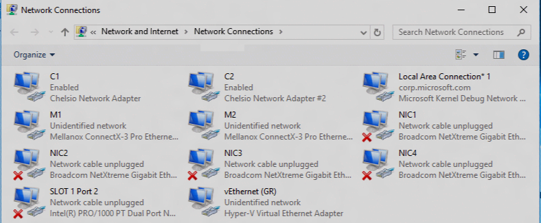

# Network Offload and Optimization Technologies
>Applies to: Windows Server 2016 version 1709 or later, and Windows 10 version 1703 or later

There are many networking features in each release of Windows Server. Each of
these features is intended to address the needs of customer workloads. In this
document we’ll examine the different network offload and optimization features
and discuss how they help make networking more efficient. We’ll wrap up by
looking at the different networking stacks and feature sets for different
applications of Windows Server 2016.

This document is a living document. The latest update was done June 14, 2017.

## Networking features

There are 3 categories of networking features that users of Windows Server
should be aware of:

1.  Software only (SO) features: These features are implemented as part of the
    OS and are independent of the underlying NIC(s). Sometimes these features
    will require some tuning of the NIC for optimal operation. Examples of these
    include Hyper-v features such as vmQoS, ACLs, and non-Hyper-V features like
    NIC Teaming.

2.  Software-Hardware (SH) integrated features: These features have both
    software and hardware components. The software is intimately tied to
    hardware capabilities that are required for the feature to work. Examples of
    these include VMMQ, VMQ, Send-side IPv4 Checksum Offload, and RSS.

3.  Hardware only (HO) features: These hardware accelerations improve networking
    performance in conjunction with the software but are not intimately part of
    any software feature. Examples of these include Interrupt Moderation, Flow
    Control, and Receive-side IPv4 Checksum Offload.

SO features are generally available in all hardware architectures and without
regard to NIC Speed or capabilities. If the feature exists in Windows it exists
no matter what NICs are installed.

SH and HO features are available if the installed NIC supports it. The feature
descriptions below will cover how to tell if your NIC supports the feature.

## Networking feature management

In general there are two ways to manage NICs and their features. The first is
PowerShell. This guide will use PowerShell examples. All the features can be
managed through the Network Control Panel (ncpa.cpl) as well. So to help readers
who prefer to use the GUI to know where to go, we include an example of how to
access the Network Control Panel.

Documentation on the PowerShell cmdlets used to manage Network Adapters can be
found at <https://technet.microsoft.com/en-us/library/jj134956(v=wps.630).aspx>.

## NIC Advanced Properties

To determine whether the installed NIC supports a feature you may need to look at the Advanced Properties of the NIC. There are two ways to get the Advanced Properties:

### Method 1 - Windows PowerShell

In Windows PowerShell, run the `Get‑NetAdapterAdvancedProperties` cmdlet against two different make/model of NICs.

There are similarities and differences in these two NIC Advanced Properties Lists.

### Method 2 - Network Control Panel

1.  Go to Start and type `ncpa.cpl` to open the Network Control Panel.

2.  Right-click the NIC.

    

3.  In the properties dialog, click **Configure**.

    

4.  Click the **Advanced** tab to view the advanced properties. The items in this list correlates to the items in the `Get-NetAdapterAdvancedProperties` output.

    