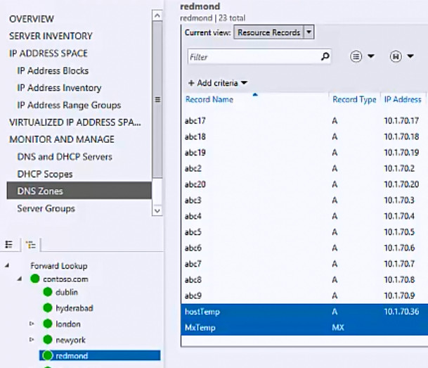
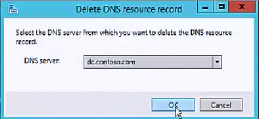

# Delete DNS Resource Records

>Applies To: Windows Server&reg; 2016

You can use this topic to delete one or more DNS resource records by using the IPAM client console.  
  
Membership in **Administrators**, or equivalent, is the minimum required to perform this procedure.  
  
### To delete DNS resource records  
  
1.  In Server Manager, click  **IPAM**. The IPAM client console appears.  
  
2.  In the navigation pane, in **MONITOR AND MANAGE**, click **DNS Zones**.  The navigation pane divides into an upper navigation pane and a lower navigation pane.  
  
3.  Click to expand **Forward Lookup** and the domain where the zone and resource records that you want to delete are located. Click on the zone, and in the display pane, click **Current view**. Click **Resource Records**.  
  
4.  In the display pane, locate and select the resource records that you want to delete.  
  
      
  
5.  Right-click the selected records, and then click **Delete DNS resource record**.  
  
      
  
6.  The **Delete DNS Resource Record** dialog box opens. Verify that the correct DNS server is selected. If it is not, click **DNS server** and select the server from which you want to delete the resource records. Click **OK**. IPAM deletes the resource records from the DNS server.  
  
      
  
## See Also  
[DNS Resource Record Management](DNS-Resource-Record-Management.md)  
[Manage IPAM](Manage-IPAM.md)  
  

