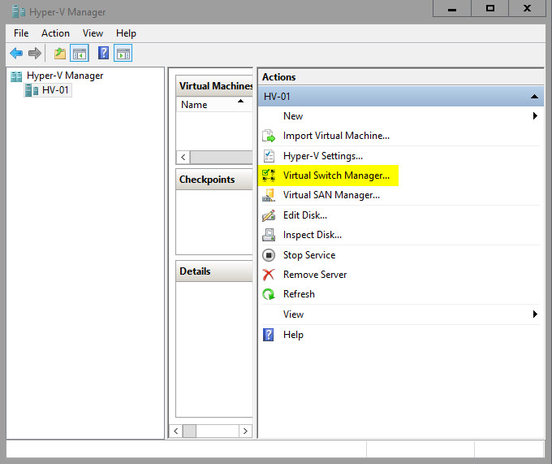
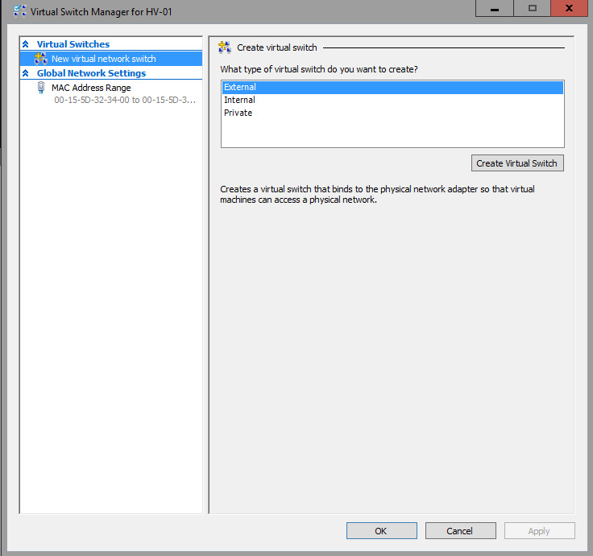
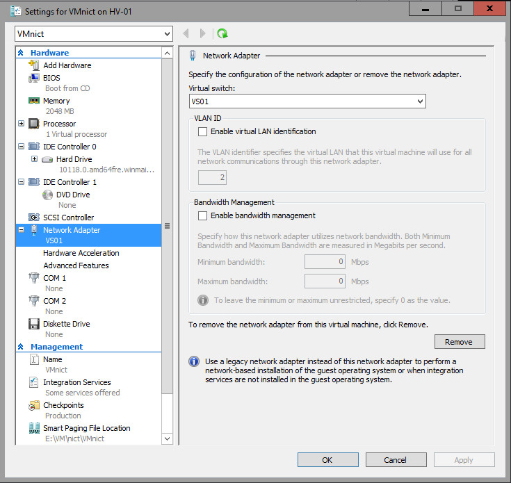
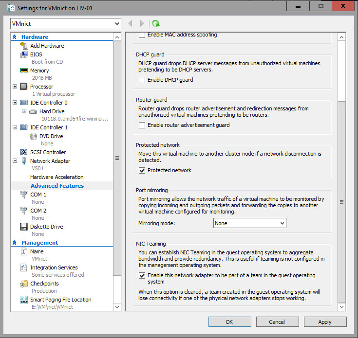
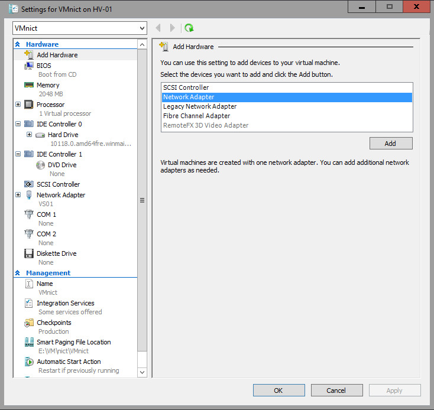
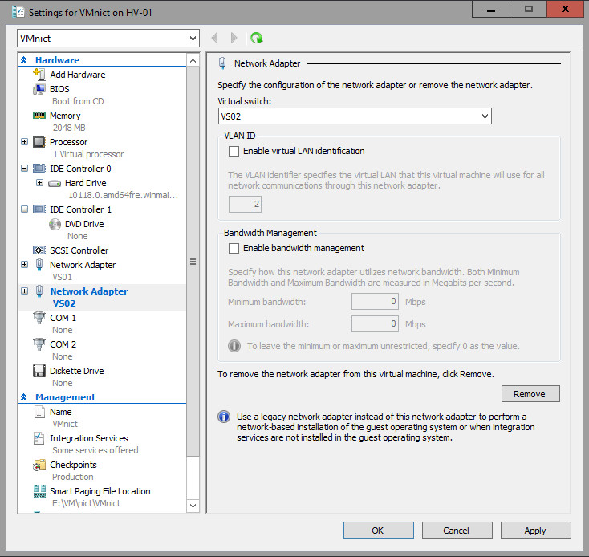

# Create a New NIC Team in a VM

>Applies To: Windows Server 2016

You can use this topic to connect a virtual machine (VM) to Hyper-V Virtual Switches in a manner that is consistent with NIC Teaming requirements within VMs. You can also use this topic to create a new NIC team in a VM.  
  
This topic contains the following sections.  
  
-   [Network configuration requirements](#bkmk_network)  
  
-   [Configure the physical and virtual network](#bkmk_configure)  
  
-   [Create a NIC Team](#bkmk_new)  
  
## Network configuration requirements  
The physical switch, Hyper-V Virtual Switch, local area network (LAN), and NIC Teaming requirements for creating a NIC Team in a VM are:  
  
-   The computer that is running Hyper-V must have two or more network adapters.  
  
-   If the network adapters are connected to multiple physical switches, the physical switches must be on the same Layer 2 subnet.  
  
-   You must use Hyper-V Manager or Windows PowerShell commands to create two external Hyper-V Virtual Switches, each of which is connected to a different physical network adapter.  
  
-   The VM in which you want to configure NIC Teaming must be connected to both external virtual switches that you create.  
  
-   The  Windows Server 2016 NIC Teaming solution supports teams with two members in VMs. Larger teams can be created but such teams are not supported.  
  
-   NIC Teams within a VM must have their Teaming mode configured as Switch Independent. In addition, Load Balancing mode for the NIC Team in a VM must be configured with the Address Hash distribution mode.  
  
## Configure the physical and virtual network  
Before you perform this procedure, you must deploy a Hyper-V host with two network adapters that are connected to different physical switches, and you must configure the network adapters with IP addresses that are from the same IP address range.  
  
By using the following procedure, you can create two external Hyper-V Virtual Switches, connect a VM to the switches, and then configure the VM connections to the switches.  
  
> [!IMPORTANT]  
> This procedure does not include instructions on how to create a VM.  
  
Membership in **Administrators**, or equivalent, is the minimum required to perform this procedure.  
  
#### To create a virtual switch and connect a VM  
  
1.  On the Hyper-V host, open Hyper-V Manager, and then click **Virtual Switch Manager**.  
  
      
  
2.  Virtual Switch Manager opens. In **What type of virtual switch do you want to create?**, ensure that **External** is selected, and then click **Create Virtual Switch**.  
  
      
  
3.  The Virtual Switch Properties page opens. Type a **Name** for the virtual switch, and add **Notes** as needed.  
  
4.  In **Connection type**, in **External network**, select the physical network adapter to which you want to attach the virtual switch.  
  
5.  Configure additional switch properties so that they are correct for your deployment, and then click **OK**.  
  
6.  Create a second external virtual switch by repeating the previous steps. Connect the second external switch to a different network adapter.  
  
7.  Open Hyper-V Manager. In **Virtual Machines**, right-click the VM that you want to configure, and then click **Settings**. The VM **Settings** dialog box opens.  
  
    > [!IMPORTANT]  
    > Ensure that the VM is not started. If it is started, perform shutdown before configuring the VM.  
  
8.  In **Hardware**, click **Network Adapter**.  
  
      
  
9. In **Network Adapter** properties, select one of the virtual switches that you created in previous steps, and then click **Apply**.  
  
      
  
10. In **Hardware**, click to expand the plus sign (+) next to **Network Adapter**. Click **Advanced Features**.  
  
    > [!NOTE]  
    > Steps 10 through 12 demonstrate how to enable NIC Teaming by using the graphical user interface. You can also enable NIC Teaming by running the following Windows PowerShell command: `Set-VMNetworkAdapter -VMName <VMname> -AllowTeaming On`  
  
      
  
11. In **Advanced Features**, scroll down to **NIC Teaming**.  
  
      
  
12. In **NIC Teaming**, click to select **Enable this network adapter to be part of a team in the guest operating system**. Click **OK**.  
  
      
  
13. To add a second network adapter, in Hyper-V Manager, in **Virtual Machines**, right-click the same VM, and then click **Settings**. The VM **Settings** dialog box opens.  
  
14. In **Add Hardware**, click **Network Adapter**, and then click **Add**.  
  
      
  
15. In **Network Adapter** properties, select the second virtual switch that you created in previous steps, and then click **Apply**.  
  
      
  
16. In **Hardware**, click to expand the plus sign (+) next to **Network Adapter**. Click **Advanced Features**.  
  
17. In **Advanced Features**, scroll down to **NIC Teaming**.  
  
18. In **NIC Teaming**, click to select **Enable this network adapter to be part of a team in the guest operating system**. Click **OK**.  
  
You can now start and log on to your VM to create your new NIC Team.  
  
## Create a  NIC Team  
To create a new NIC Team in your VM, follow the instructions in the topic [Create a New NIC Team](../../technologies/nic-teaming/Create-a-New-NIC-Team.md).  
  
## See Also  
[Create a New NIC Team on a Host Computer or VM](Create-a-New-NIC-Team-on-a-Host-Computer-or-VM.md)  
[NIC Teaming](NIC-Teaming.md)  
  

