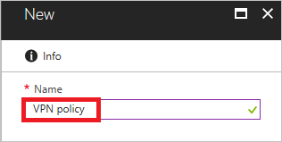
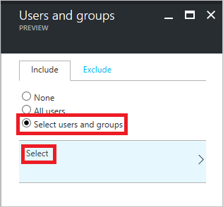
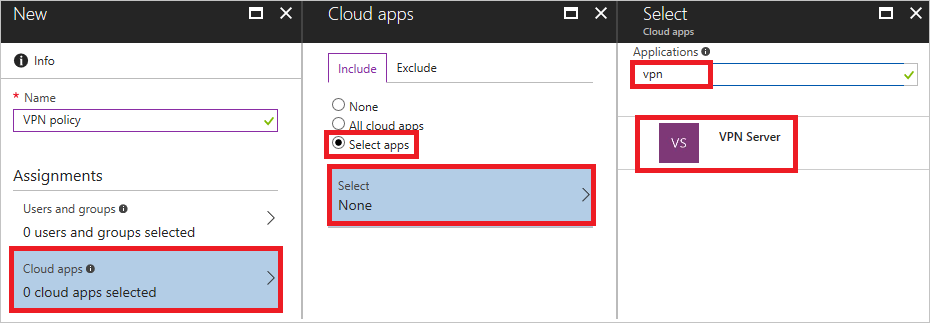

# Conditional access for VPN connectivity using Azure AD

>Applies to: Windows Server 2022, Windows Server 2019, Windows Server 2016, Windows 10, Windows 11

In this how-to guide, you'll learn how to grant VPN users access your resources using [Azure Active Directory (Azure AD) conditional access](/azure/active-directory/active-directory-conditional-access-azure-portal). With Azure AD conditional access for virtual private network (VPN) connectivity, you can help protect the VPN connections. Conditional Access is a policy-based evaluation engine that lets you create access rules for any Azure Active Directory (Azure AD) connected application.

## Prerequisites

Before you start configuring Conditional Access for your VPN, you must have completed the following prerequisites:

- [Conditional access in Azure Active Directory](/azure/active-directory/active-directory-conditional-access-azure-portal)
- [VPN and conditional access](/windows/access-protection/vpn/vpn-conditional-access)

- You've completed [Tutorial: Deploy Always On VPN - Setup infrastructure for Always On VPN](tutorial-aovpn-deploy-setup.md) or you already have setup the Always On VPN infrastructure in your environment.
- Your Windows client computer has already been configured with a VPN connection using Intune. If you don't know how to configure and deploy a VPN Profile with Intune, see [Deploy Always On VPN profile to Windows 10 or newer clients with Microsoft Intune](how-to-aovpn-client-intune.md).

## Configure EAP-TLS to ignore Certificate Revocation List (CRL) checking

An EAP-TLS client cannot connect unless the NPS server completes a revocation check of the certificate chain (including the root certificate). Cloud certificates issued to the user by Azure AD do not have a CRL because they are short-lived certificates with a lifetime of one hour. EAP on NPS needs to be configured to ignore the absence of a CRL. Since the authentication method is EAP-TLS, this registry value is only needed under EAP\13. If other EAP authentication methods are used, then the registry value should be added under those as well.

In this section, you'll add `IgnoreNoRevocationCheck` and `NoRevocationCheck`. By default, `IgnoreNoRevocationCheck` and `NoRevocationCheck` are set to 0 (disabled).

For more information on `IgnoreNoRevocationCheck` and `NoRevocationCheck`, see [NPS CRL Check Registry Settings](/previous-versions/windows/it-pro/windows-server-2008-r2-and-2008/cc771995(v=ws.10)#ignorenorevocationcheck).

>[!IMPORTANT]
>If a Windows Routing and Remote Access Server (RRAS) uses NPS to proxy RADIUS calls to a second NPS, then you must set `IgnoreNoRevocationCheck=1` on both servers.
>
>Failure to implement this registry change will cause IKEv2 connections using cloud certificates with PEAP to fail, but IKEv2 connections using Client Auth certificates issued from the on-premises CA would continue to work.

1. Open **regedit.exe** on the NPS server.

2. Navigate to **HKEY_LOCAL_MACHINE\SYSTEM\CurrentControlSet\Services\RasMan\PPP\EAP\13**.

3. Select **Edit > New** and select **DWORD (32-bit) Value** and enter **IgnoreNoRevocationCheck**.

4. Double-click **IgnoreNoRevocationCheck** and set the Value data to **1**.

5. Select **Edit > New** and select **DWORD (32-bit) Value** and enter **NoRevocationCheck**.

6. Double-click **NoRevocationCheck** and set the Value data to **1**.

7. Select **OK** and reboot the server. Restarting the RRAS and NPS services does not suffice.

|Registry Path  |EAP Extension  |
|---------|---------|
|HKLM\SYSTEM\CurrentControlSet\Services\RasMan\PPP\EAP\13     |EAP-TLS         |
|HKLM\SYSTEM\CurrentControlSet\Services\RasMan\PPP\EAP\25     |PEAP         |


## Create root certificates for VPN authentication with Azure AD

In this section, you configure conditional access root certificates for VPN authentication with Azure AD, which automatically creates a Cloud app called VPN Server in the tenant. To configure conditional access for VPN connectivity, you need to:

1. Create a VPN certificate in the Azure portal.
2. Download the VPN certificate.
3. Deploy the certificate to your VPN and NPS servers.

> [!IMPORTANT]
> Once a VPN certificate is created in the Azure portal, Azure AD will start using it immediately to issue short lived certificates to the VPN client. It is critical that the VPN certificate be deployed immediately to the VPN server to avoid any issues with credential validation of the VPN client.

When a user attempts a VPN connection, the VPN client makes a call into the Web Account Manager (WAM) on the Windows 10 client. WAM makes a call to the VPN Server cloud app. When the Conditions and Controls in the Conditional Access policy are satisfied, Azure AD issues a token in the form of a short-lived (1-hour) certificate to the WAM. The WAM places the certificate in the user's certificate store and passes off control to the VPN client. 

The VPN client then sends the certificate issued by Azure AD to the VPN for credential validation. 

> [!NOTE]
> Azure AD uses the most recently created certificate in the VPN connectivity blade as the Issuer.

**To create root certificates:**

1. Sign in to your [Azure portal](https://portal.azure.com) as a global administrator.
2. On the left menu, click **Azure Active Directory**.
3. On the **Azure Active Directory** page, in the **Manage** section, click **Security**.
4. On the **Security** page, in the **Protect** section, click **Conditional Access**.
5. On the **Conditional Access | Policies** page, in the **Manage** section, click **VPN Connectivity**.
6. On the **VPN connectivity** page, click **New certificate**.
7. On the **New** page, perform the following steps:
    a. For **Select duration**, select either 1, 2 or 3 years.
    b. Select **Create**.

## Configure the conditional access policy

In this section, you configure the conditional access policy for VPN connectivity. When the first root certificate is created in the 'VPN connectivity' blade, it automatically creates a 'VPN Server' cloud application in the tenant.

Create a Conditional Access policy that is assigned to VPN users group and scope the **Cloud app** to **VPN Server**:

- **Users**: VPN Users
- **Cloud App**: VPN Server
- **Grant (access control)**: 'Require multi-factor authentication'. Other controls can be used if desired.

**Procedure:**
This step covers creation of the most basic Conditional Access policy.  If desired, additional Conditions and Controls can be used.

1. On the **Conditional Access** page, in the toolbar on the top, select **Add**.

    

2. On the **New** page, in the **Name** box, enter a name for your policy. For example, enter **VPN policy**.

    

3. In the **Assignment** section, select **Users and groups**.

    

4. On the **Users and groups** page, perform the following steps:

    

    a. Select **Select users and groups**.

    b. Select **Select**.

    c. On the **Select** page, select the **VPN users** group, and then select **Select**.

    d. On the **Users and groups** page, select **Done**.

5. On the **New** page, perform the following steps:

    

    a. In the **Assignments** section, select **Cloud apps**.

    b. On the **Cloud apps** page, select **Select apps**.

    d. Select **VPN Server**.

6. On the **New** page, to open the **Grant** page, in the **Controls** section, select **Grant**.

    

7. On the **Grant** page, perform the following steps:

    

    a. Select **Require multi-factor authentication**.

    b. Select **Select**.

8. On the **New** page, under **Enable policy**, select **On**.

    

9. On the **New** page, select **Create**.


## Deploy conditional access root certificates to on-premises AD

In this section, you deploy a trusted root certificate for VPN authentication to your on-premises AD.

1. On the **VPN connectivity** page, select **Download certificate**.

   >[!NOTE]
   >The **Download base64 certificate** option is available for some configurations that require base64 certificates for deployment.

2. Log on to a domain-joined computer with Enterprise Admin rights and run these commands from an Administrator command prompt to add the cloud root certificate(s) into the *Enterprise NTauth* store:

   >[!NOTE]
   >For environments where the VPN server is not joined to the Active Directory domain, the cloud root certificates must be added to the _Trusted Root Certification Authorities_ store manually.

   | Command | Description |
   | --- | --- |
   | `certutil -dspublish -f VpnCert.cer RootCA` | Creates two **Microsoft VPN root CA gen 1** containers under the **CN=AIA** and **CN=Certification Authorities** containers, and publishes each root certificate as a value on the _cACertificate_ attribute of both **Microsoft VPN root CA gen 1** containers. |
   | `certutil -dspublish -f VpnCert.cer NTAuthCA` | Creates one **CN=NTAuthCertificates** container under the **CN=AIA** and **CN=Certification Authorities** containers, and publishes each root certificate as a value on the _cACertificate_ attribute of the **CN=NTAuthCertificates** container. |
   | `gpupdate /force` | Expedites adding the root certificates to the Windows server and client computers. |

3. Verify that the root certificates are present in the Enterprise NTauth store and show as trusted:
   1. Log on to a server with Enterprise Admin rights that has the **Certificate Authority Management Tools** installed.

   >[!NOTE]
   >By default the **Certificate Authority Management Tools** are installed Certificate Authority servers. They can be installed on other members servers as part of the **Role Administration Tools** in Server Manager.

   1. On the VPN server, in the Start menu, enter **pkiview.msc** to open the Enterprise PKI dialog.
   1. From the Start menu, enter **pkiview.msc** to open the Enterprise PKI dialog.
   1. Right-click **Enterprise PKI** and select **Manage AD Containers**.
   1. Verify that each Microsoft VPN root CA gen 1 certificate is present under:
      - NTAuthCertificates
      - AIA Container
      - Certificate Authorities Container

## Create OMA-DM based VPNv2 profiles to Windows 10 devices

In this section, you'll create OMA-DM based VPNv2 profiles using Intune to deploy a VPN Device Configuration policy.

1. In the Azure portal, select **Intune** > **Device Configuration** > **Profiles** and select the VPN profile you created in [Configure the VPN client by using Intune](how-to-aovpn-client-intune.md).

2. In the policy editor, select **Properties** > **Settings** > **Base VPN**. Extend the existing **EAP Xml** to include a filter that gives the VPN client the logic it needs to retrieve the AAD Conditional Access certificate from the user's certificate store instead of leaving it to chance allowing it to use the first certificate discovered.

    >[!NOTE]
    >Without this, the VPN client could retrieve the user certificate issued from the on-premises certificate authority, resulting in a failed VPN connection.

    

3. Locate the section that ends with **\</AcceptServerName>\</EapType>** and insert the following string between these two values to provide the VPN client with the logic to select the AAD Conditional Access Certificate:

    ```XML
    <TLSExtensions xmlns="http://www.microsoft.com/provisioning/EapTlsConnectionPropertiesV2"><FilteringInfo xmlns="http://www.microsoft.com/provisioning/EapTlsConnectionPropertiesV3"><EKUMapping><EKUMap><EKUName>AAD Conditional Access</EKUName><EKUOID>1.3.6.1.4.1.311.87</EKUOID></EKUMap></EKUMapping><ClientAuthEKUList Enabled="true"><EKUMapInList><EKUName>AAD Conditional Access</EKUName></EKUMapInList></ClientAuthEKUList></FilteringInfo></TLSExtensions>
    ```

4. Select the **Conditional Access** blade and toggle **Conditional access for this VPN connection** to **Enabled**.

   Enabling this setting changes the **\<DeviceCompliance>\<Enabled>true\</Enabled>** setting in the VPNv2 Profile XML.

    

5. Select **OK**.

6. Select **Assignments**, under Include, select **Select groups to include**.

7. Select the correct group that receives this policy and select **Save**.

    

## Force MDM Policy Sync on the Client

If the VPN profile does not show up on the client device, under Settings\\Network & Internet\\VPN, you can force MDM policy to sync.

1. Sign in to a domain-joined client computer as a member of the **VPN Users** group.

2. On the Start menu, enter **account**, and press Enter.

3. In the left navigation pane, select **Access work or school**.

4. Under Access work or school, select **Connected to <\domain> MDM**, then select **Info**.

5. Select **Sync** and verify the VPN profile appears under Settings\\Network & Internet\\VPN.

## Next steps

You are done configuring the VPN profile to use Azure AD conditional access.

- To learn more about how conditional access works with VPNs, see [VPN and conditional access](/windows/access-protection/vpn/vpn-conditional-access).

- To learn more about the advanced VPN features, see [Advanced VPN Features](vpn/always-on-vpn/deploy/always-on-vpn-adv-options.md#advanced-vpn-features).

- To see an overview of VPNv2 CSP, see [VPNv2 CSP](/windows/client-management/mdm/vpnv2-csp):  This topic provides you with an overview of VPNv2 CSP.