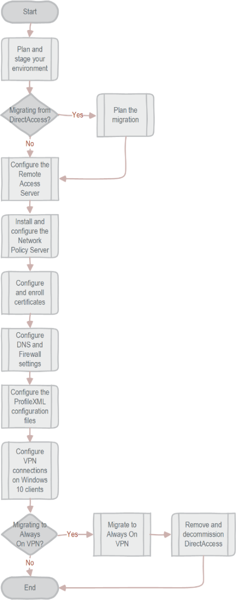
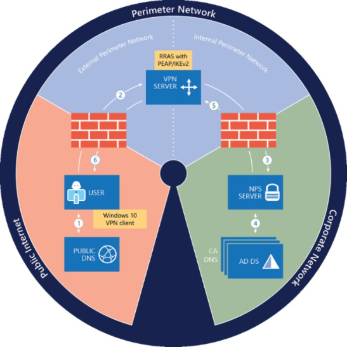

# Always On VPN Deployment and Migration Overview

>Applies To: Windows Server (Semi-Annual Channel), Windows Server 2016, Windows Server 2012 R2, Windows 10

In previous versions of the Windows VPN architecture, platform limitations made it difficult to provide the critical functionality needed to replace DirectAccess (like automatic connections initiated before users sign in). Always On VPN, however, has mitigated most of those limitations or expanded the VPN functionality beyond the capabilities of DirectAccess. Always On VPN addresses the previous gaps between Windows VPNs and DirectAccess.

## Delpoyment and Migration workflow
The Always On VPN deployment process consists of these primary components and high-level processes:

1.	**Plan and stage your environment.** Deploying Always On VPN requires proper planning to determine your deployment phases, which helps identify any issues before they affect the entire organization.
2.	**Configure the Always On VPN Server Infrastructure.** Configuring the server infrastructure is the first thing you do to deploy Always On VPN. 
3.	**Configure the Remote Access Server for Always On VPN.** The next step in the Always On VPN deployment process is to install and configure the Remote Access server role on the VPN server.
4.	**Install and configure the Network Policy Server (NPS).** The next step in the Always On VPN deployment process is to install and configure the Network Policy Server (NPS). The NPS allows you to create and enforce organization-wide network access policies for connection request authentication and authorization.
5.	**Configure DNS and Firewall settings for Always On VPN.** When remote VPN clients connect, they use the same DNS servers that your internal clients use, which allows them to resolve names in the same manner as the rest of your internal workstations. Because of this, you must ensure that the computer name that external clients use to connect to the VPN server matches the subject alternative name that is defined in the certificates you issue to the VPN server.
6. **Configure the ProfileXML configuration files.** You use ProfileXML in all the delivery methods this guide describes, including Windows PowerShell, System Center Configuration Manager, and Intune. 
7.	**Configure Always On VPN connections on Windows 10.** The final step in the Always On VPN deployment process, unless you are migrating from DirectAccess to Always On VPN, is to configure the Always On VPN connection in Windows 10 client.  If you are migrating from DirectAccess to Always On VPN, see Migrate from DirectAccess to Always On VPN section.

## VPN Connection Process Overview

The following illustration shows the infrastructure that is required to deploy Always On VPN.

1. Using public DNS servers, the Windows 10 VPN client performs a name resolution query for the IP address of the VPN gateway.

2. Using the IP address returned by DNS, the VPN client sends a connection request to the VPN gateway.

3. The VPN gateway is also configured as a Remote Authentication Dial In User Service \(RADIUS\) Client; the VPN RADIUS Client sends the connection request to the organization/corporate NPS server for connection request processing.

4. The NPS server processes the connection request, including performing authorization and authentication, and determines whether to allow or deny the connection request.

5. The NPS server forwards an Access-Accept or Access-Deny response to the VPN gateway.

6. The connection is initiated or terminated based on the response that the VPN server received from the NPS server.

For more information on each infrastructure component depicted in the illustration above, see [Always On VPN Technology Overview](always-on-vpn-technologies.md).

## Next steps
**[Plan and stage your environment](always-on-vpn-deploy-planning.md).** This section provides planning guidelines for deploying Remote Access as a single tenant VPN RAS Gateway for point\-to\-site VPN connections.

