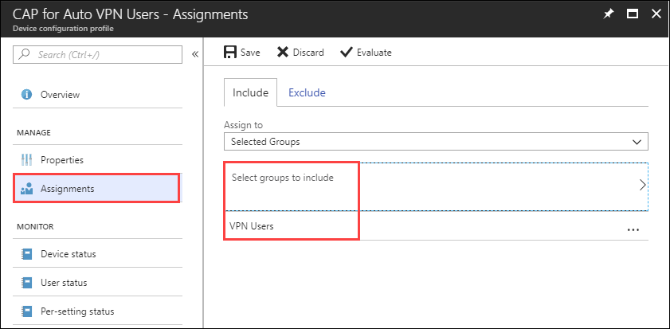

# Step 6.5. Create OMA-DM based VPNv2 Profiles to Windows 10 devices

>Applies To: Windows Server (Semi-Annual Channel), Windows Server 2016, Windows Server 2012 R2, Windows 10

&#171;  [**Previous:** Step 6.4. Deploy conditional access root certificates to on-premises AD](vpn-deploy-cond-access-root-cert-to-on-premise-ad.md)<br>
&#187; [ **Next:** Learn how conditional access for VPN works](https://docs.microsoft.com/windows/access-protection/vpn/vpn-conditional-access)

You can use one of two methods to create OMA-DM based VPNv2 profiles. The first method is a managed deployment using Intune to deploy a VPN Device Configuration policy. The second method can be used for unmanaged environments using a PowerShell script that leverages the Common Information Model, which creates a WMI session in the user’s context. From this context, it then creates a new instance of the MDM_VPNv2_01 WMI class. 

VPNv2 profiles can also be created via SCCM, Intune or with a PowerShell Script using [VPNv2 CSP settings](https://docs.microsoft.com/en-us/windows/client-management/mdm/vpnv2-csp). 

## Managed Deployment using Intune

Everything discussed in this section is the minimum needed to make this work with Conditional Access. It does not cover Split Tunneling, Using WIP, creating custom Intune device configuration profiles to get AutoVPN working, or SSO. Integrate the settings below into the VPN profile you created earlier under [Configure Windows 10 Client Always On VPN Connections](https://docs.microsoft.com/en-us/windows-server/remote/remote-access/vpn/always-on-vpn/deploy/vpn-deploy-client-vpn-connections).  In this example, we are integrating them into the [Configure the VPN client by using Intune](https://docs.microsoft.com/en-us/windows-server/remote/remote-access/vpn/always-on-vpn/deploy/vpn-deploy-client-vpn-connections#configure-the-vpn-client-by-using-intune) policy.

**Prerequisite:**<p>
You have configured the Windows 10 client computers to communicate with a VPN connection.  


**Procedure:**

1. In the Azure portal, click **Intune** > **Properties** > **Settings** > **Conditional Access**.
    
2. Under the **Base VPN** tab, extend **EAP Xml** to include a filter that gives the VPN client the logic it needs to retrieve the AAD Conditional Access certificate from the user's certificate store instead of leaving it to chance allowing it to use the first certificate discovered.

    >[!NOTE]
    >Without this, the VPN client could retrieve the user certificate issued from the on-premise certificate authority, resulting in a failed VPN connection.

    

3. Locate the section that ends with **\</AcceptServerName>\</EapType>** and insert the following string between these two values to provide the VPN client with the logic to select the AAD Conditional Access Certificate:

    ```XML
    <TLSExtensions xmlns="http://www.microsoft.com/provisioning/EapTlsConnectionPropertiesV2"><FilteringInfo xmlns="http://www.microsoft.com/provisioning/EapTlsConnectionPropertiesV3"><EKUMapping><EKUMap><EKUName>AAD Conditional Access</EKUName><EKUOID>1.3.6.1.4.1.311.87</EKUOID></EKUMap></EKUMapping><ClientAuthEKUList Enabled="true"><EKUMapInList><EKUName>AAD Conditional Access</EKUName></EKUMapInList></ClientAuthEKUList></FilteringInfo></TLSExtensions>
    ```

4. Toogle **Conditional access for this VPN connection** to **Enabled**.<p>Enabling this setting changes the **\<DeviceCompliance>\<Enabled>true\</Enabled>** setting in the VPNv2 Profile XML.<p>This tells the VPN client to call Azure AD to get a token. When the Conditional Access policy targeting '**VPN Server**' as the '**Cloud app**' has been satisfied, Azure AD issues a token in the form of a short-lived certificate that is placed into the user's certificate store.

    

5. Click **OK**.

6. Select **Assignments**, under Include, click **Select groups to include**.

7. Select the **VPN Users** group that receives this policy and click **Save**.

    

## Force MDM Policy Sync on the Client
If the VPN profile does not show up on the client device, under Settings\\Network & Internet\\VPN, you can force MDM policy to sync.

1. Sign in to a domain-joined client computer as a member of the **VPN Users** group.

2. On the Start menu, type **account**, and press Enter.

3.  In the left navigation pane, click **Access work or school**.

5.  Under Access work or school, click **Connected to <\domain> MDM** and click **Info**.

6.  Click **Sync** and verify the VPN profile appears under Settings\\Network & Internet\\VPN.


## Next step
You are done configuring the VPN profile to use Azure AD conditional access. 

|If you want to...  |Then see...  |
|---------|---------|
|Learn more about how conditional access works with VPNs  |[VPN and conditional access](https://docs.microsoft.com/windows/access-protection/vpn/vpn-conditional-access): This page provides more information about how conditional access works with VPNs.      |
|Learn more about the advanced VPN features  |[Advanced VPN Features](always-on-vpn/deploy/always-on-vpn-adv-options.md#advanced-vpn-features): This page provides guidance on how to enable VPN Traffic Filters, how to configure Automatic VPN connections using App-Triggers, and how to configure NPS to only allow VPN Connections from clients using certificates issued by Azure AD.        |


---

## Related topics
- [VPNv2 CSP](https://msdn.microsoft.com/windows/hardware/commercialize/customize/mdm/vpnv2-csp):  This topic provides you with an overview of VPNv2 CSP. The VPNv2 configuration service provider allows the mobile device management (MDM) server to configure the VPN profile of the device.

- [Configure Windows 10 Client Always On VPN Connections](https://docs.microsoft.com/en-us/windows-server/remote/remote-access/vpn/always-on-vpn/deploy/vpn-deploy-client-vpn-connections): This topic provides information about the ProfileXML options and schema, and how to create the ProfileXML VPN. After setting up the server infrastructure, you must configure the Windows 10 client computers to communicate with that infrastructure with a VPN connection. 

- [Configure the VPN client by using Intune](https://docs.microsoft.com/en-us/windows-server/remote/remote-access/vpn/always-on-vpn/deploy/vpn-deploy-client-vpn-connections#configure-the-vpn-client-by-using-intune): This topic provides information on how to deploy Windows 10 Remote Access Always On VPN profiles. Intune now uses Azure AD groups. If Azure AD Connect synced the VPN Users group from on-premises to Azure AD, then there is no need for configuring the VPN client using Intune.

---