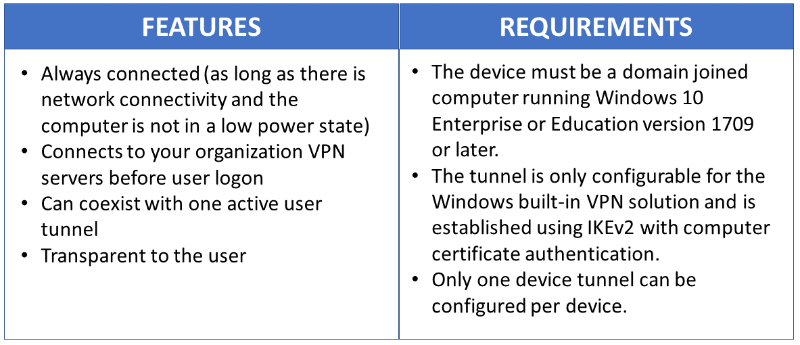

# Configure VPN Device Tunnels in Windows 10

>Applies To: Windows 10 version 1709

Always On VPN gives you the ability to create a dedicated VPN profile for device or machine. Alays On VPN connections include two types of tunnels: 
* _Device tunnel_ connects to specified VPN servers before users log on to the device. Device tunnel is used for pre-logon connectivity scenarios and device management purposes.
* _User tunnel_  connects only after a user logs on to the device. User tunnel allows users to access organization resources through VPN servers.

Unlike User Tunnel, which only connects after a user logs on to the device or machine, Device Tunnel allows the VPN to establish connectivity before user sign-in. Additionally, Device Tunnel provides feature parity with the Infrastructure Tunnel concept of DirectAccess.

You can use traffic filters to control which corporate resources as available through the Device Tunnel and when machine certificate authentication is employed. Both Device Tunnel and User Tunnel operate independently with their VPN profiles, can be connected at the same time, and can use different authentication methods and other VPN configuration settings as appropriate.

## Device Tunnel Features and Requirements



## VPN Device Tunnel Configuration

The sample profile XML below provides good guidance for scenarios where only client initiated pulls are required over the device tunnel.  Traffic filters are leveraged to restrict the device tunnel to management traffic only.  This configuration works well for Windows Update, typical Group Policy (GP) and System Center Configuration Manager (SCCM) update scenarios, as well as VPN connectivity for first logon without cached credentials, or password reset scenarios. 

On the other hand, for server initiated push cases, like Windows Remote Management (WinRM), Remote GPUpdate, and remote SCCM update scenarios – inbound traffic on the device tunnel has to be allowed, so traffic filters cannot be used.  This limitation is going to be removed in future releases.

### Sample VPN profileXML

Following is the sample VPN profileXML.

``` syntax
<VPNProfile>  
  <NativeProfile>  
<Servers>vpn.contoso.com</Servers>  
<NativeProtocolType>IKEv2</NativeProtocolType>  
<Authentication>  
  <MachineMethod>Certificate</MachineMethod>  
</Authentication>  
<RoutingPolicyType>SplitTunnel</RoutingPolicyType>  
 <!-- disable the addition of a class based route for the assigned IP address on the VPN interface -->
<DisableClassBasedDefaultRoute>true</DisableClassBasedDefaultRoute>  
  </NativeProfile> 
  <!-- use host routes(/32) to prevent routing conflicts -->  
  <Route>  
<Address>10.10.0.2</Address>  
<PrefixSize>32</PrefixSize>  
  </Route>  
  <Route>  
<Address>10.10.0.3</Address>  
<PrefixSize>32</PrefixSize>  
  </Route>  
<!-- traffic filters for the routes specified above so that only this traffic can go over the device tunnel --> 
  <TrafficFilter>  
<RemoteAddressRanges>10.10.0.2, 10.10.0.3</RemoteAddressRanges>  
  </TrafficFilter>
<!-- need to specify always on = true --> 
  <AlwaysOn>true</AlwaysOn> 
<!-- new node to specify that this is a device tunnel -->  
 <DeviceTunnel>true</DeviceTunnel>
<!--new node to register client IP address in DNS to enable manage out -->
<RegisterDNS>true</RegisterDNS>
</VPNProfile>
```

Depending on the needs of each particular deployment scenario, another VPN feature that can be configured with the device tunnel is [Trusted Network Detection](https://social.technet.microsoft.com/wiki/contents/articles/38546.new-features-for-vpn-in-windows-10-and-windows-server-2016.aspx#Trusted_Network_Detection).

```
 <!-- inside/outside detection --> 
  <TrustedNetworkDetection>corp.contoso.com</TrustedNetworkDetection> 
```

## Deployment and Testing

You can configure device tunnels by using a Windows PowerShell script and using the Windows Management Instrumentation \(WMI\) bridge. The following article provides guidelines on how to deploy a per device `(.\Device)` vs. a per user `(.\User)` profile. You must deploy the device profile in the local system context. 

For more information, see [Using PowerShell scripting with the WMI Bridge Provider](https://docs.microsoft.com/windows/client-management/mdm/using-powershell-scripting-with-the-wmi-bridge-provider).

To verify that you have successfully deployed a device profile, run the following Windows PowerShell command.

    `Get-VpnConnection -AllUserConnection`

The output displays a list of the device\-wide VPN profiles that are deployed on the device.

### Example Windows PowerShell Script

You can use the following Windows PowerShell script to assist in creating your own script for profile creation.

``` syntax
Param(
[string]$xmlFilePath,
[string]$ProfileName
)

$a = Test-Path $xmlFilePath
echo $a

$ProfileXML = Get-Content $xmlFilePath

echo $XML

$ProfileNameEscaped = $ProfileName -replace ' ', '%20'

$Version = 201606090004

$ProfileXML = $ProfileXML -replace '<', '&lt;'
$ProfileXML = $ProfileXML -replace '>', '&gt;'
$ProfileXML = $ProfileXML -replace '"', '&quot;'

$nodeCSPURI = './Vendor/MSFT/VPNv2'
$namespaceName = "root\cimv2\mdm\dmmap"
$className = "MDM_VPNv2_01"

$session = New-CimSession

try
{
$newInstance = New-Object Microsoft.Management.Infrastructure.CimInstance $className, $namespaceName
$property = [Microsoft.Management.Infrastructure.CimProperty]::Create("ParentID", "$nodeCSPURI", 'String', 'Key')
$newInstance.CimInstanceProperties.Add($property)
$property = [Microsoft.Management.Infrastructure.CimProperty]::Create("InstanceID", "$ProfileNameEscaped", 'String', 'Key')
$newInstance.CimInstanceProperties.Add($property)
$property = [Microsoft.Management.Infrastructure.CimProperty]::Create("ProfileXML", "$ProfileXML", 'String', 'Property')
$newInstance.CimInstanceProperties.Add($property)

$session.CreateInstance($namespaceName, $newInstance)
$Message = "Created $ProfileName profile."
Write-Host "$Message"
}
catch [Exception]
{
$Message = "Unable to create $ProfileName profile: $_"
Write-Host "$Message"
exit
}
$Message = "Complete."
Write-Host "$Message"
```

## Additional Resources

Following are additional resources to assist with your VPN deployment.

### VPN client configuration resources

These are VPN client configuration resources.

- [How to Create VPN profiles in System Center Configuration Manager](https://docs.microsoft.com/sccm/protect/deploy-use/create-vpn-profiles)
- [Configure Windows 10 Client Always On VPN Connections](https://docs.microsoft.com/windows-server/remote/remote-access/vpn/always-on-vpn/deploy/vpn-deploy-client-vpn-connections)
- [VPN profile options](https://docs.microsoft.com/en-us/windows/access-protection/vpn/vpn-profile-options)

### Remote Access Server \(RAS\) Gateway resources

Following are RAS Gateway resources.

- [Configure RRAS with a Computer Authentication Certificate](https://technet.microsoft.com/en-us/library/dd458982.aspx)
- [Troubleshooting IKEv2 VPN Connections](https://technet.microsoft.com/en-us/library/dd941612.aspx)
- [Configure IKEv2-based Remote Access](https://technet.microsoft.com/en-us/library/ff687731.aspx)

>[!IMPORTANT]
>When using Device Tunnel with a Microsoft RAS gateway, you will need to configure the RRAS server to support IKEv2 machine certificate authentication by enabling the **Allow machine certificate authentication for IKEv2** authentication method as described [here](https://docs.microsoft.com/en-us/previous-versions/windows/it-pro/windows-server-2008-R2-and-2008/ee922682%28v=ws.10%29). Once this setting is enabled, it is strongly recommended that the **Set-VpnAuthProtocol** PowerShell cmdlet, along with the **RootCertificateNameToAccept** optional parameter, is used to ensure that RRAS IKEv2 connections are only permitted for VPN client certificates that chain to an explicitly defined internal/private Root Certification Authority. Alternatively, the **Trusted Root Certification Authorities** store on the RRAS server should be amended to ensure that it does not contain public certification authorities as discussed [here](https://blogs.technet.microsoft.com/rrasblog/2009/06/10/what-type-of-certificate-to-install-on-the-vpn-server/). Similar methods may also need to be considered for other VPN gateways.

