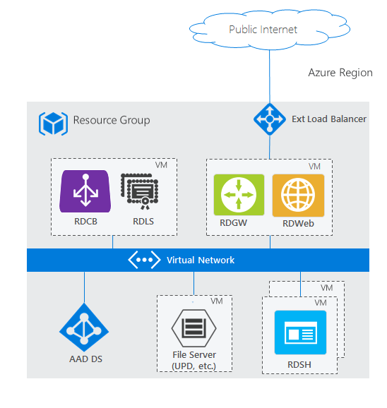

# Integrate Azure AD Domain Services with your RDS deployment

You can use [Azure AD Domain Services](/azure/active-directory-domain-services/active-directory-ds-overview) (Azure AD DS) in your Remote Desktop Services deployment in the place of Windows Server Active Directory. Azure AD DS lets you use your existing Azure AD identities in with classic Windows workloads.

With Azure AD DS you can: 
- Create an Azure environment with a local domain for organizations that are born in the cloud 
- Create an isolated Azure environment with the same identities used for your on-premise and online environment, without needing to create a site-to-site VPN or ExpressRoute 

When you finish integrating Azure AD DS into your Remote Desktop deployment, your architecture will look something like this:

To see how this architecture compares with other RDS deployment scenarios, check out [Remote Desktop Services architectures](desktop-hosting-logical-architecture.md).

To get a better understanding of Azure AD DS, check out the [Azure AD DS overview](/azure/active-directory-domain-services/active-directory-ds-overview) and [If Azure AD DS is right for you](/azure/active-directory-domain-services/active-directory-ds-comparison).

Use the following information to deploy Azure AD DS with RDS.

## Prerequisites

Before you can bring your identities from Azure AD to use in an RDS deployment, [configure Azure AD to save the hashed passwords for your users’ identities](/azure/active-directory-domain-services/active-directory-ds-getting-started-password-sync). Born in the cloud organizations don’t need to make any additional changes in their directory; however, on-premise organizations need to allow password hashes to be synchronized and stored in Azure AD, which may not be permissible to some organizations. Users will have to reset their passwords after making this configuration change.

## Deploy Azure AD DS and RDS 
Use the following steps to deploy Azure AD DS and RDS.

1. Enable [Azure AD DS](/azure/active-directory-domain-services/active-directory-ds-getting-started). Note that the linked article does the following:
   - Walk through creating the appropriate Azure AD groups for domain administration.
   - Highlight when you might have to force users to change their password so their accounts can work with Azure AD DS.

   > [!NOTE]
   > Azure AD DS support for Azure Resource Manager virtual networks is in public preview. 
   
2. Set up RDS. You can either use an Azure template or deploy RDS manually.
   - Use the [Existing AD template](https://azure.microsoft.com/resources/templates/rds-deployment-existing-ad/). Make sure to customize the following:
   Settings
      - **Resource group**: Use the resource group where you want to create the RDS resources.
         > [!NOTE] 
         > Right now this has to be the same resource group where the Azure resource manager virtual network exists.

      - **Dns Label Prefix**: Enter the URL that you want users to use to access RD Web.
      - **Ad Domain Name**: Enter the full name of your Azure AD instance, for example, "contoso.onmicrosoft.com" or "contoso.com".
      - **Ad Vnet Name** and **Ad Subnet Name**: Enter the same values that you used when you created the Azure resource manager virtual network. This is the subnet to which the RDS resources will connect.
      - **Admin Username** and **Admin Password**: Enter the credentials for an admin user that's a member of the **AAD DC Administrators** group in Azure AD.
   Template
      - Remove all properties of **dnsServers**: after selecting **Edit template** from the Azure quickstart template page, search for "dnsServers" and remove the property. One example is below:
        Image1.png
        Image2.png
   - [Deploy RDS manually](rds-deploy-infrastructure.md). 

## Known issues
Implementing Azure AD DS to replace Windows Server Active Directory for your RDS deployment eases ongoing management for your domain, but there are a few known issues:

- You'll get errors and warnings when you configure the RD licensing server. You can ignore these, but you *will* have to use an alternate method to track license compliance. (You can track logon events, connections made through the RD Gateway, or connections through the RD Connection Broker.) 
- Your users will get warnings when they connect to a full desktop. They, and you, can ignore these - despite the warnings, your users won't lose their connection to the session.
