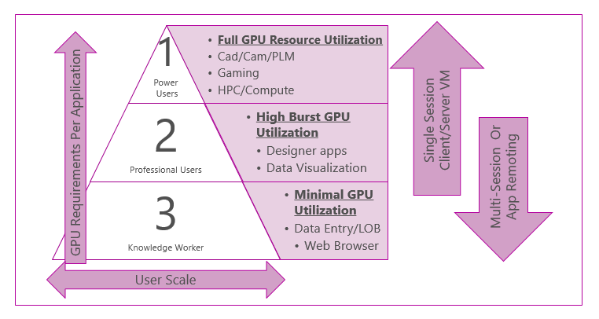

# Which graphics virtualization technology is right for you?

You have a range of options when it comes to enabling graphics rendering in Remote Desktop Services. When you are planning your virtualization environment, the following considerations drive which graphics rendering technology you choose:

In Windows Server 2016, you have two graphics virtualization technologies available with Hyper-V that let you leverage the GPU hardware:

- [Discrete Device Assignment (DDA)](#discrete-device-assignment) - For the highest performance using one or more GPUs dedicated to a VM providing native GPU driver support inside the VM. The density is low because it is limited by the number of physical GPUs available in the server. 
- [RemoteFX 3D Video Adapter (vGPU)](#remotefx-vgpu) - For knowledge worker and high-burst GPU scenarios where multiple VMs leverage one or more GPUs through para-virtualization. This solution provides higher user density per server.

The following illustration shows the graphics virtualization options in Windows Server 2016.

## Discrete Device Assignment
Discrete Device Assignment (DDA) is a hardware pass-through solution that provides the best performance, given that the VM has full access to the GPU using the native driver. Your VM user can access the full capabilities of their device as well the device’s native driver. This means the features and capabilities of running the device in a VM mirror running the same device on bare metal.

For more information about DDA, check out [Plan for deploying Discrete Device Assignment](../../virtualization/hyper-v/plan/plan-for-deploying-devices-using-discrete-device-assignment.md).

## RemoteFX 3D Video Adapter (vGPU) 
RemoteFX 3D Video Adapter (vGPU) is a graphics virtualization technology that allows the processing power of a GPU to be split across various guest operating systems to enable knowledge worker scenarios (see first graphic above). Advancements in Windows Server 2016 allow further enhancements for GPU burst scenarios, for example for designer applications and data visualization. Other feature improvements include:

- Support for Generation 2 guest VMs, Windows Server 2016 guest VMs, and Windows Client Hyper-V host.
  >[!NOTE] 
  > Remote Desktop Session Host role is not supported on a vGPU-enabled Windows Server 2016 guest VM; only single session can be hosted per vGPU-enabled Windows Server 2016 guest VM.

- Improved application compatibility and stability.
- VM Connect Enhanced Session Mode, allowing USB and clipboard redirection through VM Connect to a VM that is enabled for RemoteFX vGPU.

For more information, check out [Set up and configure RemoteFX vGPU for Remote Desktop Services](rds-remotefx-vgpu.md).

## Which should you use?

Key considerations on which virtualization technology might depend on the hardware specifications or application requirements in your environment. Here is a brief table regarding DDA and RemoteFX vGPU capabilities:

| Feature               | RemoteFX 3D Video Adapter (vGPU)                                                                       | Discrete Device Assignment                                             |
|-----------------------|-------------------------------------------------------------------------------------|------------------------------------------------------------------------|
| Device GPU assignment | Para-virtualized (many VMs to one or more GPUs)                                     | 1 or more GPU to 1 VM                                                  |
| Scale                 | Best scale / 1 GPU to many VMs                                                      | Low scale / 1 or more GPUs to 1 VM                                     |
| App compatibility     | DX 11.1, OpenGL 4.4, OpenCL 1.1                                                     | All GPU capabilities provided by vendor (DX 12, OpenGL, CUDA)          |
| AVC444                | Enabled by default (Windows 10 and Windows Server 2016)                             | Available through Group Policy (Windows 10 and Windows Server 2016)    |
| GPU VRAM              | Up to 1 GB dedicated VRAM                                                           | Up to VRAM supported by the GPU                                        |
| Frame rate            | Up to 30fps                                                                         | Up to 60fps                                                            |
| GPU driver in guest   | RemoteFX 3D adapter display driver (Microsoft)                                      | GPU vendor driver (Nvidia, AMD, Intel)                                 |
| Guest OS support      |  Windows Server 2012 R2  Windows Server 2016  Windows 7 SP1  Windows 8.1 Windows 10 |  Windows Server 2012 R2  Windows Server 2016  Windows 10 Linux         |
| Hypervisor            | Microsoft Hyper-V                                                                   | Microsoft Hyper-V                                                      |
| Host OS availability  |  Windows Server 2012 R2  Windows Server 2016 Windows 10                             | Windows Server 2016                                                    |
| GPU hardware          | Enterprise GPUs (such as Nvidia Quadro/GRID or AMD FirePro)                         | Enterprise GPUs (such as Nvidia Quadro/GRID or AMD FirePro)            |
| Server hardware       | No special requirements                                                             | Modern server, exposes IOMMU to OS (usually SR-IOV compliant hardware) |

A general rule of thumb is to use DDA for the best application compatibility since the virtual machine will have direct access to the GPU. If your applications or workloads do not have as strict GPU requirements and you want to server a wider base of users, RemoteFX 3D Video Adapter (vGPU) might work best for you.