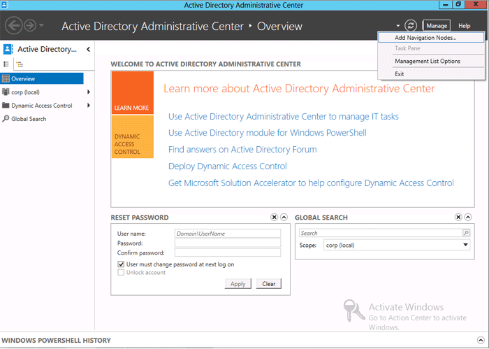
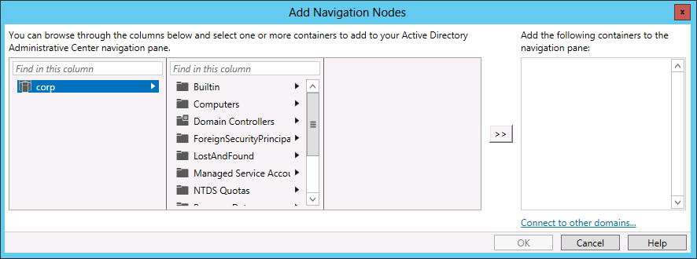
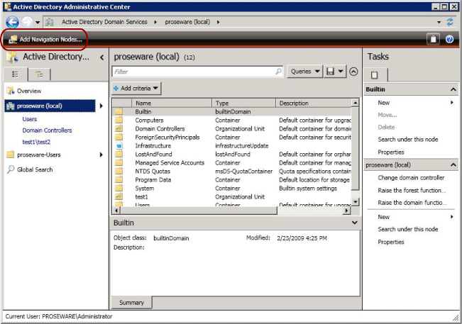
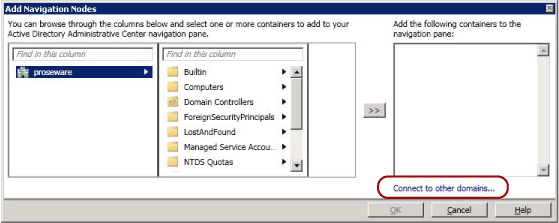

# Manage Different Domains in Active Directory Administrative Center

>Applies To: Windows Server (Semi-Annual Channel), Windows Server 2016

  When you open Active Directory Administrative, the domain that you are currently logged on to on this computer \(the local domain\) appears in the Active Directory Administrative Center navigation pane \(the left pane\). Depending on the rights of your current set of logon credentials, you can view or manage the Active Directory objects in this local domain.

 You can also use the same set of logon credentials and the same instance of Active Directory Administrative Center to view or manage Active Directory objects in any other domain in the same forest, or a domain in another forest that has an established trust with the local domain. Both one\-way trusts and two\-way trusts are supported.

> [!NOTE]
>  If there is a one\-way trust between Domain A and Domain B through which users in Domain A can access resources in Domain B but users in Domain B cannot access resources in Domain A, if you are running Active Directory Administrative Center on the computer where Domain A is your local domain, you can connect to Domain B with the current set of logon credentials and in the same instance of Active Directory Administrative Center. But if you are running Active Directory Administrative Center on the computer where Domain B is your local domain, you cannot connect to Domain A with the same set of credentials in the same instance of the Active Directory Administrative Center.

 There is no minimum group membership required to complete this procedure.

### Windows Server 2012: To manage a foreign domain in the selected instance of Active Directory Administrative Center using the current set of logon credentials

1.  To open Active Directory Administrative Center, in **Server Manager**, click **Tools**, and then click **Active Directory Administrative Center**.

    > [!NOTE]
    >  Another way to open Active Directory Administrative Center is to click **Start**, and then type **dsac.exe**.

2.  To open **Add Navigation Nodes**, click **Manage**, then click **Add Navigation Nodes** as shown in the following illustration.

     

3.  In **Add Navigation Nodes**, click **Connect to other domains** as shown in the following illustration.

     

4.  In **Connect to**, type the name of the foreign domain that you want to manage \(for example, **contoso.com**\), and then click **OK**.

5.  When you are successfully connected to the foreign domain, browse through the columns in the **Add Navigation Nodes** window, select the container or containers to add to your Active Directory Administrative Center navigation pane, and then click **OK**.

### Windows Server 2008 R2: To manage a foreign domain in the selected instance of Active Directory Administrative Center using the current set of logon credentials

1. To open Active Directory Administrative Center, click **Start**, click **Administrative Tools**, and then click **Active Directory Administrative Center**.

   > [!NOTE]
   >  Another way to open Active Directory Administrative Center is to click **Start**, click **Run**, and then type **dsac.exe**.

2. To open **Add Navigation Nodes**, near the top of the Active Directory Administrative Center window, click **Add Navigation Nodes** as shown in the following illustration.

    

   > [!NOTE]
   >  Another way to open **Add Navigation Nodes** is to right\-click anywhere in the empty space in the Active Directory Administrative Center navigation pane, and then click **Add Navigation Nodes**.

3. In **Add Navigation Nodes**, click **Connect to other domains** as shown in the following illustration.

    

4. In **Connect to**, type the name of the foreign domain that you want to manage \(for example, **contoso.com**\), and then click **OK**.

5. When you are successfully connected to the foreign domain, browse through the columns in the **Add Navigation Nodes** window, select the container or containers to add to your Active Directory Administrative Center navigation pane, and then click **OK**.

   For more information about customizing the Active Directory Administrative Center navigation pane, see [Customize the Active Directory Administrative Center Navigation Pane](customize-the-active-directory-administrative-center-navigation-pane.md).

   You can also open Active Directory Administrative Center by using a set of logon credentials that is different from your current set of logon credentials. The command in the following procedure can be useful if you are logged on to the computer that is running Active Directory Administrative Center with normal user credentials, but you want to use Active Directory Administrative Center on this computer to manage your local domain as an administrator. \(This command can also be useful if you want to use Active Directory Administrative Center to remotely manage a foreign domain that is different from your local domain with a set of credentials that is different from your current set of logon credentials. However, the foreign domain must have an established trust with the local domain.\)

   There is no minimum group membership required to complete this procedure.

### To manage a domain using logon credentials that are different from the current set of logon credentials

1.  To open Active Directory Administrative Center, at a command prompt, type the following command, and then press ENTER:

     `runas /user:<domain\user> dsac`

     Where `<domain\user>` is the set of credentials that you want to open Active Directory Administrative Center with and `dsac` is the Active Directory Administrative Center executable file name \(Dsac.exe\).

     For example, type the following command, and then press ENTER:

     `runas /user:contoso\administrator dsac`

2.  When Active Directory Administrative Center is open, browse through the navigation pane to view or manage your Active Directory domain.

