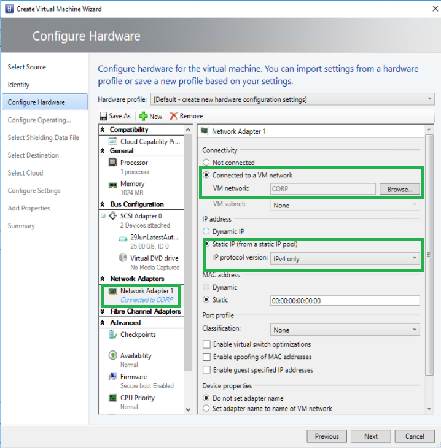
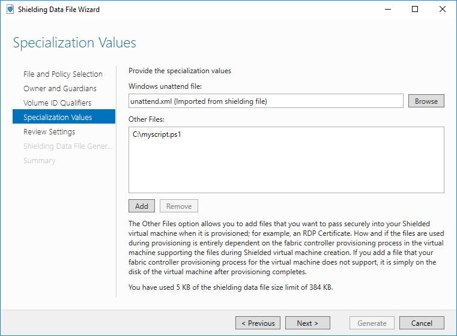
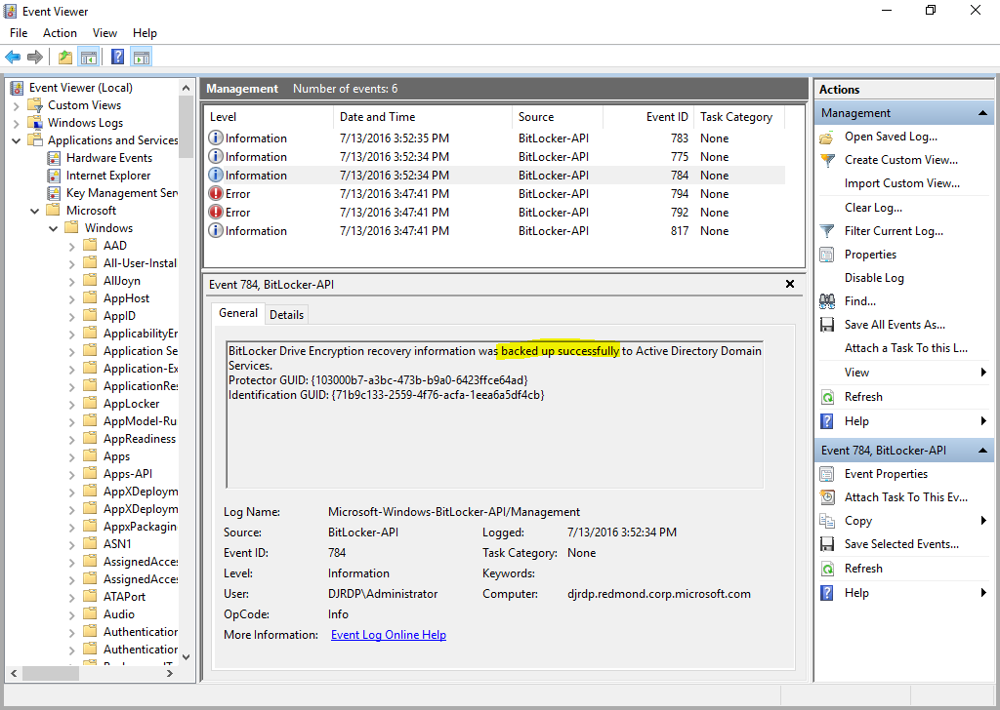

# Shielded VMs - Generate an answer file by using the New-ShieldingDataAnswerFile function

>Applies To: Windows Server 2016

As part of the process of configuring shielded VMs, you may need to create a virtual machine (VM) specialization answer file, `unattend.xml`. The **New-ShieldingDataAnswerFile** Windows PowerShell function helps you do this. You can then use the answer file when you're creating shielded VMs from a template by using System Center Virtual Machine Manager (or any other fabric controller).

For general guidelines for Unattend files for shielded VMs, see [Create an answer file](guarded-fabric-tenant-creates-shielding-data.md#create-an-answer-file).

To understand how this topic fits in the overall process of deploying shielded VMs, see [Configuration scenarios for shielded VMs in a guarded fabric](guarded-fabric-configuration-scenarios-for-shielded-vms-overview.md).
 
## Downloading the New-ShieldingDataAnswerFile function

To download the **New-ShieldingDataAnswerFile** function, go to:

https://www.powershellgallery.com/packages/GuardedFabricTools

The `unattend.xml` output can be packaged into the shielding data, along with additional artifacts, so that it can be used to create shielded VMs from templates.

The following sections show how you can use the function parameters for an `unattend.xml` file containing various options:

- [Answer file without joining a domain](#answer-file-without-joining-a-domain)
- [Answer file that includes joining a domain](#answer-file-that-includes-joining-a-domain)
- [Answer file that uses static IP](#answer-file-that-uses-static-ip)
- [Answer file that includes a setup script](#answer-file-that-includes-a-setup-script)
- [Answer file that configures BitLocker to back up the recovery password](#answer-file-that-configures-bitlocker-to-back-up-the-recovery-password)

You can also review the [function parameters](#function-parameters), later in this topic.

## Answer file without joining a domain

The following commands create an `unattend.xml` file that does not join a domain at the end of the initialization. Note that the RDP certificate is located at `C:\myRDP.pfx` with the password `RDPPassword1`. This certificate proves that this is your VM when you connect to the VM by using RDP.

```powershell
$myadminpwd = ConvertTo-SecureString "AdminPassword1" -AsPlainText -Force
$myRDPCertpwd = ConvertTo-SecureString "RDPPassword1" -AsPlainText -Force

New-ShieldingDataAnswerFile -AdminPassword $myadminpwd -RDPCertificateFilePath C:\myRDP.pfx -RDPCertificatePassword $myRDPCertpwd
```

## Answer file that includes joining a domain

The following commands create an `unattend.xml` file that joins a domain at the end of the initialization. In this example, the domain to be joined is `contoso.com` and the user name is `CONTOSO\MyUsername`. Note that the RDP certificate is located at `C:\myRDP.pfx` with the password `RDPPassword1`.

```powershell
$myadminpwd = ConvertTo-SecureString "AdminPassword1" -AsPlainText -Force
$mydomainpwd = ConvertTo-SecureString "UserPassword1" -AsPlainText -Force
$mydomaincreds = New-Object System.Management.Automation.PSCredential("CONTOSO\MyUsername", $mydomainpwd)
$myRDPCertpwd = ConvertTo-SecureString "RDPPassword1" -AsPlainText -Force

New-ShieldingDataAnswerFile -AdminPassword $myadminpwd -DomainJoin contoso.com -DomainJoinCredential $mydomaincreds -RDPCertificateFilePath C:\myRDP.pfx -RDPCertificatePassword $myRDPCertpwd
```
## Answer file that uses static IP

The following commands create an `unattend.xml` file that does not join a domain at the end of the initialization and has a static IP address.

Virtual Machine Manager provides three components to the static IP address by using an IP pool: IPv4 address, gateway address, and DNS address. If you want any additional fields to be included, such as IPv6 address, you need to manually edit the resultant `unattend.xml` file.

The following screenshots show the IP pools that you can configure in Virtual Machine Manager. These pools are necessary if you want to use static IP.

Currently, the function supports only one DNS server. Here is what your DNS settings would look like:


Here is what your summary for creating the static IP address pool would look like. In short, you must have only one network route, one gateway, and one DNS server - and you must specify your IP address.


You need to configure your network adapter for your virtual machine. The following screenshot shows where to set that configuration and how to switch it to static IP.



Then, you can use the function with the switch `-StaticIP` turned on. The function will fill the `unattend.xml` file with static IP configurations. The parameters `@IPAddr-1@`, `@NextHop-1-1@`, and `@DNSAddr-1-1@` in `unattend.xml` will then be translated to real values that you specified in Virtual Machine Manager.

```powershell
New-ShieldingDataAnswerFile -AdminPassword $myadminpwd -RDPCertificateFilePath C:\myRDP.pfx -RDPCertificatePassword $myRDPCertpwd -StaticIP

WARNING: You have enabled StaticIP.
For this answer file, we expect you to configure the VMM to contain only a single NIC and to have your Static IP Pool setup correctly. You should have configured on VMM to have one DNS server address and IPv4 static IP address. You can modify these values from the answer file if you want to do it manually:
    @IP4Addr-1@
    @MACAddr-1@
    @Prefix-1-1@
    @NextHop-1-1@
    @DnsAddr-1-1@
```

## Answer file that includes a setup script

The following commands create an `unattend.xml` file that will run a Windows PowerShell script that must be included in the shielding data file.

```powershell
New-ShieldingDataAnswerFile -AdminPassword $myadminpwd -RDPCertificateFilePath C:\myRDP.pfx -RDPCertificatePassword $myRDPCertpwd -SetupScriptFilePath C:\myscript.ps1
```
The following screenshot shows how to add the script to your shielding data file by using the Shielding Data File Wizard. Open the wizard as described in [Create a shielding data file and add guardians](guarded-fabric-tenant-creates-shielding-data.md#create-a-shielding-data-file-and-add-guardians), and add guardians. In the **Specialization Values** section, click **Add** and select your desired script.



Note that the name of the script must be the same as the script that you will include in your shielding data file. The setup process will put the file in `C:\Temp`, and the `unattend.xml` file will invoke your Windows PowerShell script from there. The `unattend.xml` file will append a Windows PowerShell command to start the script onto the `SetupComplete.cmd` file. This command runs after setup is complete.

> **Note**&nbsp;&nbsp;We recommend that you add the `Start-Transcript` command on your script so that you can see the output of your scripts. This can be useful for debugging. For more information, see [Start-Transcript](https://technet.microsoft.com/library/hh849687.aspx).

## Answer file that configures BitLocker to back up the recovery password

If the VM is domain joined, you can configure BitLocker Drive Encryption to back up the recovery password for a drive that uses BitLocker. To enable this in your `unattend.xml` file, you must pass in the switch `BackupBitLockerKeyProtector` like this:

```powershell
New-ShieldingDataAnswerFile -AdminPassword $myadminpwd -DomainJoin contoso.com -DomainJoinCredential $mydomaincreds -RDPCertificateFilePath C:\myRDP.pfx -RDPCertificatePassword $myRDPCertpwd -BackupBitLockerKeyProtector
```

After the setup is complete and you have signed in, you can check the following output file to verify that everything was backed up correctly:

`C:\Windows\Setup\Scripts\BitLockerRecoveryScriptOutput.txt`

Here is an example of what a successful output looks like:

```
Updating policy...
Computer Policy update has completed successfully.
User Policy update has completed successfully.
WARNING: ACTIONS REQUIRED:

1. Save this numerical recovery password in a secure location away from your computer:

517704-229735-170434-383603-399432-419243-060533-116479

To prevent data loss, save this password immediately. This password helps ensure that you can unlock the encrypted volume.


   ComputerName: DJRDP

VolumeType        Mount CapacityGB VolumeStatus    Encryption KeyProtector              AutoUnlockEnabled
                  Point                            Percentage
-----        --- ----- ------    ----- ------              ---------
OperatingSystem   C:    24.55      FullyEncrypted  100        {Tpm, RecoveryPassword}
```
You can also check Event Viewer to see if the key has been successfully backed up. It should look like this:



The location of BitLocker-API is **Event Viewer (Local) > Applications and Services Logs > Microsoft > Windows > BitLocker-API > Management**.

## Function parameters

You can see all the available parameters by going through the documentation online or by referring to the function like this: 

```powershell
Get-Help New-ShieldingDataAnswerFile
```

Here are all the parameters:

| **Parameter** | **Required or optional** | **Description** |
| -- | -- | -- |
| -AdminPassword &lt;SecureString&gt; | Required | Specifies the administrator&#39;s password. |
| -BackupBitLockerKeyProtector | Optional | If the VM is domain joined, specifies whether to back up the KeyProtector recovery password. |
| -DomainJoin &lt;String&gt; | Optional | Specifies the name of the domain that the VM will join. |
| -DomainJoinCredential &lt;PSCredential&gt; | Optional (required if DomainJoin) | Specifies the user credential for the domain join. |
| -DSCConfigurationID &lt;String&gt; | Optional | Specifies the configuration ID of the DSC pull server. |
| -DSCPullServerURL &lt;String&gt; | Optional | Specifies the name of the DSC pull server to pull from. |
| -Language &lt;String&gt; | Optional | Sets the language of the operating system. |
| -Path &lt;String&gt; | Optional (defaults to current path) | Sets the output of the .xml file. |
| -ProductKey &lt;String&gt; | Optional (defaults to None) | Specifies either None or UserSupplied. None is used for volume license and evaluation, whereas UserSupplied will use Virtual Machine Manager to supply the product key. |
| -RDPCertificateFilePath &lt;String&gt; | Optional | Specifies the file path of the RDP certificate that will be used to connect to the shielded VM through RDP. |
| -RDPCertificatePassword &lt;SecureString&gt; | Optional (required if RDPCertificate) | Specifies the password for the RDP certificate. |
| -SetupScriptFilePath &lt;String&gt; | Optional | Specifies the file path of a Windows PowerShell script that will run on startup of the machine. |
| -StaticIP | Optional | Sets to static IP and specifies the IP address. |

## See also

- [Configuration scenarios for shielded VMs in a guarded fabric](guarded-fabric-configuration-scenarios-for-shielded-vms-overview.md)
- [Guarded fabric and shielded VMs](guarded-fabric-and-shielded-vms-top-node.md)
