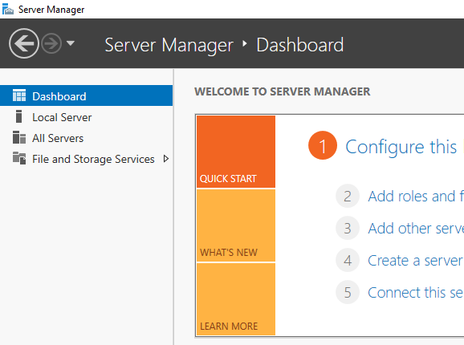
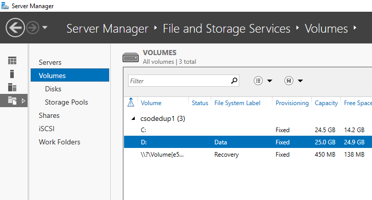

---
title:"Installing and Enabling Data Deduplication"  
description:"Learn how to install the Data Deduplication (Dedup) feature, evaluate workloads for Dedup, and enable Dedup on targeted volumes."  
author:"wmgries"  
ms.author:"wgries"   
manager:"eldenc"  
ms.date:"08/19/2016"   
ms.topic:"get-started-article"  
ms.prod:"windows-server-threshold"  
ms.service:"na"  
ms.technology:
- techgroup-storage
- dedup
---

# Installing and Enabling Data Deduplication
> Applies to Windows Server 2016

This document explains how to install the [Data Deduplication](overview.md) (commonly referred to as Dedup) feature, evaluate workloads for deduplication, and enable Dedup on targeted volumes.

## Install the Data Deduplication feature
### To install the Data Deduplication feature on the server using Server Manager
1. From the Add Roles and Feature Wizard, under Server Roles, select the **Data Deduplication** check box.  

2. Click **Next** until the **Install** button is active, and then click **Install**.  
 

### To install the Data Deduplication feature on the server using PowerShell
#### On Full and Core versions of Windows Server
1. Run the following PowerShell command as an administrator:  
`Install-WindowsFeature -Name FS-Data-Deduplication`

#### On Nano Server
1. Create a Nano Server installation with the 'Storage' installed per the [Getting Started with Nano Server](../../compute/nano-server/getting-started-with-nano-server.md#BKMK_CreateImage) guide.
2. From a Windows PC with the [Remote Server Administration Tools](https://www.microsoft.com/en-us/download/details.aspx?id=45520) (RSAT) installed (or from a Full or Core Windows Server), install the Data Deduplication with an explicit reference to the Nano Server instance (replace 'MyNanoServer' with the real name of the Nano Server instance):  
`Install-WindowsFeature -ComputerName <Nano-Server-Name> -Name FS-Data-Deduplication`  
&nbsp;  
**-- OR --**  
&nbsp;  
Remote into the Nano Server instance with PowerShell remoting and using dism to install Dedup:  
`Enter-PSSession -ComputerName MyNanoServer`  
`dism /online /enable-feature /featurename:dedup-core /all`

## Enable Data Deduplication
### Determine which workloads are candidates for Dedup
Dedup can be very effective in minimizing the costs of a server application's data consumption by reducing the amount of disk space consumed by redundant data. Before enabling Dedup, it is important that you first understand if your server application, or 'workload', is an '**Always**' workload or a '**Sometimes**' workload. Understanding the characteristics of your workload will help you get the maximum optimization and performance out of your storage. 

* '**Always**' workloads have been proven to have both datasets which benefit highly from Dedup and resource consumption patterns which are compatible with Dedup's post-processing model. Always [enable Dedup](install-enable.md#enable-dedup-lights-on) on volumes serving the following workloads:
	* General purpose file servers (GPFS) serving shares like team shares, user home folders, Work Folders, and software development shares.
	* Virtualized Desktop Infrastructure (VDI) servers.
	* Virtualized Backup Applications, such as [Microsoft Data Protection Manager (DPM)](https://technet.microsoft.com/en-us/library/hh758173.aspx).
* '**Sometimes**' workloads are other workloads which may benefit from enabling Dedup. Not every workload in every circumstance is a good candidate for Dedup. 'Sometimes' workloads fitness for Dedup should be evaluated before enabling Dedup. 'Sometimes' workloads includes workloads like:
	* General Purpose Hyper-V hosts
	* SQL Servers
	* Line-of-business (LOB) servers

### Evaluating 'Sometimes' workloads
In order to determine a 'Sometimes' workload's fitness for Dedup, there are several questions that should be answered. Whether or not the answers to these questions preclude you from enabling Dedup for a '**Sometimes**' workload is left up to you, the workload owner. It may be advisable to pilot Dedup on a test dataset for your workload to see how it performs. 

1. **Does my workload's dataset has enough duplication within it to benefit from enabling Dedup?**  
	Before enabling Dedup for a 'Sometimes' workload, investigate how much duplication your workload's dataset has by using the Data Deduplication Savings Evaluation tool, or DDPEval. This tool can be found under `C:\Windows\System32\DDPEval.exe` when [Dedup has been installed](install-enable.md#install-dedup). DDPEval can evaluate the potential for optimization against directly connected volumes (including local disks or Cluster Shared Volumes) and mapped or unmapped network shares.  
	&nbsp;   
	Running DDPEval.exe will return an output similar to the following:  
	&nbsp;  
	`Data Deduplication Savings Evaluation Tool`  
	`Copyright 2011-2012 Microsoft Corporation.  All Rights Reserved.`    
	&nbsp;   
	`Evaluated folder: E:\Test`     
	`Processed files: 34`  
	`Processed files size: 12.03MB`  
	`Optimized files size: 4.02MB`  
	`Space savings: 8.01MB`  
	`Space savings percent: 66`  
	`Optimized files size (no compression): 11.47MB`  
	`Space savings (no compression): 571.53KB`  
	`Space savings percent (no compression): 4`  
	`Files with duplication: 2`  
	`Files excluded by policy: 20`  
	`Files excluded by error: 0`  

2. **What do my workload's IO patterns to its dataset look like? What performance do I have for my workload?**  
	Writes to a deduplicated volume always occur un-deduplicated as Dedup uses a post-processing model. Therefore, the primary thing to examine is a workload's expected read patterns to the deduplicated volume. Because Dedup moves file content into the Dedup Chunk Store, and attempts to lay the Chunk Store out by file as much as possible, read operations are most performant when they are to sequential ranges of a file.  
	&nbsp;  
	Database-like workloads typically have more random-like read patterns than sequential read patterns because databases do not typically guarantee that the database layout will be optimal for all possible queries that may be run. Because the sections of the Chunk Store may exist all over the volume, accessing data ranges in the Chunk Store for database queries may introduce additional latency. High performance workloads are particularly sensitive to this extra latency, however, other database-like workloads may not be. 

	> [!Note]  
	> These concerns primarily apply to storage workloads on volumes made up of traditional rotational storage media (also known as Hard Disks drives, or HDDs). All flash storage infrastructure (also known as Solid State Disk drives, or SSDs), are less affected by random IO patterns because one of the properties of flash media is equal access time to all locations on the disk. Therefore, Dedup will not introduce the same amount of latency for reads to a workload's datasets stored on all flash media as it would on traditional rotational storage media.

3. **What are the resource requirements of my workload on the server?**  
	Because Dedup uses a post-processing model, Dedup needs to, periodically, have sufficient system resources to complete its optimization and other jobs (see more [here](understand.md#job-info)). This means that workloads that have idle time, such as in the evening or on weekends, are excellent candidates for Dedup, while workloads that run 24/7 may not be. Workloads that have no idle time may have still be good candidates for Dedup if the workload does not have high resource requirements on the server. 

### Enabling Dedup
Before enabling Dedup, you must choose the [Usage Type](understand.md#usage-type) that most closely resembles your workload. There are three Usage Types included with Dedup:

* [Default](understand.md#usage-type-default) - tuned specifically for general purpose file server.
* [Hyper-V](understand.md#usage-type-hyperv) - tuned specifically for Virtualized Desktop Intrastructure (VDI) servers.
* [Backup](understand.md#usage-type-backup) - tuned specifically for Virtualized Backup Applications, such as [Microsoft Data Protection Manager (DPM)](https://technet.microsoft.com/en-us/library/hh758173.aspx).

These Usage Types give sensible defaults for '**Always**' workloads, and also provide a good starting point for '**Sometimes**' workloads. It is possible (and recommended for '**Sometimes** workloads) to modify [Dedup's advanced settings](advanced-settings.md) to improve Dedup's performance. It is not required to configure Dedup's settings for '**Always**' workloads.

#### Using Server Manager to enable Dedup
1. Select **File and Storage Services** from the left-hand panel in Server Manager.  

2. Select **Volumes** from the **File and Storage Services** pop-out menu.  

3. Right-click on the desired volume and select **Configure Data Deduplication...**.  

4. Select the desired **Usage Type** from the drop-down box and select **OK**.

> [!Note]  
> More information on excluding file extensions or folders and selecting the deduplication schedule, including why you would want to do this, can be found here: [Configuring Data Deduplication](dedup-settings).

#### Using PowerShell to enable Dedup
1. With an administrator context, run the following PowerShell command:  
`Enable-DedupVolume -Volume <Volume-Path> -UsageType <Selected-Usage-Type>`

> [!Note]  
> The Dedup PowerShell cmdlets, including `Enable-DedupVolume`, are remotable by appending the `-CimSession` parameter with a CIM Session. This is particularly useful for running the Dedup PowerShell cmdlets remotely against a Nano Server instance. To create a new CIM Session run `New-CimSession`. More information about creating CIM Sessions can be found here: [New-CimSession](https://technet.microsoft.com/en-us/library/jj590760.aspx). 

#### Special considerations for 'Sometimes' workloads
* If the '**Sometimes**' workload have high resource requirements for on a server, Dedup jobs should be scheduled to run during the expected idle times for that workload. More information on how to configure the schedule for Dedup jobs can be found [here](advanced-settings.md#schedule-dedup-jobs). This is particularly important when running dedup on a hyper-converged host, as running Dedup during expected working hours can starve VMs.
* If the '**Sometimes**' workload does not have high resource requirements, or if it is more important that Dedup optimization jobs complete than workload reqests be served, the memory, CPU, and priority of the Dedup jobs can be adjusted. More information on how to configure the memory, CPU, and prioritization of Dedup jobs can be found [here](jobs.md#change-dedup-jobs).

## Frequently Asked Questions (FAQ)
**I want to run Dedup on the dataset for X workload... is this supported?**  
Aside from workloads which are [known not to interop with Dedup](interop.md), we fully support the data integrity of Data Deduplication with any workload. Workloads that can be characterized as '**Sometimes**' workloads are not guaranteed to be as performant with Dedup enabled as they are without Dedup. It is left up to the workload owner, you, to determine what if any performance impacts Dedup has on your workload and if this is acceptable for this workload.

**What are the volume sizing requirements for deduplicated volumes?**  
In Windows Server 2012 and Windows Server 2012 R2, volumes had to be carefully sized to ensure that Data Deduplication could keep up with the churn on the volume. This typically meant that the average maximum size of a Dedup volume for a high churn workload was 1-2 TB, and the absolute maximum recommeneded size was 10 TB. In Windows Server 2016, these limitations were removed. For more information, view [What's new in Data Deduplication](whats-new.md).

**Do I need to modify the schedule or other Dedup settings for 'Always' workloads?**  
No, the provided [Usage Types](understand.md#usage-type) were created to provide reasonable defaults for '**Always**' workloads.

**What are the memory requirements for Dedup?**