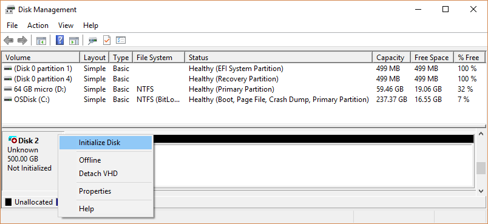

# Initialize new disks

> **Applies To:** Windows 10, Windows 8.1, Windows 7, Windows Server (Semi-Annual Channel), Windows Server 2019, Windows Server 2016, Windows Server 2012 R2, Windows Server 2012

If you add a brand new disk to your PC and it doesn't show up in File Explorer, you might need to [add a drive letter](change-a-drive-letter.md), or initialize it before using it. You can only initialize a drive that's not yet formatted. Initializing a disk erases everything on it and prepares it for use by Windows, after which you can format it and then store files on it.

> [!WARNING]
> If your disk already has files on it that you care about, don't initialize it - you'll lose all the files. Instead we recommend troubleshooting the disk to see if you can read the files - see [A disk's status is Not Initialized or the disk is missing entirely](troubleshooting-disk-management.md#disks-that-are-missing-or-not-initialized-plus-general-troubleshooting-steps).

## To initialize new disks

Here's how to initialize a new disk using Disk Management. If you prefer using PowerShell, use the [initialize-disk](/powershell/module/storage/initialize-disk) cmdlet instead.

1. Open Disk Management with administrator permissions.
 
    To do so, in the search box on the taskbar, type **Disk Management**, select and hold (or right-click) **Disk Management**, then select **Run as administrator** > **Yes**. If you can't open it as an administrator, type **Computer Management** instead, and then go to **Storage** > **Disk Management**.
1. In Disk Management, right-click the disk you want to initialize, and then click **Initialize Disk** (shown here). If the disk is listed as *Offline*, first right-click it and select **Online**.

     Note that some USB drives don't have the option to be initialized, they just get formatted and a [drive letter](change-a-drive-letter.md).

    
2. In the **Initialize Disk** dialog box (shown here), check to make sure that the correct disk is selected and then click **OK** to accept the default partition style. If you need to change the partition style (GPT or MBR) see [About partition styles - GPT and MBR](#about-partition-styles---gpt-and-mbr).

     The disk status briefly changes to **Initializing** and then to the **Online** status. If initializing fails for some reason, see [A disk's status is Not Initialized or the disk is missing entirely](troubleshooting-disk-management.md#disks-that-are-missing-or-not-initialized-plus-general-troubleshooting-steps).

    

3. Select and hold (or right-click) the unallocated space on the drive and then select **New Simple Volume**.
4. Select **Next**, specify the size of the volume (you'll likely want to stick with the default, which uses the whole drive), and then select **Next**.
5. Specify the drive letter you want to assign to the volume and then select **Next**.
6. Specify the file system you want to use (usually NTFS), select **Next**, and then **Finish**.

## About partition styles - GPT and MBR

Disks can be divided up into multiple chunks called partitions. Each partition - even if you have only one - has to have a partition style - GPT or MBR. Windows uses the partition style to understand how to access the data on the disk.

As fascinating as this probably isn't, the bottom line is that these days, you don't usually have to worry about partition style - Windows automatically uses the appropriate disk type.

Most PCs use the GUID Partition Table (GPT) disk type for hard drives and SSDs. GPT is more robust and allows for volumes bigger than 2 TB. The older Master Boot Record (MBR) disk type is used by 32-bit PCs, older PCs, and removable drives such as memory cards.

To convert a disk from MBR to GPT or vice versa, you first have to delete all volumes from the disk, erasing everything on the disk. For more info, see [Convert an MBR disk into a GPT disk](change-an-mbr-disk-into-a-gpt-disk.md), or [Convert a GPT disk into an MBR disk](change-a-gpt-disk-into-an-mbr-disk.md).
