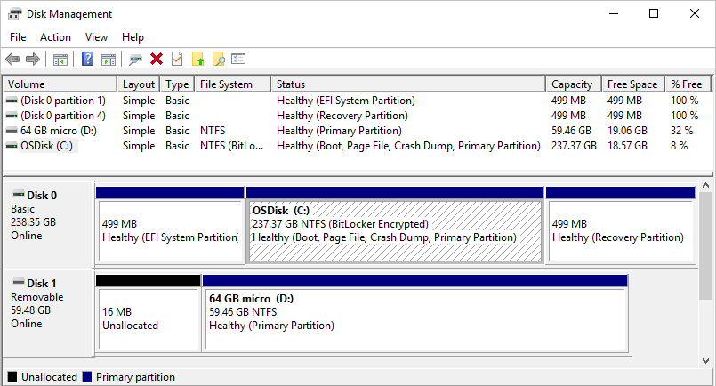

# Overview of Disk Management

> **Applies To:** Windows 10, Windows 8.1, Windows 7, Windows Server (Semi-Annual Channel), Windows Server 2016, Windows Server 2012 R2, Windows Server 2012

Disk Management is a system utility in Windows that enables you to perform advanced storage tasks such as adding or changing drive letters, shrinking volumes, and extending volumes.

Most of the time you don't need to use Disk Management - for example, here are some common tasks you might want to do but that use other tools in Windows:

- To free up disk space, see [Free up drive space in Windows 10](https://support.microsoft.com/help/12425/windows-10-free-up-drive-space).
- To defragment your drives, see [Defragment your Windows 10 PC](https://support.microsoft.com/help/4026701/windows-defragment-your-windows-10-pc).
- To take multiple hard drives and pool them together, similar to a RAID, see [Storage Spaces](https://support.microsoft.com/help/12438/windows-10-storage-spaces).

However, if you need to tinker with the drives in your PC, here are some of the things Disk Management is good for:

- To setup a new drive, see [Initializing a new drive](initialize-new-disk.md).
- To extend a volume into space that's not already part of a volume on the same drive, see [Extend a basic volume](extend-a-basic-volume.md).
- To shrink a partition, usually so that you can extend a neighboring partition, see [Shrink a basic volume](srhink-a-basic-volume.md).
- To change a drive letter or assign a new drive letter, see [Change a drive letter](change-a-drive-letter.md).

> [!TIP]
>  If you get an error or something doesn't work when following these procedures, take a peek at the [Troubleshooting Disk Management](troubleshooting-disk-management.md) topic. If that doesn't help - don't panic! There's a ton of info on the [Microsoft community](https://answers.microsoft.com/en-us/windows) site - try searching there, and if you still need help, post a question there and Microsoft or other members of the community will try to help. If you have feedback on how to improve these topics, we'd love to hear from you! Just answer the *Is this page helpful?* prompt, and leave any comments there or in the public comments thread at the bottom of this topic.

## About those extra recovery partitions

In case you're curious (we've read your comments!), Windows typically includes three partitions on your main drive (usually the C:\ drive):

- **EFI system partition** - This is used by modern PCs to start (boot) your PC and your operating system.
- **Windows operating system drive (C:)** - This is where Windows is installed, and usually where you put the rest of your apps and files.
- **Recovery partition** - This is where special tools are stored to help you recover Windows in case it has trouble starting or runs into other serious issues.

Although Disk Management might show the EFI system partition and the recovery partition as 100% free, it's lying. These partitions are generally pretty full with really important files your PC needs to operate properly. It's best to just leave them alone to do their jobs starting your PC and helping you recover from problems.

## See also

- [Manage disks](manage-disks.md)
- [Manage basic volumes](manage-basic-volumes.md)
- [Troubleshooting Disk Management](troubleshooting-disk-management.md)
- [Recovery options in Windows 10](https://support.microsoft.com/help/12415/windows-10-recovery-options)
- [Find lost files after the update to Windows 10](https://support.microsoft.com/help/12386/windows-10-find-lost-files-after-update)
- [Back up and restore your files](https://support.microsoft.com/help/17143/windows-10-back-up-your-files)
- [Create a recovery drive](https://support.microsoft.com/help/4026852/windows-create-a-recovery-drive)
- [Create a system restore point](https://support.microsoft.com/help/4027538/windows-create-a-system-restore-point)
- [Find my BitLocker recovery key](https://support.microsoft.com/help/4026181/windows-find-my-bitlocker-recovery-key)
