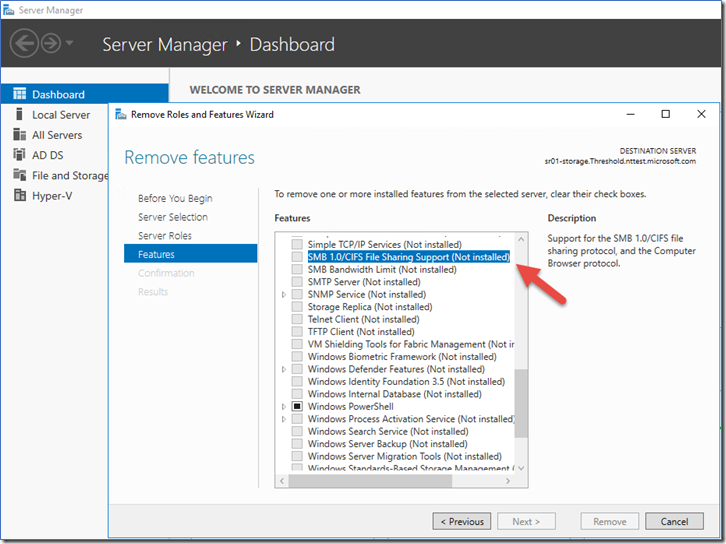
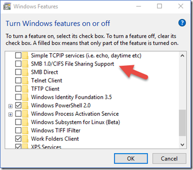
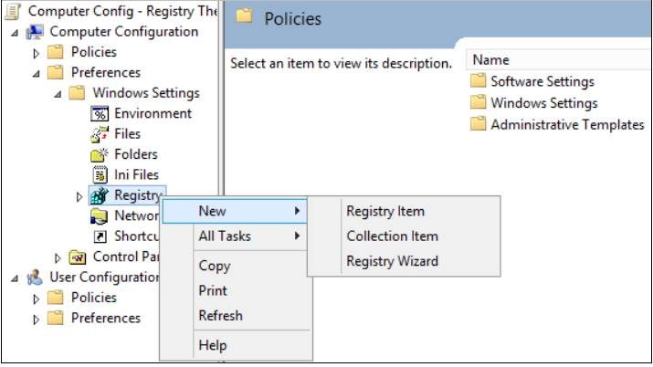
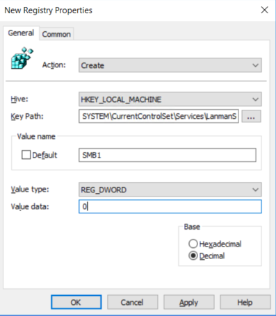
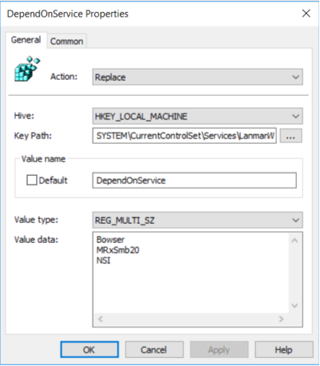
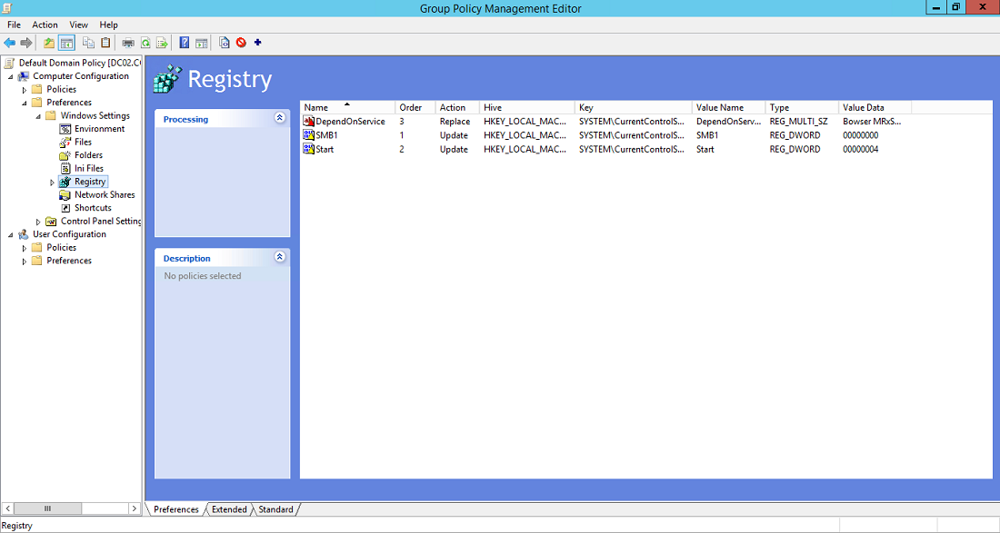

# How to detect, enable and disable SMBv1, SMBv2, and SMBv3 in Windows

>Applies to: Windows 10, Windows 8.1, Windows 8, Windows Server 2019, Windows Server 2016, Windows Server 2012 R2, Windows Server 2012

This article describes how to enable and disable Server Message Block (SMB) version 1 (SMBv1), SMB version 2 (SMBv2), and SMB version 3 (SMBv3) on the SMB client and server components.

While disabling or removing SMBv1 might cause some compatibility issues with old computers or software, SMBv1 has significant security vulnerabilities and [we strongly encourage you not to use it](https://techcommunity.microsoft.com/t5/storage-at-microsoft/stop-using-smb1/ba-p/425858).

## Disabling SMBv2 or SMBv3 for troubleshooting

While we recommend that you keep SMBv2 and SMBv3 enabled, you might find it useful to disable one temporarily for troubleshooting, as described in [How to detect status, enable, and disable SMB protocols on the SMB Server](detect-enable-and-disable-smbv1-v2-v3#how-to-detect-status-enable-and-disable-smb-protocols-on-the-smb-server).

In Windows 10, Windows 8.1, and Windows 8, Windows Server 2019, Windows Server 2016, Windows Server 2012 R2, and Windows Server 2012, disabling SMBv3 deactivates the following functionality (and also the SMBv2 functionality that's described in the previous list):

- Transparent Failover - clients reconnect without interruption to cluster nodes during maintenance or failover    
- Scale Out – concurrent access to shared data on all file cluster nodes     
- Multichannel - aggregation of network bandwidth and fault tolerance if multiple paths are available between client and server  
- SMB Direct – adds RDMA networking support for very high performance, with low latency and low CPU utilization    
- Encryption – Provides end-to-end encryption and protects from eavesdropping on untrustworthy networks    
- Directory Leasing - Improves application response times in branch offices through caching    
- Performance Optimizations - optimizations for small random read/write I/O

In Windows 7 and Windows Server 2008 R2, disabling SMBv2 deactivates the following functionality: 
 
- Request compounding - allows for sending multiple SMB 2 requests as a single network request    
- Larger reads and writes - better use of faster networks    
- Caching of folder and file properties - clients keep local copies of folders and files    
- Durable handles - allow for connection to transparently reconnect to the server if there is a temporary disconnection    
- Improved message signing - HMAC SHA-256 replaces MD5 as hashing algorithm    
- Improved scalability for file sharing - number of users, shares, and open files per server greatly increased    
- Support for symbolic links    
- Client oplock leasing model - limits the data transferred between the client and server, improving performance on high-latency networks and increasing SMB server scalability    
- Large MTU support - for full use of 10-gigabye (GB) Ethernet    
- Improved energy efficiency - clients that have open files to a server can sleep    

The SMBv2 protocol was introduced in Windows Vista and Windows Server 2008, while the SMBv3 protocol was introduced in Windows 8 and Windows Server 2012. For more information about the capabilities of SMBv2 and SMBv3 capabilities, see the following articles:

[Server Message Block overview](/previous-versions/windows/it-pro/windows-server-2012-r2-and-2012/hh831795(v=ws.11))

[What's New in SMB](/previous-versions/windows/it-pro/windows-server-2008-r2-and-2008/ff625695(v=ws.10))  

## How to gracefully remove SMB v1 in Windows 8.1, Windows 10, Windows 2012 R2, Windows Server 2016, and Windows Server 2019

#### PowerShell methods

##### SMB v1 (client and server)

- Detect: 

  ```PowerShell
  Get-WindowsOptionalFeature -Online -FeatureName smb1protocol
  ```

- Disable: 

  ```PowerShell
  Disable-WindowsOptionalFeature -Online -FeatureName smb1protocol
  ```

- Enable: 

  ```PowerShell
  Enable-WindowsOptionalFeature -Online -FeatureName smb1protocol
  ```

#### Windows Server 2012 R2, Windows Server 2016, Windows Server 2019: Server Manager method for disabling SMB

##### SMB v1



#### Windows 8.1 and Windows 10: PowerShell method

##### SMB v1 Protocol

- Detect: 
  
  ```PowerShell
  Get-WindowsOptionalFeature –Online –FeatureName SMB1Protocol
  ```

- Disable: 

  ```PowerShell
  Disable-WindowsOptionalFeature -Online -FeatureName SMB1Protocol
  ```

- Enable: 

  ```PowerShell
  Enable-WindowsOptionalFeature -Online -FeatureName SMB1Protocol
  ```

##### SMB v2/v3 Protocol (only disables SMB v2/v3 Server)

- Detect: 
  
  ```PowerShell
  Get-SmbServerConfiguration | Select EnableSMB2Protocol
  ```

- Disable: 
  
  ```PowerShell
  Set-SmbServerConfiguration –EnableSMB2Protocol $false
  ```

- Enable:

  ```PowerShell
  Set-SmbServerConfiguration –EnableSMB2Protocol $true
  ```

#### Windows 8.1 and Windows 10: Add or Remove Programs method



## How to detect status, enable, and disable SMB protocols on the SMB Server

### For Windows 8 and Windows Server 2012

Windows 8 and Windows Server 2012 introduce the new **Set-SMBServerConfiguration** Windows PowerShell cmdlet. The cmdlet enables you to enable or disable the SMBv1, SMBv2, and SMBv3 protocols on the server component.  

> [!NOTE]   
> When you enable or disable SMBv2 in Windows 8 or Windows Server 2012, SMBv3 is also enabled or disabled. This behavior occurs because these protocols share the same stack.     

You do not have to restart the computer after you run the **Set-SMBServerConfiguration** cmdlet. 

##### SMB v1 on SMB Server

- Detect: 
  
  ```PowerShell
  Get-SmbServerConfiguration | Select EnableSMB1Protocol
  ```

- Disable: 

  ```PowerShell
  Set-SmbServerConfiguration -EnableSMB1Protocol $false
  ```

- Enable: 
  ```PowerShell
  Set-SmbServerConfiguration -EnableSMB1Protocol $true
  ```

For more information, see [Server storage at Microsoft](https://techcommunity.microsoft.com/t5/Storage-at-Microsoft/Stop-using-SMB1/ba-p/425858). 
##### SMB v2/v3 on SMB Server

- Detect:

  ```PowerShell
  Get-SmbServerConfiguration | Select EnableSMB2Protocol
  ```

- Disable: 
  
  ```PowerShell
  Set-SmbServerConfiguration -EnableSMB2Protocol $false
  ```

- Enable:
  
  ```PowerShell
  Set-SmbServerConfiguration -EnableSMB2Protocol $true
  ```

### For Windows 7, Windows Server 2008 R2, Windows Vista, and Windows Server 2008

To enable or disable SMB protocols on an SMB Server that is running Windows 7, Windows Server 2008 R2, Windows Vista, or Windows Server 2008, use Windows PowerShell or Registry Editor. 

#### PowerShell methods

> [!NOTE]
> This method requires PowerShell 2.0 or later version of PowerShell.

##### SMB v1 on SMB Server

Detect:

```PowerShell
Get-Item HKLM:\SYSTEM\CurrentControlSet\Services\LanmanServer\Parameters | ForEach-Object {Get-ItemProperty $_.pspath}
```

Default configuration = Enabled (No registry key is created), so no SMB1 value will be returned

Disable:

```PowerShell
Set-ItemProperty -Path "HKLM:\SYSTEM\CurrentControlSet\Services\LanmanServer\Parameters" SMB1 -Type DWORD -Value 0 –Force
```

Enable:  

```PowerShell
Set-ItemProperty -Path "HKLM:\SYSTEM\CurrentControlSet\Services\LanmanServer\Parameters" SMB1 -Type DWORD -Value 1 –Force
```  

**Note** You must restart the computer after you make these changes. 
For more information, see [Server storage at Microsoft](https://techcommunity.microsoft.com/t5/storage-at-microsoft/stop-using-smb1/ba-p/425858). 
##### SMB v2/v3 on SMB Server

Detect:  

```PowerShell
Get-ItemProperty HKLM:\SYSTEM\CurrentControlSet\Services\LanmanServer\Parameters | ForEach-Object {Get-ItemProperty $_.pspath} 
```

Disable:

```PowerShell
Set-ItemProperty -Path "HKLM:\SYSTEM\CurrentControlSet\Services\LanmanServer\Parameters" SMB2 -Type DWORD -Value 0 –Force  
```

Enable:

```PowerShell
Set-ItemProperty -Path "HKLM:\SYSTEM\CurrentControlSet\Services\LanmanServer\Parameters" SMB2 -Type DWORD -Value 1 –Force 
```

> [!NOTE]
> You must restart the computer after you make these changes. 

#### Registry Editor

> [!IMPORTANT]
> Follow the steps in this section carefully. Serious problems might occur if you modify the registry incorrectly. Before you modify it, [back up the registry for restoration](https://support.microsoft.com/help/322756) in case problems occur.
 
To enable or disable SMBv1 on the SMB server, configure the following registry key:

**HKEY_LOCAL_MACHINE\SYSTEM\CurrentControlSet\Services\LanmanServer\Parameters**

```
Registry entry: SMB1
REG_DWORD: 0 = Disabled
REG_DWORD: 1 = Enabled
Default: 1 = Enabled (No registry key is created)
```

To enable or disable SMBv2 on the SMB server, configure the following registry key: 

**HKEY_LOCAL_MACHINE\SYSTEM\CurrentControlSet\Services\LanmanServer\Parameters**

```
Registry entry: SMB2
REG_DWORD: 0 = Disabled
REG_DWORD: 1 = Enabled
Default: 1 = Enabled (No registry key is created) 
```

> [!NOTE]
> You must restart the computer after you make these changes. 

## How to detect status, enable, and disable SMB protocols on the SMB Client

### For Windows Vista, Windows Server 2008, Windows 7, Windows Server 2008 R2, Windows 8, and Windows Server 2012

> [!NOTE]
> When you enable or disable SMBv2 in Windows 8 or in Windows Server 2012, SMBv3 is also enabled or disabled. This behavior occurs because these protocols share the same stack. 

##### SMB v1 on SMB Client

- Detect
  
  ```cmd
  sc.exe qc lanmanworkstation
  ```

- Disable:
  
  ```cmd
  sc.exe config lanmanworkstation depend= bowser/mrxsmb20/nsi
  sc.exe config mrxsmb10 start= disabled
  ```

- Enable:

  ```cmd
  sc.exe config lanmanworkstation depend= bowser/mrxsmb10/mrxsmb20/nsi
  sc.exe config mrxsmb10 start= auto
  ```

For more information, see [Server storage at Microsoft](https://techcommunity.microsoft.com/t5/storage-at-microsoft/stop-using-smb1/ba-p/425858) 
##### SMB v2/v3 on SMB Client

- Detect:

  ```cmd
  sc.exe qc lanmanworkstation
  ```

- Disable:

  ```cmd
  sc.exe config lanmanworkstation depend= bowser/mrxsmb10/nsi
  sc.exe config mrxsmb20 start= disabled 
  ```

- Enable:

  ```cmd
  sc.exe config lanmanworkstation depend= bowser/mrxsmb10/mrxsmb20/nsi
  sc.exe config mrxsmb20 start= auto
  ```

> [!NOTE]
> - You must run these commands at an elevated command prompt.    
> - You must restart the computer after you make these changes.    
 

## Disable SMBv1 Server with Group Policy

This procedure configures the following new item in the registry:

**HKEY_LOCAL_MACHINE\SYSTEM\CurrentControlSet\Services\LanmanServer\Parameters** 

- Registry entry: **SMB1** 
- REG_DWORD: **0** = Disabled   

To configure this by using Group Policy, follow these steps:
 
1. Open the **Group Policy Management Console**. Right-click the Group Policy object (GPO) that should contain the new preference item, and then click **Edit**.

2. In the console tree under **Computer Configuration**, expand the **Preferences** folder, and then expand the **Windows Settings** folder.

3. Right-click the **Registry** node, point to **New**, and select **Registry Item**.

       
 
In the **New Registry Properties**dialog box, select the following: 
 
- **Action**: Create    
- **Hive**: HKEY_LOCAL_MACHINE    
- **Key Path**: SYSTEM\CurrentControlSet\Services\LanmanServer\Parameters    
- **Value name**: SMB1    
- **Value type**: REG_DWORD    
- **Value data**: 0    
 


This disables the SMBv1 Server components. This Group Policy must be applied to all necessary workstations, servers, and domain controllers in the domain.

> [!NOTE]
> [WMI filters](/previous-versions/windows/it-pro/windows-server-2008-r2-and-2008/cc947846(v=ws.10)) can also be set to exclude unsupported operating systems or selected exclusions, such as Windows XP.

> [!IMPORTANT]
> Be careful when you make these changes on domain controllers on which legacy Windows XP or older Linux and third-party systems (that do not support SMBv2 or SMBv3) require access to SYSVOL or other file shares where SMB v1 is being disabled.     

## Disable SMBv1 Client with Group Policy

To disable the SMBv1 client, the services registry key needs to be updated to disable the start of **MRxSMB10** and then the dependency on **MRxSMB10** needs to be removed from the entry for **LanmanWorkstation** so that it can start normally without requiring **MRxSMB10** to first start.

This will update and replace the default values in the following two items in the registry: 

**HKEY_LOCAL_MACHINE\SYSTEM\CurrentControlSet\services\mrxsmb10** 

Registry entry: **Start** REG_DWORD: **4**= Disabled

**HKEY_LOCAL_MACHINE\SYSTEM\CurrentControlSet\Services\LanmanWorkstation** 

Registry entry: **DependOnService** REG_MULTI_SZ: **"Bowser","MRxSmb20″,"NSI"**   

> [!NOTE]
> The default included MRxSMB10 which is now removed as dependency.

To configure this by using Group Policy, follow these steps:
 
1. Open the **Group Policy Management Console**. Right-click the Group Policy object (GPO) that should contain the new preference item, and then click **Edit**.

2. In the console tree under **Computer Configuration**, expand the **Preferences** folder, and then expand the **Windows Settings** folder.

3. Right-click the **Registry** node, point to **New**, and select **Registry Item**.    

4. In the **New Registry Properties** dialog box, select the following: 
 
   - **Action**: Update
   - **Hive**: HKEY_LOCAL_MACHINE
   - **Key Path**: SYSTEM\CurrentControlSet\services\mrxsmb10
   - **Value name**: Start
   - **Value type**: REG_DWORD
   - **Value data**: 4
 
   

5. Then remove the dependency on the **MRxSMB10** that was just disabled.

   In the **New Registry Properties** dialog box, select the following: 
 
   - **Action**: Replace
   - **Hive**: HKEY_LOCAL_MACHINE
   - **Key Path**: SYSTEM\CurrentControlSet\Services\LanmanWorkstation
   - **Value name**: DependOnService
   - **Value type**: REG_MULTI_SZ 
   - **Value data**:
      - Bowser
      - MRxSmb20
      - NSI
 
   > [!NOTE]
   > These three strings will not have bullets (see the following screen shot).

    

   The default value includes **MRxSMB10** in many versions of Windows, so by replacing them with this multi-value string, it is in effect removing **MRxSMB10** as a dependency for **LanmanServer** and going from four default values down to just these three values above.

   > [!NOTE]
   > When you use Group Policy Management Console, you don't have to use quotation marks or commas. Just type the each entry on individual lines.

6. Restart the targeted systems to finish disabling SMB v1.

### Auditing SMBv1 usage

To determine which clients are attempting to connect to an SMB server with SMBv1, you can enable auditing on Windows Server 2016, Windows 10, and Windows Server 2019. You can also audit on Windows 7 and Windows Server 2008 R2 if they installed the May 2018 monthly update and on Windows 8, Windows 8.1, Windows Server 2012, and Windows Server 2012 R2 if they installed the July 2017 monthly update. 

- Enable:
  
  ```PowerShell
  Set-SmbServerConfiguration –AuditSmb1Access $true
  ```

- Disable: 
  
  ```PowerShell
  Set-SmbServerConfiguration –AuditSmb1Access $false
  ```
  
- Detect: 
  
  ```PowerShell
  Get-SmbServerConfiguration | Select AuditSmb1Access
  ```

When SMBv1 auditing is enabled, event 3000 appears in the "Microsoft-Windows-SMBServer\Audit" event log, identifying each client that attempts to connect with SMBv1.

### Summary

If all the settings are in the same Group Policy Object (GPO), Group Policy Management displays the following settings.

 

### Testing and validation

After these are configured, allow the policy to replicate and update. As necessary for testing, run **gpupdate /force** at a command prompt, and then review the target computers to make sure that the registry settings are applied correctly. Make sure SMB v2 and SMB v3 is functioning for all other systems in the environment.

> [!NOTE]
> Do not forget to restart the target systems.
