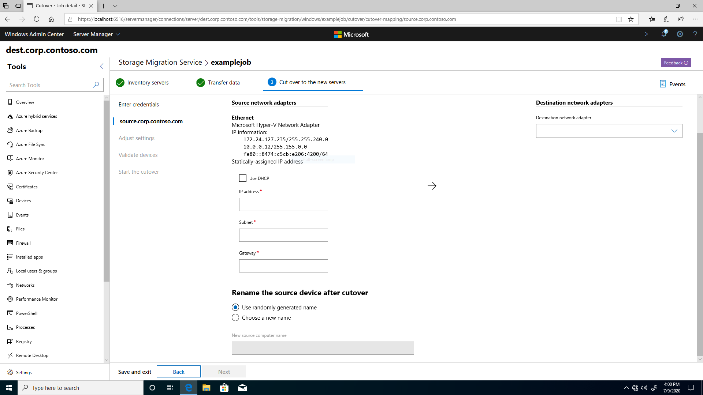
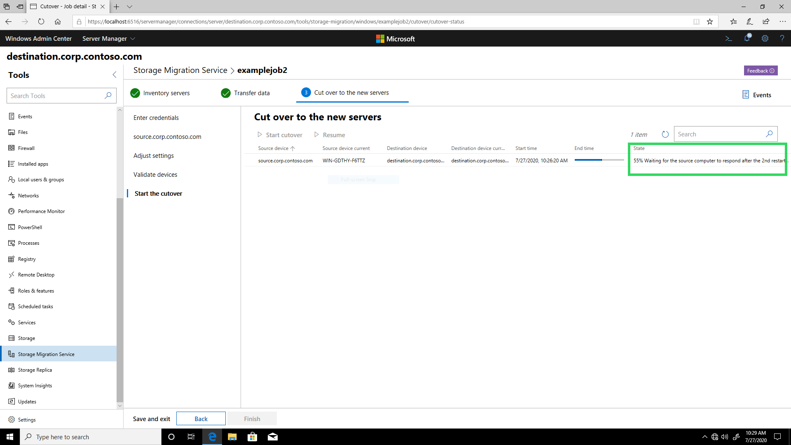

# How cutover works in Storage Migration Service

Cutover is the phase of migration that moves the network identity of the source computer to the destination computer. After cutover, the source computer will still contain the same files as before, but it won't be available to users and apps.

## Summary

__Figure 1: Storage Migration Service cutover configuration__

Before cutover starts, you provide the network configuration information needed to cut over from the source computer to the destination computer. You can also choose a new unique name for the source computer or let Storage Migration Service create a random one.

Then, Storage Migration Service takes the following steps to cut over the source computer to the destination computer:

1. We connect to the source and destination computers. They should both already have the following firewall rules enabled inbound:
    * File and Printer Sharing (SMB-In), TCP Port 445
    * Netlogon Service (NP-In), TCP Port 445
    * Windows Management Instrumentation (DCOM-In), TCP Port 135
    * Windows Management Instrumentation (WMI-In), TCP, Any Port

2. We set security permissions on the destination computer in Active Directory Domain Services to match the source computer's permissions.

3. We create a temporary local user account on the source computer. If the computer is domain-joined, the account username is "MsftSmsStorMigratSvc". We disable the [local account token filter policy](https://support.microsoft.com/help/951016/description-of-user-account-control-and-remote-restrictions-in-windows) on the source computer to allow the account through, and then connect to the source computer. We make this temporary account so that when we restart and remove the source computer from the domain later, we can still access the source computer.

4. We repeat the previous step on the destination computer.

5. We remove the source computer from the domain to free up its Active Directory account, which the destination computer will later take over.

6. We map network interfaces on the source computer and rename the source computer.

7. We add the source computer back to the domain. The source computer now has a new identity and is available to admins, but not to users and apps.

8. On the source computer, we remove any lingering alternate computer names, remove the temporary local account we created, and re-enable the local account token filter policy.

9. We remove the destination computer from the domain.

10. We replace the IP addresses on the destination computer with the IP information provided by the source, and then rename the destination computer to the source computer's original name.

11. We join the destination computer back to the domain. When joined, it uses the source computer's original Active Directory computer account. This preserves group memberships and security ACLs. The destination computer now has the identity of the source computer.

12. On the destination computer, we remove any lingering alternate computer names, remove the temporary local account we created, and re-enable the local account token filter policy, completing cutover.

After cutover finishes, the destination computer has taken on the identity of the source computer, and you can then decommission the source computer.

## Detailed stages

__Figure 2: Storage Migration Service showing a cutover stage description__

You can keep track of cutover progress through descriptions of each stage that appear as shown in the figure above. The following table shows each possible stage along with its progress, description, and any clarifying notes.

|  Progress | Description                                                                                               |  Notes |
|:-----|:--------------------------------------------------------------------------------------------------------------------|:---|
|  0% | The cutover is idle. |   |
| 2%  | Connecting to the source computer... |   Please ensure that the [requirements for both source and destination computers](https://docs.microsoft.com/windows-server/storage/storage-migration-service/overview#security-requirements-the-storage-migration-service-proxy-service-and-firewall-ports) are fulfilled.|
| 5%  | Connecting to the destination computer... |   |
| 6%  | Setting security permissions on the computer object in Active Directory... |   Replicates the source computer's Active Directory object security permissions on the destination computer.|
| 8%  | Making sure that the temporary account that we created was successfully deleted on the source computer... |   Makes sure that we can create a temporary account with the same name.|
| 11% | Creating a temporary local user account on the source computer... |   If the source computer is domain-joined, the temporary account username is "MsftSmsStorMigratSvc". The password consists of 127 random unicode wide characters with letters, numbers, symbols, and case changes. If the source computer is in a workgroup, we use the original source credentials.|
| 13% | Setting the local account token filter policy on the source computer... |   Disables the policy so that we can connect to the source when it's not joined to the domain. Learn more about the local account token filter policy [here](https://support.microsoft.com/help/951016/description-of-user-account-control-and-remote-restrictions-in-windows).|
| 16% | Connecting to the source computer using the temporary local user account... |   |
| 19% | Making sure that the temporary account that we created was successfully deleted on the destination computer... |   |
| 22% | Creating a temporary local user account on the destination computer... | If the destination computer is domain-joined, the temporary account username is "MsftSmsStorMigratSvc". The password consists of 127 random unicode wide characters with letters, numbers, symbols, and case changes. If the destination computer is in a workgroup, we use the original destination credentials. |
| 25% | Setting the local account token filter policy on the destination computer... | Disables the policy so that we can connect to the destination when it's not joined to the domain. Learn more about the local account token filter policy [here](https://support.microsoft.com/help/951016/description-of-user-account-control-and-remote-restrictions-in-windows).	|
| 27% | Connecting to the destination computer using the temporary local user account... |   |
| 30% | Removing the source computer from the domain... |   |
| 31% | Collecting the source computer IP addresses. |   Applies only to Linux source computers. |
| 33% | Restarting the source computer... (1st restart) |   |
| 36% | Waiting for the source computer to respond after the 1st restart... |   Likely to become unresponsive if the source computer isn't covered by a DHCP subnet, but you selected DHCP during network configuration.|
| 38% | Mapping network interfaces on the source computer... |   |
| 41% | Renaming the source computer... |   |
| 42% | Restarting the source computer... (1st restart) |   Applies only to Linux source computers.|
| 43% | Restarting the source computer... (2nd restart) |   Applies only to domain-joined Windows Server 2003 source computers.|
| 43% | Waiting for the source computer to respond after the 1st restart... |   |
| 43% | Waiting for the source computer to respond after the 2nd restart... |   |
| 44% | Adding the source computer to the domain... |   |
| 47% | Restarting the source computer... (1st restart) |   |
| 50% | Restarting the source computer... (2nd restart) |   |
| 51% | Restarting the source computer... (3rd restart) |   Applies only to Windows Server 2003 source computers.|
| 52% | Waiting for the source computer to respond... |   |
| 52% | Waiting for the source computer to respond after the 1st restart... |   |
| 55% | Waiting for the source computer to respond after the 2nd restart... |   |
| 56% | Waiting for the source computer to respond after the 3rd restart... |   |
| 57% | Removing alternate computer names on the source... |   Ensures that the source is unreachable to other users and apps. For more info, see [Netdom computername](https://docs.microsoft.com/previous-versions/windows/it-pro/windows-server-2012-R2-and-2012/cc835082(v=ws.11)). |
| 58% | Removing a temporary local account we created on the source computer... |   |
| 61% | Resetting the local account token filter policy on the source computer... |   Enables the policy.|
| 63% | Removing the destination computer from the domain... |   |
| 66% | Restarting the destination computer... (1st restart) |   |
| 69% | Waiting for the destination computer to respond after the 1st restart... |   |
| 72% | Mapping network interfaces on destination computer... |  Maps each network adapter and IP address from the source computer onto the destination computer, replacing the destination's network information.   |
| 75% | Renaming the destination computer... |   |
| 77% | Adding the destination computer to the domain... |  The destination computer takes over the old source computer's Active Directory object. This can fail if the destination user isn't a member of Domain Admins or doesn't have admin rights to the source computer Active Directory object. You can specify alternate destination credentials in the "Enter credentials" step before cutover starts.|
| 80% | Restarting the destination computer... (1st restart) |   |
| 83% | Restarting the destination computer... (2nd restart) |   |
| 84% | Waiting for the destination computer to respond... |   |
| 86% | Waiting for the destination computer to respond after the 1st restart... |   |
| 88% | Waiting for the destination computer to respond after the 2nd restart... |   |
| 91% | Waiting for the destination computer to respond with the new name... |  May take a long time due to Active Directory and DNS replication. |
| 93% | Removing alternate computer names on the destination... |   Ensures that the destination name has been replaced.|
| 94% | Removing a temporary local account we created on the destination computer...|   |
| 97% | Resetting the local account token filter policy on the destination computer... |   Enables the policy.|
| (100%) | Succeeded |   |

## FAQ

### __Is domain controller migration supported?__

Not currently, but see the [FAQ page](https://docs.microsoft.com/windows-server/storage/storage-migration-service/faq#is-domain-controller-migration-supported) for a workaround.

## Known issues
>Ensure that you have fulfilled the requirements from the [Storage Migration Service overview](overview.md) and installed the latest Windows update on the computer running Storage Migration Service.

See the [known issues page](https://docs.microsoft.com/windows-server/storage/storage-migration-service/known-issues) for more information on the following issues.
* [__Storage Migration Service cutover validation fails with error "Access is denied for the token filter policy on destination computer"__](https://docs.microsoft.com/windows-server/storage/storage-migration-service/known-issues#storage-migration-service-cutover-validation-fails-with-error-access-is-denied-for-the-token-filter-policy-on-destination-computer)

* [__Error "CLUSCTL_RESOURCE_NETNAME_REPAIR_VCO failed against netName resource" and Windows Server 2008 R2 cluster cutover fails__](https://docs.microsoft.com/windows-server/storage/storage-migration-service/known-issues#error-clusctl_resource_netname_repair_vco-failed-against-netname-resource-and-windows-server-2008-r2-cluster-cutover-fails)

* [__Cutover hangs on "38% Mapping network interfaces on the source computer..." when using static IPs__](https://docs.microsoft.com/windows-server/storage/storage-migration-service/known-issues#cutover-hangs-on-38-mapping-network-interfaces-on-the-source-computer-when-using-static-ips)

* [__Cutover hangs on "38% Mapping network interfaces on the source computer..."__](https://docs.microsoft.com/windows-server/storage/storage-migration-service/known-issues#cutover-hangs-on-38-mapping-network-interfaces-on-the-source-computer)

## Additional References

- [Storage Migration Service overview](overview.md)
- [Migrate a file server by using Storage Migration Service](migrate-data.md)
- [Storage Migration Services frequently asked questions (FAQ)](faq.md)
- [Storage Migration Service known issues](known-issues.md)
