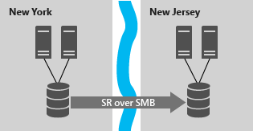
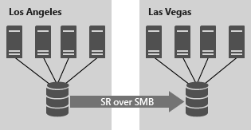
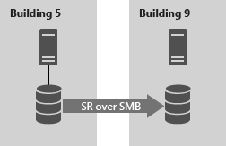
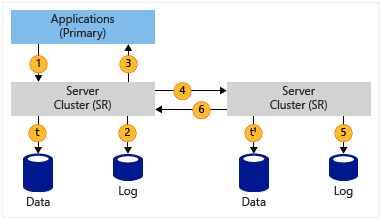

# Storage Replica overview

>Applies to: Windows Server 2022, Windows Server 2019, Windows Server 2016

Storage Replica is Windows Server technology that enables replication of volumes between servers or clusters for disaster recovery. It also enables you to create stretch failover clusters that span two sites, with all nodes staying in sync.

Storage Replica supports synchronous and asynchronous replication:

* **Synchronous replication** mirrors data within a low-latency network site with crash-consistent volumes to ensure zero data loss at the file-system level during a failure.
* **Asynchronous replication** mirrors data across sites beyond metropolitan ranges over network links with higher latencies, but without a guarantee that both sites have identical copies of the data at the time of a failure.

## Why use Storage Replica?

Storage Replica offers disaster recovery and preparedness capabilities in Windows Server. Windows Server offers the peace of mind of zero data loss, with the ability to synchronously protect data on different racks, floors, buildings, campuses, counties, and cities. After a disaster strikes, all data exists elsewhere without any possibility of loss. The same applies *before* a disaster strikes; Storage Replica offers you the ability to switch workloads to safe locations prior to catastrophes when granted a few moments warning - again, with no data loss.

Storage Replica allows more efficient use of multiple datacenters. By stretching clusters or replicating clusters, workloads can be run in multiple datacenters for quicker data access by local proximity users and applications, as well as better load distribution and use of compute resources. If a disaster takes one datacenter offline, you can move its typical workloads to the other site temporarily.

Storage Replica may allow you to decommission existing file replication systems such as DFS Replication that were pressed into duty as low-end disaster recovery solutions. While DFS Replication works well over low bandwidth networks, its latency is high - often measured in hours or days. This is caused by its requirement for files to close and its artificial throttles meant to prevent network congestion. With those design characteristics, the newest and hottest files in a DFS Replication replica are the least likely to replicate. Storage Replica operates below the file level and has none of these restrictions.

Storage Replica also supports asynchronous replication for longer ranges and higher latency networks. Because it isn't checkpoint-based, and instead continuously replicates, the delta of changes tends to be far lower than snapshot-based products. Storage Replica operates at the partition layer and therefore replicates all VSS snapshots created by Windows Server or backup software. By using VSS snapshots it allows use of application-consistent data snapshots for point in time recovery, especially unstructured user data replicated asynchronously.

## Supported configurations

You can deploy Storage Replica in a stretch cluster, between cluster-to-cluster, and in server-to-server configurations (see Figures 1-3).

**Stretch Cluster** allows configuration of computers and storage in a single cluster, where some nodes share one set of asymmetric storage and some nodes share another, then synchronously or asynchronously replicate with site awareness. This scenario can utilize Storage Spaces with shared SAS storage, SAN and iSCSI-attached LUNs. It's managed with PowerShell and the Failover Cluster Manager graphical tool, and allows for automated workload failover.

**FIGURE 1: Storage replication in a stretch cluster using Storage Replica**

**Cluster to Cluster** allows replication between two separate clusters, where one cluster synchronously or asynchronously replicates with another cluster. This scenario can utilize Storage Spaces Direct, Storage Spaces with shared SAS storage, SAN and iSCSI-attached LUNs. It's managed with Windows Admin Center and PowerShell, and requires manual intervention for failover.

**FIGURE 2: Cluster-to-cluster storage replication using Storage Replica**

**Server to server** allows synchronous and asynchronous replication between two standalone servers, using Storage Spaces with shared SAS storage, SAN and iSCSI-attached LUNs, and local drives. It's managed with Windows Admin Center and PowerShell, and requires manual intervention for failover.

**FIGURE 3: Server-to-server storage replication using Storage Replica**

> [!NOTE]
> You can also configure server-to-self replication, using four separate volumes on one computer. However, this guide does not cover this scenario.

## Storage Replica Features

* **Zero data loss, block-level replication**. With synchronous replication, there's no possibility of data loss. With block-level replication, there's no possibility of file locking.

* **Simple deployment and management**. Storage Replica has a design mandate for ease of use. Creation of a replication partnership between two servers can utilize the Windows Admin Center. Deployment of stretch clusters uses intuitive wizard in the familiar Failover Cluster Manager tool.

* **Guest and host**. All capabilities of Storage Replica are exposed in both virtualized guest and host-based deployments. This means guests can replicate their data volumes even if running on non-Windows virtualization platforms or in public clouds, as long as using Windows Server in the guest.

* **SMB3-based**. Storage Replica uses the proven and mature technology of SMB 3, first released in Windows Server 2012. This means all of SMB's advanced characteristics - such as multichannel and SMB direct support on RoCE, iWARP, and InfiniBand RDMA network cards - are available to Storage Replica.

* **Security**. Unlike many vendor's products, Storage Replica has industry-leading security technology baked in. This includes packet signing, AES-128-GCM full data encryption, support for Intel AES-NI encryption acceleration, and pre-authentication integrity man-in-the-middle attack prevention. Storage Replica utilizes Kerberos AES256 for all authentication between nodes.

* **High performance initial sync**. Storage Replica supports seeded initial sync, where a subset of data already exists on a target from older copies, backups, or shipped drives. Initial replication only copies the differing blocks, potentially shortening initial sync time and preventing data from using up limited bandwidth. Storage replicas block checksum calculation and aggregation means that initial sync performance is limited only by the speed of the storage and network.

* **Consistency groups**. Write ordering guarantees that applications such as Microsoft SQL Server can write to multiple replicated volumes and know the data is written on the destination server sequentially.

* **User delegation**. Users can be delegated permissions to manage replication without being a member of the built-in Administrators group on the replicated nodes, therefore limiting their access to unrelated areas.

* **Network Constraint**. Storage Replica can be limited to individual networks by server and by replicated volumes, in order to provide application, backup, and management software bandwidth.

* **Thin provisioning**. Support for thin provisioning in Storage Spaces and SAN devices is supported in order to provide near-instantaneous initial replication times under many circumstances. Once initial replication is initiated, the volume won't be able to shrink or trim

* **Compression**. Storage Replica offers compression for data transferred over the network between
  the source and destination server. Storage Replica Compression for Data Transfer is only supported in
  Windows Server Datacenter: Azure Edition beginning with OS build 20348.1070 and later
  ([KB5017381](https://support.microsoft.com/help/5017381)).

Storage Replica includes the following features:

| Feature | Details |
| ----------- | ----------- |
| Type | Host-based |
| Synchronous | Yes |
| Asynchronous | Yes |
| Storage hardware agnostic | Yes |
| Replication unit | Volume (Partition) |
| Windows Server stretch cluster creation | Yes |
| Server to server replication | Yes |
| Cluster to cluster replication | Yes |
| Transport | SMB3 |
| Network | TCP/IP or RDMA |
| Network constraint support | Yes |
| Network compression | Yes** |
| RDMA* | iWARP, InfiniBand, RoCE v2 |
| Replication network port firewall requirements | Single IANA port (TCP 445 or 5445) |
| Multipath/Multichannel | Yes (SMB3) |
| Kerberos support | Yes (SMB3) |
| Over the wire encryption and signing|Yes (SMB3) |
| Per-volume failovers allowed | Yes |
| Thin-provisioned storage support | Yes |
| Management UI in-box | PowerShell, Failover Cluster Manager |

*May require additional long haul equipment and cabling.
**When using Windows Server Datacenter: Azure Edition beginning with OS build 20348.1070

## Storage Replica prerequisites

* Active Directory Domain Services forest.
* Storage Spaces with SAS JBODs, Storage Spaces Direct, fibre channel SAN, shared VHDX, iSCSI Target, or local SAS/SCSI/SATA storage. SSD or faster recommended for replication log drives. Microsoft recommends that the log storage is faster than the data storage. Log volumes must never be used for other workloads.
* At least one ethernet/TCP connection on each server for synchronous replication, but preferably RDMA.
* At least 2 GB of RAM and two cores per server.
* A network between servers with enough bandwidth to contain your IO write workload and an average of 5 ms round trip latency or lower, for synchronous replication. Asynchronous replication doesn't have a latency recommendation.
* Windows Server, Datacenter Edition, or Windows Server, Standard Edition. Storage Replica running on Windows Server, Standard Edition, has the following limitations:

  * You must use Windows Server 2019 or later
  * Storage Replica replicates a single volume instead of an unlimited number of volumes.
  * Volumes can have a size of up to 2 TB instead of an unlimited size.

## Background

This section includes information about high-level industry terms, synchronous and asynchronous replication, and key behaviors.

### High-level industry terms

Disaster Recovery (DR) refers to a contingency plan for recovering from site catastrophes so that the business continues to operate. Data DR means multiple copies of production data in a separate physical location. For example, a stretch cluster, where half the nodes are in one site and half are in another. Disaster Preparedness (DP) refers to a contingency plan for preemptively moving workloads to a different location prior to an oncoming disaster, such as a hurricane.

Service level agreements (SLAs) define the availability of a business' applications and their tolerance of down time and data loss during planned and unplanned outages. Recovery Time Objective (RTO) defines how long the business can tolerate total inaccessibility of data. Recovery Point Objective (RPO) defines how much data the business can afford to lose.

### Synchronous replication

Synchronous replication guarantees that the application writes data to two locations at once before completion of the IO operation. This replication is more suitable for mission critical data, as it requires network and storage investments, and risks degraded application performance by needing to perform writes in two locations.

When application writes occur on the source data copy, the originating storage doesn't acknowledge the IO immediately. Instead, those data changes replicate to the remote destination copy and return an acknowledgment. Only then does the application receive the IO acknowledgment. This ensures constant synchronization of the remote site with the source site, in effect extending storage IOs across the network. In the event of a source site failure, applications can fail over to the remote site and resume their operations with assurance of zero data loss.

| Mode | Diagram | Steps |
| -------- | ----------- | --------- |
| **Synchronous**
Zero Data Loss
RPO |  | 1.  Application writes data 2.  Log data is written and the data is replicated to the remote site 3.  Log data is written at the remote site 4.  Acknowledgment from the remote site 5.  Application write acknowledged
t & t1 : Data flushed to the volume, logs always write through |

### Asynchronous replication

Contrarily, asynchronous replication means that when the application writes data, that data replicates to the remote site without immediate acknowledgment guarantees. This mode allows faster response time to the application and a DR solution that works geographically.

When the application writes data, the replication engine captures the write and immediately acknowledges to the application. The captured data then replicates to the remote location. The remote node processes the copy of the data and lazily acknowledges back to the source copy. Since replication performance is no longer in the application IO path, the remote site's responsiveness and distance are less important factors. There's risk of data loss if the source data is lost and the destination copy of the data was still in buffer without leaving the source.

With its higher than zero RPO, asynchronous replication is less suitable for HA solutions like Failover Clusters, as they're designed for continuous operation with redundancy and no loss of data.

| Mode | Diagram | Steps |
| -------- | ----------- | --------- |
| **Asynchronous**
Near zero data loss
(depends on multiple factors)
RPO | |1.  Application writes data 2.  Log data written 3.  Application write acknowledged 4.  Data replicated to the remote site 5.  Log data written at the remote site 6.  Acknowledgment from the remote site
t & t1 : Data flushed to the volume, logs always write through |

### Key evaluation points and behaviors

* Network bandwidth and latency with fastest storage. There are physical limitations around synchronous replication. Because Storage Replica implements an IO filtering mechanism using logs and requiring network round trips, synchronous replication is likely make application writes slower. By using low latency, high-bandwidth networks, and high-throughput disk subsystems for the logs, you minimize performance overhead.

* The destination volume isn't accessible while replicating in Windows Server 2016. When you configure replication, the destination volume dismounts, making it inaccessible to any reads or writes by users. Its driver letter may be visible in typical interfaces like File Explorer, but an application can't access the volume itself. Block-level replication technologies are incompatible with allowing access to the destination target's mounted file system in a volume. NTFS and ReFS don't support users writing data to the volume while blocks change underneath them.

The **Test-Failover** cmdlet debuted in Windows Server, version 1709, and was also included in Windows Server 2019. This now supports temporarily mounting a read-write snapshot of the destination volume for backups, testing, etc. See [Frequently asked questions about Storage Replica](https://aka.ms/srfaq) for more info.

* The Microsoft implementation of asynchronous replication is different than most. Most industry implementations of asynchronous replication rely on snapshot-based replication, where periodic differential transfers move to the other node and merge. Storage Replica asynchronous replication operates just like synchronous replication, except that it removes the requirement for a serialized synchronous acknowledgment from the destination. This means that Storage Replica theoretically has a lower RPO as it continuously replicates. However, this also means it relies on internal application consistency guarantees rather than using snapshots to force consistency in application files. Storage Replica guarantees crash consistency in all replication modes

* Many customers use DFS Replication as a disaster recovery solution even though often impractical for that scenario - DFS Replication can't replicate open files and is designed to minimize bandwidth usage at the expense of performance, leading to large recovery point deltas. Storage Replica may allow you to retire DFS Replication from some of these types of disaster recovery duties.

* Storage Replica isn't a backup solution. Some IT environments deploy replication systems as backup solutions, due to their zero data loss options when compared to daily backups. Storage Replica replicates all changes to all blocks of data on the volume, regardless of the change type. If a user deletes all data from a volume, Storage Replica replicates the deletion instantly to the other volume, irrevocably removing the data from both servers. Don't use Storage Replica as a replacement for a point-in-time backup solution.

* Storage Replica isn't Hyper-V Replica or Microsoft SQL AlwaysOn Availability Groups. Storage Replica is a general purpose, storage-agnostic engine. By definition, it can't tailor its behavior as ideally as application-level replication. This may lead to specific feature gaps that encourage you to deploy or remain on specific application replication technologies.

> [!NOTE]
> This document contains a list of [known issues](storage-replica-known-issues.md) and expected behaviors as well as [Frequently Asked Questions](storage-replica-frequently-asked-questions.yml) section.

### Storage Replica terminology

This guide frequently uses the following terms:

* The source is a computer's volume that allows local writes and replicates outbound. Also known as "primary".

* The destination is a computer's volume that doesn't allow local writes and replicates inbound. Also known as "secondary".

* A replication partnership is the synchronization relationship between a source and destination computer for one or more volumes and utilizes a single log.

* A replication group is the organization of volumes and their replication configuration within a partnership, on a per server basis. A group may contain one or more volumes.

### What's new for Storage Replica

For a list of new features in Storage Replica in Windows Server 2019, see [What's new in storage](../whats-new-in-storage.md#storage-replica2019)

## More information

* [Stretch Cluster Replication Using Shared Storage](stretch-cluster-replication-using-shared-storage.md)
* [Server to Server Storage Replication](server-to-server-storage-replication.md)
* [Cluster to Cluster Storage Replication](cluster-to-cluster-storage-replication.md)
* [Storage Replica: Known Issues](storage-replica-known-issues.md)
* [Storage Replica: Frequently Asked Questions](storage-replica-frequently-asked-questions.yml)
* [Storage Spaces Direct in Windows Server 2016](/azure-stack/hci/concepts/storage-spaces-direct-overview)
* [Windows IT Pro Support](https://www.microsoft.com/itpro/windows/support)
