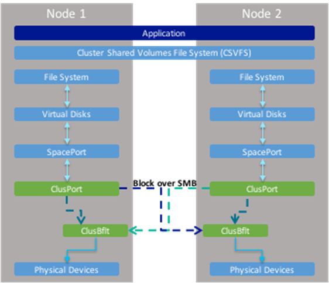
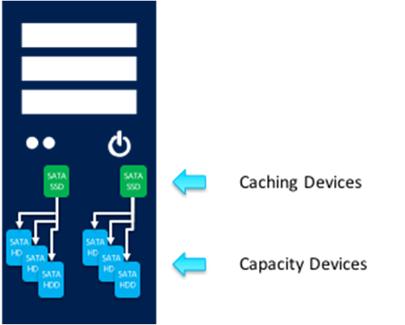

# Software Storage Bus Overview

>Applies To: Windows Server Technical Preview

The Software Storage Bus  is a virtual storage bus spanning all the servers that make up the cluster. Software Storage Bus essentially makes it possible for each server to see all disks across all servers in the cluster providing full mesh connectivity. Software Storage Bus consists of two components on each server in the cluster; ClusPort and ClusBlft. ClusPort implements a virtual HBA that allows the node to connect to disk devices in all the other servers in the cluster. ClusBlft implements virtualization of the disk devices and enclosures in each server for ClusPort in other servers to connect to.  

    

## SMB as transport  
Software Storage Bus uses SMB3 and SMB Direct as the transport for communication between the servers in the cluster. Software Storage Bus uses a separate named instance of SMB in each server, which separates it from other consumers of SMB, such as CSVFS, to provide additional resiliency. Using SMB3 enables Software Storage Bus to take advantage of the innovation we have done in SMB3, including SMB Multichannel and SMB Direct. SMB Multichannel can aggregate bandwidth across multiple network interfaces for higher throughput and provide resiliency to a failed network interface. For more information about SMB Multichannel, see [Deploy SMB Multichannel](https://technet.microsoft.com/library/dn610980.aspx). SMB Direct enables use of RDMA enabled network adapters, including iWARP and RoCE, which can dramatically lower the CPU overhead of doing IO over the network and reduce the latency to disk devices. For more information about SMB Direct, see [Improve Performance of a File Server with SMB Direct](https://technet.microsoft.com/library/jj134210.aspx). To view a demonstration of the  IOPS difference in a system with and without RDMA enabled , see [Enabling Private Cloud Storage Using Servers with Local Disks](https://channel9.msdn.com/Events/Ignite/2015/BRK3474).  

## Software Storage Bus Bandwidth Management  
Software Storage Bus also implements a fair access algorithm that ensures fair device access from any server to protect against one server starving out other servers. It also implements an algorithm for IO prioritization that prioritizes Application IO, which usually is IO from virtual machines, over system IO, which usually would be rebalance or repair operations. However, at the same time it ensures that rebalance and repair operations can make forward progress. Finally, it implements an algorithm that de-randomizes IO going to rotational disk devices to drive a more sequential IO pattern on these devices, despite the IO coming from the application (virtual machines) being a random IO pattern.  

## Software Storage Bus Cache  
Software Storage Bus implements a caching mechanism, which is known as Storage Bus Cache. The Storage Bus Cache  is scoped to each server (per node cache) and is agnostic to the storage pools and virtual disks defined in the system. Storage Bus Cache is resilient to failures as it sits underneath the virtual disk, which provides resiliency by writing data copies to different fault domains, which by default is storage nodes. When Storage Spaces Direct is enabled in a cluster, Software Bus Cache identifies which devices to use a caching devices and which devices are capacity devices. Caching devices cache data for the capacity devices, essentially creating hybrid disks. Once it has been determined whether a device is a caching device or a capacity device, the capacity devices are bound to a caching device in a round robin manner, as shown in the following diagram. Rebinding will occur if there is a topology change, such as if a caching device fails.  

  

The behavior of the caching devices is determined by the actual disk configuration of the system and outlined in the table below:  

|**Storage Configuration**|**Caching Devices**|**Capacity Devices**|**Caching Behavior**|  
|-|-|-|-|  
|SATA SSD + SATA HDD|All SATA SSD|All SATA HDD|Read + Write|  
|NVMe SSD + SATA HDD|All NVMe SSD|All SATA HDD|Read + Write|  
|NVMe SSD + SATA SSD|All NVMe SSD|All SATA SSD|Write only|  
|NVMe SSD + SATA SSD + SATA HDD|All NVMe SSD|All SATA SSD and SATA HDD|Write only for SATA SSD and Read + Write for SATA HDD|  

In systems with rotational capacity devices (HDD), Software Storage Cache will act as both a read and write cache. This is because there is a seek penalty on rotational disk devices. In systems with all flash devices (NVMe SSD + SATA SSD), SBC will only act as a write cache. Because the NVMe devices will absorb most of the writes in the system, it is possible to use mixed-use or even read-intensive SATA SSD devices, which can lower the overall cost of flash in the system. In systems with only a single tier of devices, such as an all NVMe system or all SATA SSD system, SBC will need to be disabled.  

Software Bus Cache creates a special partition on each caching device that, by default, consumes all available capacity except 32GB. The 32GB is used for storage pool and virtual disk metadata. Software Bus Cache uses memory for runtime data structures, about 5GB of memory per TB of caching devices in the node. For instance, a system with 4x 800GB caching devices requires about 16GB of memory to manage the cache in addition to what is the for the base operating systems and any hosted hyper-converged virtual machines.  

## Related Topics  

-   [Storage Spaces Direct in Windows Server 2016 Technical Preview](storage-spaces-direct-windows-server-2016.md)  

-   [Storage Spaces Direct Hardware Requirements](Storage-Spaces-Direct-Hardware-Requirements.md)  

-   [Hyper-converged solution using Storage Spaces Direct in Windows Server 2016](../software-defined-storage/Hyper-converged-solution-using-Storage-Spaces-Direct-in-Windows-Server-2016.md)  

-   [Storage Spaces Optimize Pool](Storage-Spaces-Optimize-Pool.md)  

-   [Storage Spaces Fault Tolerance](Storage-Spaces-Fault-Tolerance.md)  

## See Also  

-   [Enabling Private Cloud Storage Using Servers with Local Disks](http://channel9.msdn.com/Events/Ignite/2015/BRK3474) (video)  

-   [Testing Storage Spaces Direct using Windows Server 2016 virtual machines](http://blogs.msdn.com/b/clustering/archive/2015/05/27/10617612.aspx) (blog)  

-   [What's New in Failover Clustering in Windows Server Technical Preview](../../compute/failover-clustering/whats-new-failover-clustering-windows-server.md)  

-   [Storage Replica in Windows Server 2016 Technical Preview](../storage-replica/storage-replica-windows-server-2016.md)  

-   [Storage Quality of Service](../software-defined-storage/Storage-Quality-of-Service.md)  

