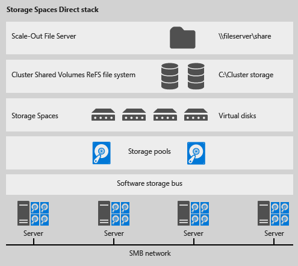
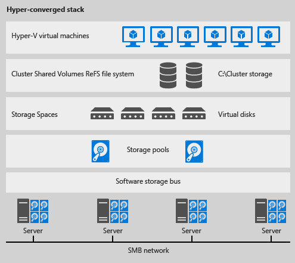

# Storage Spaces Direct in Windows Server 2016 Technical Preview

>Applies To: Windows Server Technical Preview

Windows Server 2016 Technical Preview introduces Storage Spaces Direct, which enables building highly available and scalable storage systems with local storage. This is a significant step forward in Microsoft Windows Server software-defined storage (SDS) as it simplifies the deployment and management of SDS systems and also unlocks use of new classes of disk devices, such as SATA and NVMe disk devices, that were previously not possible with clustered Storage Spaces with shared disks.  

With Windows Server 2016 Technical Preview Storage Spaces Direct, you can now build HA Storage Systems using storage nodes with only local storage, which is either disk devices that are internal to each storage node (Figure 1). This eliminates the need for a shared SAS fabric and its complexities, but also enables using devices such as SATA solid state drives, which can help further reduce cost or NVMe solid state devices to improve performance.  

  

**FIGURE 1: Storage Spaces with internal disks**  

Storage Spaces Direct is an evolution of Storage Spaces, which means that it is an extension of the existing software defined storage stack for Windows Server. Storage Spaces Direct leverages SMB3 for all intra-node (aka east-west) communication, including SMB Direct and SMB Multichannel, for low latency and high throughput storage.  

This topic provides an overview of Storage Spaces Direct and the scenarios that its supports and includes the following sections:  
* [Storage Spaces Direct Overview](#BKMK_S2DOverview)  
* [Supported Storage Spaces Direct  Deployment Scenarios](#BKMK_S2DSupportedScenarios)  

## Storage Spaces Direct Overview  
Storage Spaces Direct seamlessly integrates with the features you know today that make up the Windows Server software defined storage stack, including Scale-Out File Server, Clustered Shared Volume File System (CSVFS), Storage Spaces and Failover Clustering. Figure 3 below illustrates the "Storage Spaces Direct" stack:  

  

**FIGURE 2: Storage Spaces Direct stack**  

  

**FIGURE 3: Hyperconverged Storage Spaces Direct stack - same cluster configured for Storage Spaces Direct  and the hosting of virtual machines**  

The Storage Spaces Direct stack includes the following, starting from the bottom:  

**Networking hardware** Storage Spaces Direct relies on a network to communicate between hosts. For production deployments, it is required to have an RDMA-capable NIC (or a pair of NIC ports).  

**Storage hardware**: The storage system consisting of a minimum of three storage nodes with local storage. Each storage node can have internal disks, or disks in an external SAS connected JBOD enclosure. The disk devices can be SATA disks, NVMe disks or SAS disks.  

**Software Storage Bus**: The Software Storage Bus is the Storage Spaces Direct specific software component that spans all the storage nodes and brings together the local storage in each node, so all disks are visible to the Storage Spaces layer above. For more information about Software Storage Bus, see [Storage Spaces Direct - Under the hood with the Software Storage Bus](http://blogs.technet.com/b/clausjor/archive/2015/11/19/storage-spaces-direct-under-the-hood-with-the-software-storage-bus.aspx).  

**Storage Pool**: The storage pool spans local storage across all the nodes.  

**Storage Spaces**: Storage Spaces (aka virtual disks) provide resiliency to disk or node failures as data copies are stored on different storage nodes.  

**Resilient File System (ReFS)** ReFS provides the file system in which the Hyper-V VM files are stored. ReFS is a premier file system for virtualized deployments and includes optimizations for Storage Spaces such as error detection and automatic correction. In addition, ReFS provides accelerations for VHD(X) operations such as fixed VHD(X) creation, dynamic VHD(X) growth, and VHD(X) merge.  

**Clustered Shared Volumes**:  CSVFS layers above ReFS to bring all the mounted volumes into a single namespace accessible through any node.  

**Scale-Out File Server**  This is the top layer of the storage stack that provides remote access to the storage system using the SMB3 access protocol. The Scale-Out File Server (SOFS) layer is only needed in disaggregated configurations (where the Storage Spaces Direct system is dedicated to providing storage services), and is not implemented in hyper-converged configurations (where the virtual machines are hosted on the same cluster as the Storage Spaces Direct system).  

##  Supported Storage Spaces Direct Deployment Scenarios  
Storage Spaces Direct can be deployed  either for primary storage of Hyper-V VM file, or, for secondary storage for Hyper-V Replica virtual machine files.  In addition, the deployment can be for backup or for archive of virtual machine files.  

### Disaggregated and Hyper-converged Configurations  
There are two targeted deployment scenarios for Windows Server 2016 Technical Preview Storage Spaces Direct. Both cases provide storage for Hyper-V, specifically focusing on Hyper-V IaaS (Infrastructure as a Service) for Service Providers and Enterprises.  

The **disaggregated** deployment scenario has the Hyper-V servers (compute component) in a separate cluster from the Storage Spaces Direct servers (storage component).  Virtual machines are configured to store their files on the Scale-Out File Server which is accessed through the network using the SMB3 protocol. This allows for scaling Hyper-V clusters (compute) and Scale Out File Server cluster (storage) independently. For example, the compute nodes are nearing capacity for the number of VMs that they can host but the storage has excess capacity (both disk and IOPS), more compute nodes can be added without adding additional storage nodes. Figure 4 illustrates the disaggregated deployment scenario.  

  

**FIGURE 4:  Disaggregated deployment of Storage Spaces Direct**  

The **hyper-converged** deployment scenario has the Hyper-V (compute) and Storage Spaces Direct (storage) components on the same cluster. Virtual machine's files are stored on the local CSVs and does not implement a Scale-Out File Server. This allows for scaling Hyper-V compute clusters and storage together and removes requirement of configuring file server access and permissions.  Once Storage Spaces Direct is configured and the CSV volumes are available, configuring and provisioning Hyper-V is the same process and uses the same tools that you would use with any other Hyper-V deployment on a failover cluster. For step-by-step instructions about building a hyper-converged solution with Storage Spaces Direct, see [Hyper-converged solution using Storage Spaces Direct in Windows Server 2016](../software-defined-storage/Hyper-converged-solution-using-Storage-Spaces-Direct-in-Windows-Server-2016.md).   

## Related Topics  

-   [Storage Spaces Direct in Windows Server 2016 Technical Preview](Storage-Spaces-Direct-in-Windows-Server-2016-Technical-Preview.md)  

-   [Storage Spaces Direct Hardware Requirements](Storage-Spaces-Direct-Hardware-Requirements.md)  

-   [Hyper-converged solution using Storage Spaces Direct in Windows Server 2016](../software-defined-storage/Hyper-converged-solution-using-Storage-Spaces-Direct-in-Windows-Server-2016.md)  

-   [Storage Spaces Optimize Pool](Storage-Spaces-Optimize-Pool.md)  

-   [Storage Spaces Fault Tolerance](Storage-Spaces-Fault-Tolerance.md)  

## See Also  

-   [Enabling Private Cloud Storage Using Servers with Local Disks](http://channel9.msdn.com/Events/Ignite/2015/BRK3474) (video)  

-   [Testing Storage Spaces Direct using Windows Server 2016 virtual machines](http://blogs.msdn.com/b/clustering/archive/2015/05/27/10617612.aspx) (blog)  

-   [What's New in Failover Clustering in Windows Server Technical Preview](../../compute/failover-clustering/What-s-New-in-Failover-Clustering-in-Windows-Server-Technical-Preview.md)  

-   [Storage Replica in Windows Server 2016 Technical Preview](../storage-replica/Storage-Replica-in-Windows-Server-2016-Technical-Preview.md)  

-   [Storage Quality of Service](../software-defined-storage/Storage-Quality-of-Service.md)

