# Use Azure Monitor to send emails for Health Service Faults

>Applies to: Windows Server 2019, Windows Server 2016

Azure Monitor maximizes the availability and performance of your applications by delivering a comprehensive solution for collecting, analyzing, and acting on telemetry from your cloud and on-premises environments. It helps you understand how your applications are performing and proactively identifies issues affecting them and the resources they depend on.

This is particularly helpful for your on-premises hyper-converged cluster. With Azure Monitor integrated, you will be able to configure email, text (SMS), and other alerts to ping you when something is wrong with your cluster (or when you want to flag some other activity based on the data collected). Below, we will briefly explain how Azure Monitor works, how to install Azure Monitor, and how to configure it to send you notifications.

If you are using System Center, check out the [Storage Spaces Direct management pack](https://www.microsoft.com/download/details.aspx?id=100782) that monitors both Windows Server 2019 and Windows Server 2016 Storage Spaces Direct clusters.

This management pack includes:

* Physical disk health and performance monitoring
* Storage Node health and performance monitoring
* Storage Pool health and performance monitoring
* Volume resiliency type and Deduplication status

## Understanding Azure Monitor

All data collected by Azure Monitor fits into one of two fundamental types: metrics and logs.

1. [Metrics](https://docs.microsoft.com/azure/azure-monitor/platform/data-collection#metrics) are numerical values that describe some aspect of a system at a particular point in time. They are lightweight and capable of supporting near real-time scenarios. You'll see data collected by Azure Monitor right in their Overview page in the Azure portal.

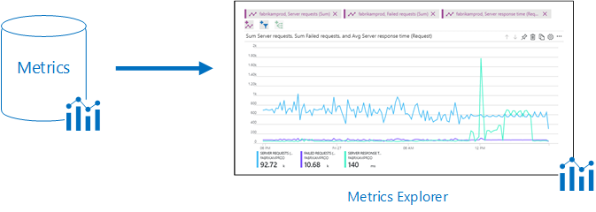

2. [Logs](https://docs.microsoft.com/azure/azure-monitor/platform/data-collection#logs) contain different kinds of data organized into records with different sets of properties for each type. Telemetry such as events and traces are stored as logs in addition to performance data so that it can all be combined for analysis. Log data collected by Azure Monitor can be analyzed with [queries](https://docs.microsoft.com/azure/azure-monitor/log-query/log-query-overview) to quickly retrieve, consolidate, and analyze collected data. You can create and test queries using [Log Analytics](https://docs.microsoft.com/azure/azure-monitor/log-query/portals) in the Azure portal and then either directly analyze the data using these tools or save queries for use with [visualizations](https://docs.microsoft.com/azure/azure-monitor/visualizations) or [alert rules](https://docs.microsoft.com/azure/azure-monitor/platform/alerts-overview).


We will have more details below on how to configure these alerts.

## Onboarding your cluster using Windows Admin Center

Using Windows Admin Center, you can onboard your cluster to Azure Monitor.

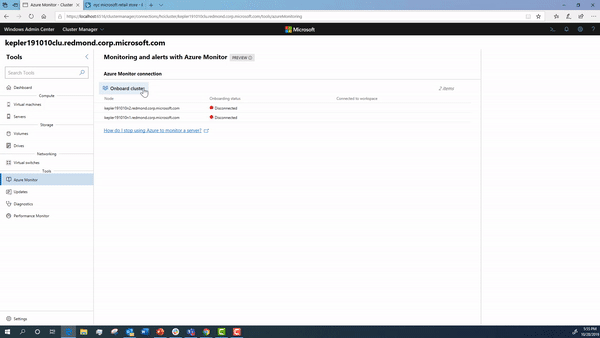

During this onboarding flow, the steps below are happening under the hood. We detail how to configure them in detail in case you want to manually setup your cluster.

### Configuring Health Service

The first thing that you need to do is configure your cluster. As you may know, the [Health Service](../../failover-clustering/health-service-overview.md) improves the day-to-day monitoring and operational experience for clusters running Storage Spaces Direct.

As we saw above, Azure Monitor collects logs from each node that it is running on in your cluster. So, we have to configure the Health Service to write to an event channel, which happens to be:

```
Event Channel: Microsoft-Windows-Health/Operational
Event ID: 8465
```

To configure the Health Service, you run:

```PowerShell
get-storagesubsystem clus* | Set-StorageHealthSetting -Name "Platform.ETW.MasTypes" -Value "Microsoft.Health.EntityType.Subsystem,Microsoft.Health.EntityType.Server,Microsoft.Health.EntityType.PhysicalDisk,Microsoft.Health.EntityType.StoragePool,Microsoft.Health.EntityType.Volume,Microsoft.Health.EntityType.Cluster"
```

When you run the cmdlet above to set the Health Settings, you cause the events we want to begin being written to the *Microsoft-Windows-Health/Operational* event channel.

### Configuring Log Analytics

Now that you have setup the proper logging on your cluster, the next step is to properly configure log analytics.

To give an overview, [Azure Log Analytics](https://docs.microsoft.com/azure/azure-monitor/platform/agent-windows) can collect data directly from your physical or virtual Windows computers in your datacenter or other cloud environment into a single repository for detailed analysis and correlation.

To understand the supported configuration, review [supported Windows operating systems](https://docs.microsoft.com/azure/azure-monitor/platform/log-analytics-agent#supported-windows-operating-systems) and [network firewall configuration](https://docs.microsoft.com/azure/azure-monitor/platform/log-analytics-agent#network-firewall-requirements).

If you don't have an Azure subscription, create a [free account](https://azure.microsoft.com/free/?WT.mc_id=A261C142F) before you begin.

#### Login in to Azure Portal

Log in to the Azure portal at [https://portal.azure.com](https://azure.microsoft.com/free/?WT.mc_id=A261C142F).

#### Create a workspace

For more details on the steps listed below, see the [Azure Monitor documentation](https://docs.microsoft.com/azure/azure-monitor/learn/quick-collect-windows-computer).

1. In the Azure portal, click **All services**. In the list of resources, type **Log Analytics**. As you begin typing, the list filters based on your input. Select **Log Analytics**.<br><br>

   <br><br>

2. Click **Create**, and then select choices for the following items:

   * Provide a name for the new **Log Analytics Workspace**, such as *DefaultLAWorkspace*.
   * Select a **Subscription** to link to by selecting from the drop-down list if the default selected is not appropriate.
   * For **Resource Group**, select an existing resource group that contains one or more Azure virtual machines. <br><br>

       <br><br>

3. After providing the required information on the **Log Analytics Workspace** pane, click **OK**.

While the information is verified and the workspace is created, you can track its progress under **Notifications** from the menu.

#### Obtain workspace ID and key
Before installing the Microsoft Monitoring Agent for Windows, you need the workspace ID and key for your Log Analytics workspace.  This information is required by the setup wizard to properly configure the agent and ensure it can successfully communicate with Log Analytics.

1. In the Azure portal, click **All services** found in the upper left-hand corner. In the list of resources, type **Log Analytics**. As you begin typing, the list filters based on your input. Select **Log Analytics**.
2. In your list of Log Analytics workspaces, select *DefaultLAWorkspace* created earlier.
3. Select **Advanced settings**.<br><br> <br><br>
4. Select **Connected Sources**, and then select **Windows Servers**.
5. The value to the right of **Workspace ID** and **Primary Key**. Save both temporarily - copy and paste both into your favorite editor for the time being.

### Installing the agent on Windows
The following steps install and configure the Microsoft Monitoring Agent. **Be sure to install this agent on each server in your cluster and indicate that you want the agent to run at Windows Startup.**

1. On the **Windows Servers** page, select the appropriate **Download Windows Agent** version to download depending on the processor architecture of the Windows operating system.
2. Run Setup to install the agent on your computer.
2. On the **Welcome** page, click **Next**.
3. On the **License Terms** page, read the license and then click **I Agree**.
4. On the **Destination Folder** page, change or keep the default installation folder and then click **Next**.
5. On the **Agent Setup Options** page, choose to connect the agent to Azure Log Analytics and then click **Next**.
6. On the **Azure Log Analytics** page, perform the following:
   1. Paste the **Workspace ID** and **Workspace Key (Primary Key)** that you copied earlier.
    a. If the computer needs to communicate through a proxy server to the Log Analytics service, click **Advanced** and provide the URL and port number of the proxy server.  If your proxy server requires authentication, type the username and password to authenticate with the proxy server and then click **Next**.
7. Click **Next** once you have completed providing the necessary configuration settings.<br><br> <br><br>
8. On the **Ready to Install** page, review your choices and then click **Install**.
9. On the **Configuration completed successfully** page, click **Finish**.

When complete, the **Microsoft Monitoring Agent** appears in **Control Panel**. You can review your configuration and verify that the agent is connected to Log Analytics. When connected, on the **Azure Log Analytics** tab, the agent displays a message stating: **The Microsoft Monitoring Agent has successfully connected to the Microsoft Log Analytics service.**


To understand the supported configuration, review [supported Windows operating systems](https://docs.microsoft.com/azure/azure-monitor/platform/log-analytics-agent#supported-windows-operating-systems) and [network firewall configuration](https://docs.microsoft.com/azure/azure-monitor/platform/log-analytics-agent#network-firewall-requirements).

## Setting up alerts using Windows Admin Center

In Windows Admin Center, you can configure default alerts that will apply to all servers in your Log Analytics workspace.


These are the alerts and their default conditions that you can opt into:

| Alert Name                | Default Condition                                  |
|---------------------------|----------------------------------------------------|
| CPU utilization           | Over 85% for 10 minutes                            |
| Disk capacity utilization | Over 85% for 10 minutes                            |
| Memory utilization        | Available memory less than 100 MB for 10 minutes   |
| Heartbeat                 | Fewer than 2 beats for 5 minutes                   |
| System critical error     | Any critical alert in the cluster system event log |
| Health service alert      | Any health service fault on the cluster            |

Once you configure the alerts in Windows Admin Center, you can see the alerts in your log analytics workspace in Azure.

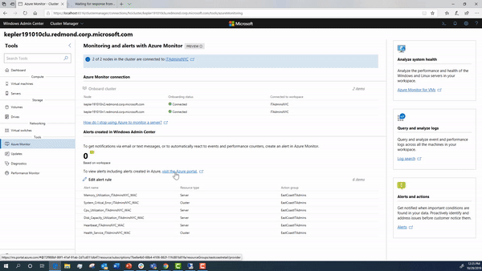

During this onboarding flow, the steps below are happening under the hood. We detail how to configure them in detail in case you want to manually setup your cluster.

### Collecting event and performance data

Log Analytics can collect events from the Windows event log and performance counters that you specify for longer term analysis and reporting, and take action when a particular condition is detected.  Follow these steps to configure collection of events from the Windows event log, and several common performance counters to start with.

1. In the Azure portal, click **More services** found on the lower left-hand corner. In the list of resources, type **Log Analytics**. As you begin typing, the list filters based on your input. Select **Log Analytics**.
2. Select **Advanced settings**.<br><br> <br><br>
3. Select **Data**, and then select **Windows Event Logs**.
4. Here, add the Health Service event channel by typing in the name below and the click the plus sign **+**.
   ```
   Event Channel: Microsoft-Windows-Health/Operational
   ```
5. In the table, check the severities **Error** and **Warning**.
6. Click **Save** at the top of the page to save the configuration.
7. Select **Windows Performance Counters** to enable collection of performance counters on a Windows computer.
8. When you first configure Windows Performance counters for a new Log Analytics workspace, you are given the option to quickly create several common counters. They are listed with a checkbox next to each.<br> <br> Click **Add the selected performance counters**.  They are added and preset with a ten second collection sample interval.
9. Click **Save** at the top of the page to save the configuration.

## Creating alerts based on log data

If you've made it this far, your cluster should be sending your logs and performance counters to Log Analytics. The next step is to create alert rules that automatically run log searches at regular intervals. If results of the log search match particular criteria, then an alert is fired that sends you an email or text notification. Let's explore this below.

### Create a query

Start by opening the Log Search portal.

1. In the Azure portal, click **All services**. In the list of resources, type **Monitor**. As you begin typing, the list filters based on your input. Select **Monitor**.
2. On the Monitor navigation menu, select **Log Analytics** and then select a workspace.

The quickest way to retrieve some data to work with is a simple query that returns all records in table. Type the following queries in the search box and click the search button.

```
Event
```

Data is returned in the default list view, and you can see how many total records were returned.

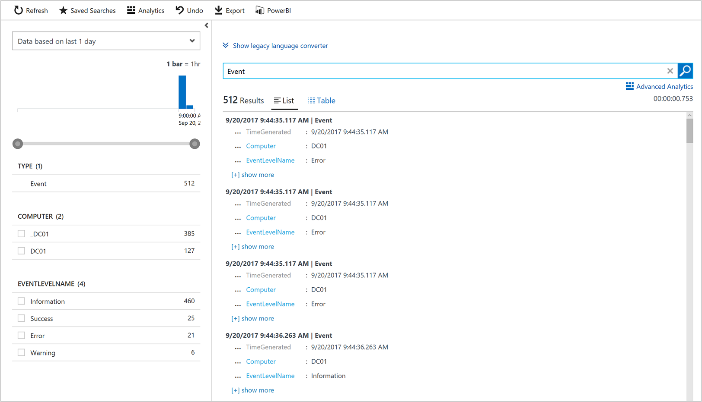

On the left side of the screen is the filter pane which allows you to add filtering to the query without modifying it directly.  Several record properties are displayed for that record type, and you can select one or more property values to narrow your search results.

Select the checkbox next to **Error** under **EVENTLEVELNAME** or type the following to limit the results to error events.

```
Event | where (EventLevelName == "Error")
```

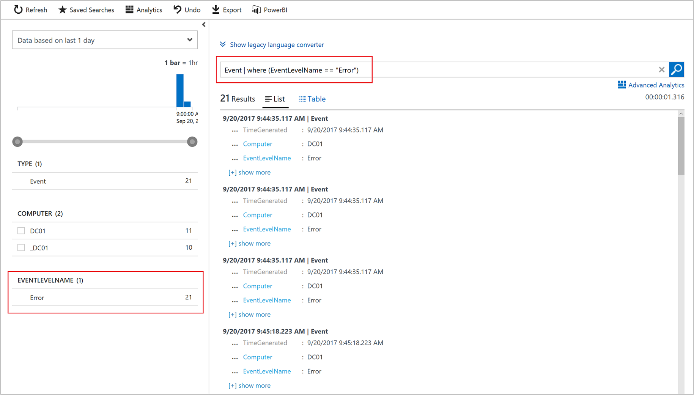

After you have the approriate queries made for events you care about, save them for the next step.

### Create alerts
Now, let's walk through an example for creating an alert.

1. In the Azure portal, click **All services**. In the list of resources, type **Log Analytics**. As you begin typing, the list filters based on your input. Select **Log Analytics**.
2. In the left-hand pane, select **Alerts** and then click **New Alert Rule** from the top of the page to create a new alert.<br><br> 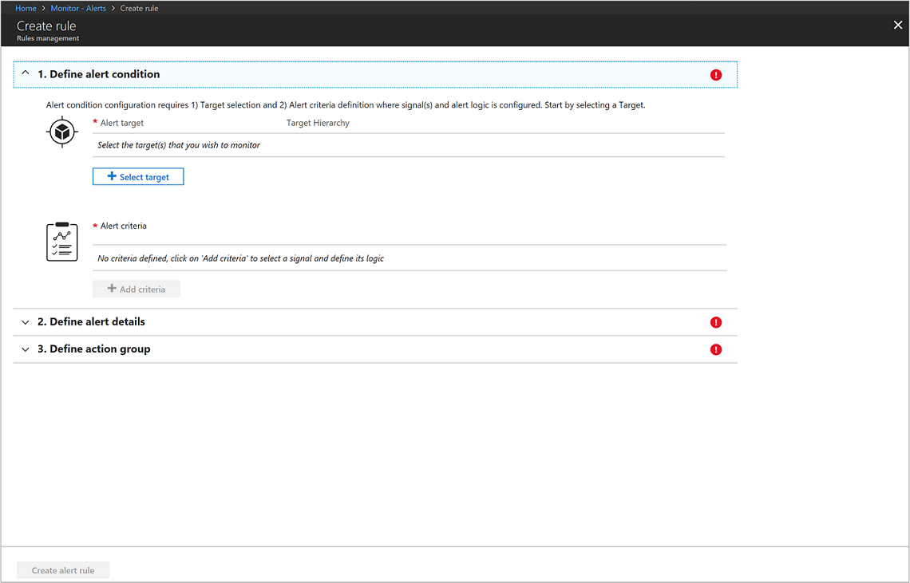<br>
3. For the first step, under the **Create Alert** section, you are going to select your Log Analytics workspace as the resource, since this is a log based alert signal.  Filter the results by choosing the specific **Subscription** from the drop-down list if you have more than one, which contains Log Analytics workspace created earlier.  Filter the **Resource Type** by selecting **Log Analytics** from the drop-down list.  Finally, select the **Resource** **DefaultLAWorkspace** and then click **Done**.<br><br> 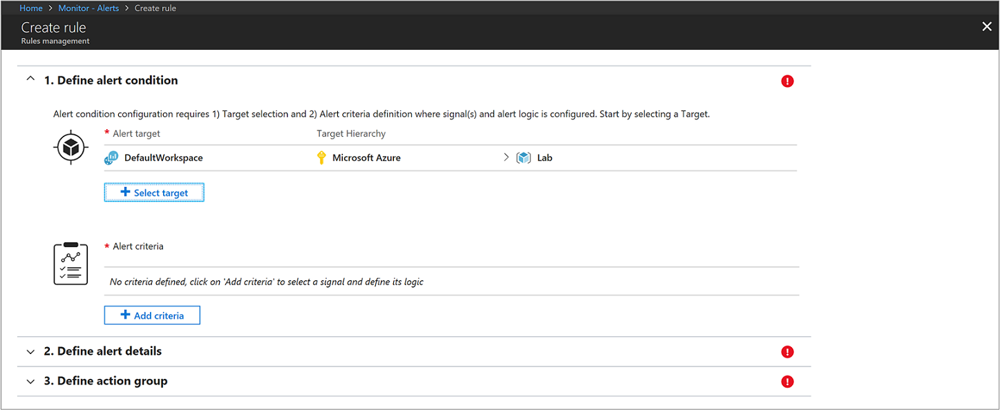<br>
4. Under the section **Alert Criteria**, click **Add Criteria** to select your saved query and then specify logic that the alert rule follows.
5. Configure the alert with the following information:
   a. From the **Based on** drop-down list, select **Metric measurement**.  A metric measurement will create an alert for each object in the query with a value that exceeds our specified threshold.
   b. For the **Condition**, select **Greater than** and specify a thershold.
   c. Then define when to trigger the alert. For example you could select **Consecutive breaches** and from the drop-down list select **Greater than** a value of 3.
   d. Under Evaluation based on section, modify the **Period** value to **30** minutes and **Frequency** to 5. The rule will run every five minutes and return records that were created within the last thirty minutes from the current time.  Setting the time period to a wider window accounts for the potential of data latency, and ensures the query returns data to avoid a false negative where the alert never fires.
6. Click **Done** to complete the alert rule.<br><br> 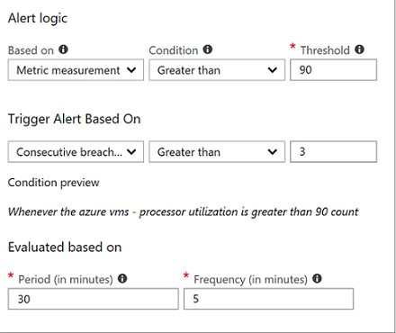<br>
7. Now moving onto the second step, provide a name of your alert in the **Alert rule name** field, such as **Alert on all Error Events**.  Specify a **Description** detailing specifics for the alert, and select **Critical(Sev 0)** for the **Severity** value from the options provided.
8. To immediately activate the alert rule on creation, accept the default value for **Enable rule upon creation**.
9. For the third and final step, you specify an **Action Group**, which ensures that the same actions are taken each time an alert is triggered and can be used for each rule you define. Configure a new action group with the following information:
   a. Select **New action group** and the **Add action group** pane appears.
   b. For **Action group name**, specify a name such as **IT Operations - Notify** and a **Short name** such as **itops-n**.
   c. Verify the default values for **Subscription** and **Resource group** are correct. If not, select the correct one from the drop-down list.
   d. Under the Actions section, specify a name for the action, such as **Send Email** and under **Action Type** select **Email/SMS/Push/Voice** from the drop-down list. The **Email/SMS/Push/Voice** properties pane will open to the right in order to provide additional information.
   e. On the **Email/SMS/Push/Voice** pane, select and setup your preference. For example, enable **Email** and provide a valid email SMTP address to deliver the message to.
   f. Click **OK** to save your changes.<br><br>

    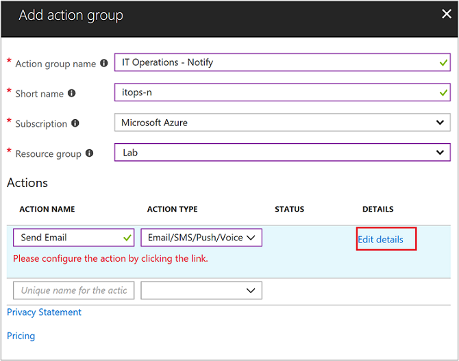

10. Click **OK** to complete the action group.
11. Click **Create alert rule** to complete the alert rule. It starts running immediately.<br><br> 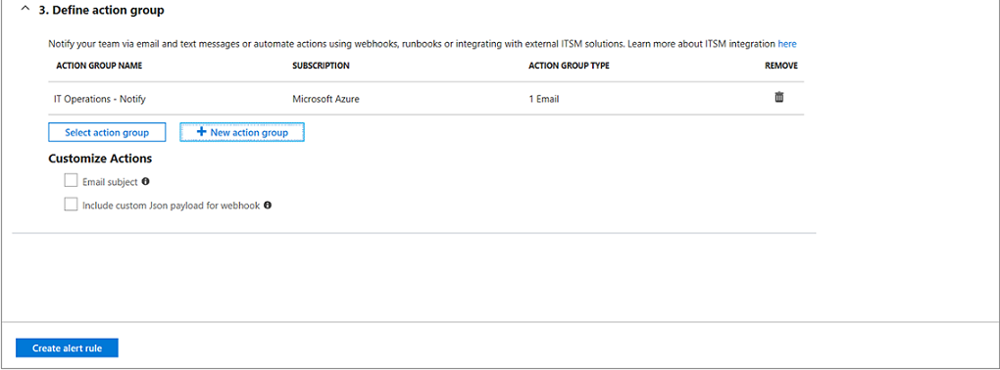<br>

### Example alert

For reference, this is what an example alert looks like in Azure.

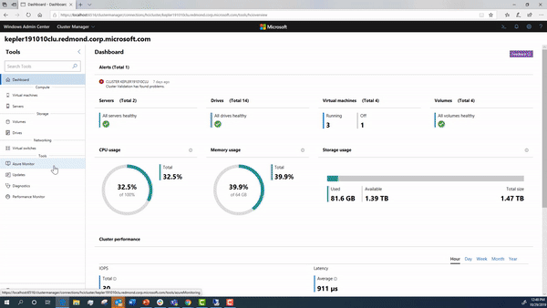

Below is an example of the email that you will be send by Azure Monitor:


## Additional References

- [Storage Spaces Direct overview](storage-spaces-direct-overview.md)
- For more detailed information, read the [Azure Monitor documentation](https://docs.microsoft.com/azure/azure-monitor/learn/tutorial-viewdata).
- Read this for an overview on how to [connect to other Azure hybrid services](../../manage/windows-admin-center/azure/index.md).
