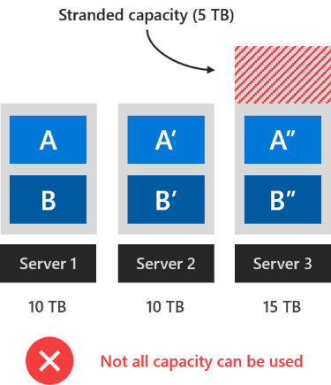
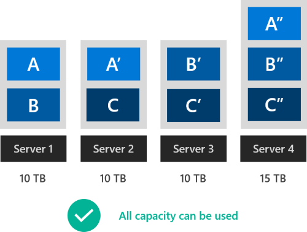

# Drive symmetry considerations for Storage Spaces Direct 

> Applies To: Windows Server 2016

[Storage Spaces Direct](storage-spaces-direct-overview.md) works best when every server has exactly the same drives.

In reality, we recognize this is not always practical: Storage Spaces Direct is designed to run for years and to scale as the needs of your organization grow. Today, you may buy spacious 3 TB hard drives; next year, it may become impossible to find ones that small. Therefore, some amount of mixing-and-matching is supported.

This topic explains the constraints and provides examples of supported and unsupported configurations.

## Constraints

### Type

All servers must have the same [types of drives](choosing-drives.md#drive-types).

For example, if one server has NVMe, they must *all* have NVMe.

### Number

All servers must have the same number of drives of each type.

For example, if one server has *six* HDD, they must all have *six* HDD.

   > [!NOTE]
   > It is okay for the number of drives to differ temporarily during failures or while adding or removing drives.

### Model

It is recommended to use drives of the same model and firmware version whenever possible. If you can't, carefully select drives which are as similar as possible and verify that they don't have any conflicting requirements, such as system, adapter, or driver incompatibility.

It is not advisable to mix-and-match drives of the same type with sharply different performance or endurance characteristics (unless one is cache and the other is capacity) because Storage Spaces Direct distributes IO evenly and does not discriminate based on model.

### Size

It is recommended to use drives of the same sizes whenever possible.

Using cache drives of different sizes will not boost cache performance predictably or uniformly: only IO to [drive bindings](understand-the-cache.md#server-side-architecture) with larger cache drives may see improved performance. See [Understanding the cache](understand-the-cache.md) to learn more.

Using capacity drives of different sizes may result in stranded capacity – see the next section.

   > [!WARNING]
   > Differing capacity drives sizes across servers may result in stranded capacity.

## Understand: stranded capacity

Storage Spaces Direct is robust to capacity imbalance across drives and across servers. Even if the imbalance is severe, everything will continue to work. However, depending on several factors, capacity that is not available in every server may not be usable.

To see why this happens, consider the simplified illustration below. Each colored box represents one copy of mirrored data. For example, the boxes marked A, A', and A'' are three copies of the same data. To honor server fault tolerance, these copies *must* be stored in different servers.

### With stranded capacity

As drawn, Server 1 (10 TB) and Server 2 (10 TB) are full. Server 3 has larger drives, therefore its total capacity is larger (15 TB). However, to store more three-way mirror data on Server 3 would require copies on Server 1 and Server 2 too, which are already full. The remaining 5 TB capacity on Server 3 cannot be used – it is stranded capacity.

### Without stranded capacity

Conversely, with four servers of 10 TB, 10 TB, 10 TB, and 15 TB capacity and three-way mirror resiliency, it *is* possible to validly place copies in a way that uses all available capacity. Whenever this is possible, the Storage Spaces Direct allocator will find and use the optimal placement, leaving no stranded capacity.

The number of servers, the resiliency, and the severity of the capacity imbalance affect whether there is stranded capacity. **The most prudent general rule is to assume that only capacity available in every server is guaranteed to be usable.**

## Example configurations

Here are some supported and unsupported configurations:

###  Supported: different models between servers

The first two servers use NVMe model "X" but the third server uses NVMe model "Z", which is very similar.

| Server 1                    | Server 2                    | Server 3                     |
|-----------------------------|-----------------------------|------------------------------|
| 2 x NVMe Model X (cache)    | 2 x NVMe Model X (cache)    | 2 x NVMe Model **Z** (cache) |
| 10 x SSD Model Y (capacity) | 10 x SSD Model Y (capacity) | 10 x SSD Model Y (capacity)  |

This is supported.

###  Supported: different models within server

Every server uses some different mix of HDD models "Y" and "Z", which are very similar.

| Server 1                       | Server 2                       | Server 3                       |
|--------------------------------|--------------------------------|--------------------------------|
| 2 x SSD Model X (cache)        | 2 x SSD Model X (cache)        | 2 x SSD Model X (cache)        |
| **7** x HDD Model Y (capacity) | **5** x HDD Model Y (capacity) | **1** x HDD Model Y (capacity) |
| **3** x HDD Model Z (capacity) | **5** x HDD Model Z (capacity) | **9** x HDD Model Z (capacity) |

This is supported.

###  Supported: different sizes across servers

The first two servers use 4 TB HDD but the third server uses very similar 6 TB HDD.

| Server 1                | Server 2                | Server 3                    |
|-------------------------|-------------------------|-----------------------------|
| 2 x 800 GB NVMe (cache) | 2 x 800 GB NVMe (cache) | 2 x 800 GB NVMe (cache)     |
| 4 x 4 TB HDD (capacity) | 4 x 4 TB HDD (capacity) | 4 x **6** TB HDD (capacity) |

This is supported, although it will result in stranded capacity.

###  Supported: different sizes within server

Every server uses some different mix of 1.2 TB and very similar 1.6 TB SSD.

| Server 1                   | Server 2                   | Server 3                 |
|----------------------------|----------------------------|--------------------------|
| 3 x 1.2 TB SSD (cache)     | 2 x 1.2 TB SSD (cache)     | 4 x 1.2 TB SSD (cache)   |
| 1 x **1.6 TB** SSD (cache) | 2 x **1.6 TB** SSD (cache) | -                        |
| 20 x 4 TB HDD (capacity)   | 20 x 4 TB HDD (capacity)   | 20 x 4 TB HDD (capacity) |

This is supported. (Note that every server has 4 total SSD.)

###  Not supported: different types of drives across servers

Server 1 has NVMe but the others don't.

| Server 1             | Server 2            | Server 3            |
|----------------------|---------------------|---------------------|
| 6 x **NVMe** (cache) | -                   | -                   |
| -                    | 6 x SSD (cache)     | 6 x SSD (cache)     |
| 18 x HDD (capacity)  | 18 x HDD (capacity) | 18 x HDD (capacity) |

This is not supported. The types of drives must be the same in every server.

###  Not supported: different number of each type across servers

Server 3 has more drives than the others.

| Server 1            | Server 2            | Server 3                |
|---------------------|---------------------|-------------------------|
| 2 x NVMe (cache)    | 2 x NVMe (cache)    | **4** x NVMe (cache)    |
| 10 x HDD (capacity) | 10 x HDD (capacity) | **20** x HDD (capacity) |

This is not supported. The number of drives of each type must be the same in every server.

## Summary

To recap, every server in the cluster must have the same types of drives and the same number of each type. It is supported to mix-and-match drive models and drive sizes as needed, with the caveats described above.

| Constraint                               |               |
|------------------------------------------|---------------|
| Same types of drives in every server     | **Required**  |
| Same number of each type in every server | **Required**  |
| Same drive models in every server        | Recommended   |
| Same drive sizes in every server         | Recommended   |

## See also

- [Storage Spaces Direct hardware requirements](storage-spaces-direct-hardware-requirements.md)
- [Storage Spaces Direct overview](storage-spaces-direct-overview.md)
