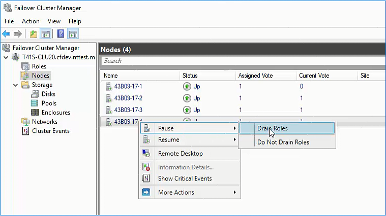
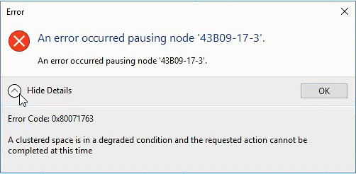
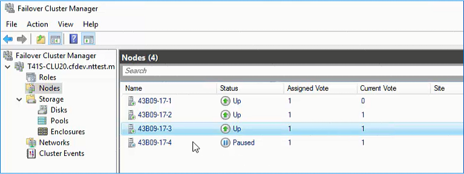
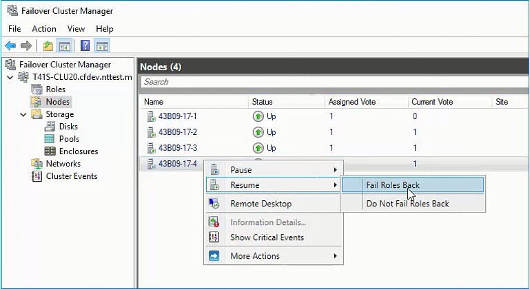

# Taking a Storage Spaces Direct server down for maintenance

> Applies To: Windows Server 2016

This topic provides guidance on how to properly restart or shutdown servers with [Storage Spaces Direct](storage-spaces-direct-overview.md).

When bringing servers in a Storage Spaces Direct (S2D) cluster down for maintenance or restarting to apply updates, there are special considerations. With Storage Spaces Direct bringing down a server also means bringing down pieces of the storage, which is shared across all the servers. This requires properly pausing and draining the server, and ensuring there are enough copies of the data available elsewhere so it remains safe and accessible throughout the maintenance.

We recommend using [Cluster Aware Updating (CAU)](https://technet.microsoft.com/library/hh831694.aspx) to automate the process of patching Storage Spaces Direct clusters. It is integrated with Storage Spaces Direct and will automate all of the below steps below, including checking volume health and resync progress before patching the next server.

## Verifying it's safe to take the server down

Before bringing a server down for maintenance, verify that all your volumes are healthy.

In PowerShell, run the following cmdlet (as Administrator) to view volume status.

```PowerShell
PS C:\> Get-VirtualDisk 

FriendlyName ResiliencySettingName OperationalStatus HealthStatus IsManualAttach Size
------------ --------------------- ----------------- ------------ -------------- ----
MyVolume1    Mirror                OK                Healthy      True           1 TB
MyVolume2    Mirror                OK                Healthy      True           1 TB
MyVolume3    Mirror                OK                Healthy      True           1 TB
```

Verify that the **HealthStatus** property for every volume (virtual disk) is **Healthy**.

To do this in Failover Cluster Manager, go to **Storage** -> **Disks**.

Verify that the **Status** column for every volume (virtual disk) shows **Online**.

## Pause and drain the server

Before restarting or shutting down the server, drain (move off) any roles such as virtual machines running on it. This also gives Storage Spaces Direct an opportunity to gracefully flush and commit data to ensure the shutdown is transparent to any applications running on that server.

   > [!IMPORTANT]
   > Always pause and drain clustered servers before restarting or shutting them down.

In PowerShell, run the following cmdlet (as Administrator) to pause and drain.

```PowerShell
PS C:\> Suspend-ClusterNode -Drain
```

To do this in Failover Cluster Manager, go to **Nodes**.

Right-click the node and select **Pause** -> **Drain Roles**, or use the **Actions** pane on the right.



All virtual machines will begin live migrating to other servers in the cluster. This can take a few minutes.

   > [!NOTE]
   > When you pause and drain the cluster node properly, Windows performs an automatic safety check to ensure it is safe to proceed. If there are unhealthy volumes, it will stop and alert you that it's not safe to proceed.



## Shutting down the server

Once the server has completed draining, it will show as **Paused** in Failover Cluster Manager and PowerShell.



You can now safely restart or shut it down, just like you would normally.

   > [!NOTE]
   > While the server is paused, storage IO does not flow to its drives. This means that although all your volumes remain online and accessible, they will show as **Incomplete** in Failover Cluster Manager or PowerShell. This is expected.

```PowerShell
PS C:\> Get-VirtualDisk 

FriendlyName ResiliencySettingName OperationalStatus HealthStatus IsManualAttach Size
------------ --------------------- ----------------- ------------ -------------- ----
MyVolume1    Mirror                Incomplete        Warning      True           1 TB
MyVolume2    Mirror                Incomplete        Warning      True           1 TB
MyVolume3    Mirror                Incomplete        Warning      True           1 TB
```

This is normal and should not cause concern. All your volumes remain online and accessible.

## Resume the server

When you are ready for the server to begin hosting workloads again, resume it.

In PowerShell, run the following cmdlet (as Administrator) to resume.

```PowerShell
PS C:\> Resume-ClusterNode
```

To move the roles that were previously running on this server back, use the optional **-Failback** flag.

```PowerShell
PS C:\> Resume-ClusterNode –Failback Immediate
```

To do this in Failover Cluster Manager, go to **Nodes**.

Right-click the node and select **Resume** -> **Failback Roles** (optional), or use the **Actions** pane on the right.



## Wait for storage to resync

When the server resumes, any new writes that happened while it was paused (while its drives were not receiving storage IO) need to resync. This happens automatically. Using intelligent change tracking, it's not necessary for *all* data to be scanned or synchronized; only the changes. This process is throttled to mitigate impact to production workloads. Depending on how long the server was paused, and how much new data as written, it may take many minutes to complete.

You must wait for re-syncing to complete before pausing or shutting any others servers in the cluster.

In PowerShell, run the following cmdlet (as Administrator) to monitor progress.

```PowerShell
PS C:\> Get-StorageJob

Name   IsBackgroundTask ElapsedTime JobState  PercentComplete BytesProcessed BytesTotal
----   ---------------- ----------- --------  --------------- -------------- ----------
Repair True             00:06:23    Running   65              11477975040    17448304640
Repair True             00:06:40    Running   66              15987900416    23890755584
Repair True             00:06:52    Running   68              20104802841    22104819713
```

The **BytesTotal** shows how much storage needs to resync. The **PercentComplete** displays progress.

   > [!DANGER]
   > It is not safe to pause or shut down another server until these resync jobs have completed.

During this time, your volumes will continue to show as **Warning**. This is expected.

```PowerShell
PS C:\> Get-VirtualDisk 

FriendlyName ResiliencySettingName OperationalStatus HealthStatus IsManualAttach Size
------------ --------------------- ----------------- ------------ -------------- ----
MyVolume1    Mirror                InService         Warning      True           1 TB
MyVolume2    Mirror                InService         Warning      True           1 TB
MyVolume3    Mirror                InService         Warning      True           1 TB
```

Once the jobs complete, verify that volumes show **Healthy** again.

```PowerShell
PS C:\> Get-VirtualDisk 

FriendlyName ResiliencySettingName OperationalStatus HealthStatus IsManualAttach Size
------------ --------------------- ----------------- ------------ -------------- ----
MyVolume1    Mirror                OK                Healthy      True           1 TB
MyVolume2    Mirror                OK                Healthy      True           1 TB
MyVolume3    Mirror                OK                Healthy      True           1 TB
```

It's now safe to pause and restart other servers in the cluster. That's it!

## See also

- [Storage Spaces Direct overview](storage-spaces-direct-overview.md)
- [Cluster Aware Updating (CAU)](https://technet.microsoft.com/library/hh831694.aspx)
