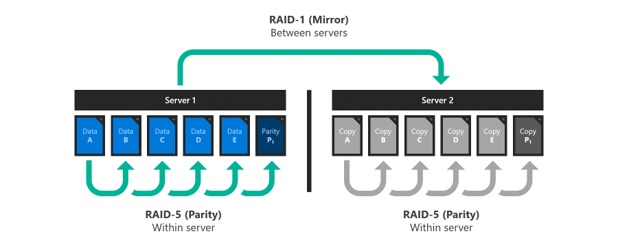
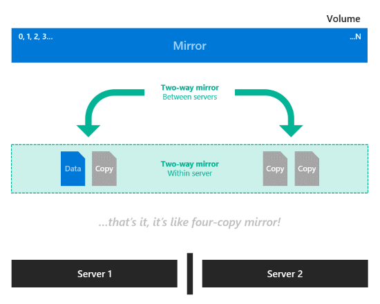

# Nested resiliency for Storage Spaces Direct

> Applies to: Windows Server 2019

Nested resiliency is a new capability of [Storage Spaces Direct](storage-spaces-direct-overview.md) in Windows Server 2019 that enables a two-server cluster to withstand multiple hardware failures at the same time without loss of storage availability, so users, apps, and virtual machines continue to run without disruption. This topic explains how it works, provides step-by-step instructions to get started, and answers the most frequently asked questions.

## Prerequisites

###  Consider nested resiliency if:

- Your cluster runs Windows Server 2019; and
- Your cluster has exactly 2 server nodes

###  You can't use nested resiliency if:

- Your cluster runs Windows Server 2016; or
- Your cluster has 3 or more server nodes

## Why nested resiliency

Volumes that use nested resiliency can **stay online and accessible even if multiple hardware failures happen at the same time**, unlike classic [two-way mirroring](storage-spaces-fault-tolerance.md) resiliency. For example, if two drives fail at the same time, or if a server goes down and a drive fails, volumes that use nested resiliency stay online and accessible. For hyper-converged infrastructure, this increases uptime for apps and virtual machines; for file server workloads, this means users enjoy uninterrupted access to their files.


The trade-off is that nested resiliency has **lower capacity efficiency than classic two-way mirroring**, meaning you get slightly less usable space. For details, see the [Capacity efficiency](#capacity-efficiency) section below.

## How it works

### Inspiration: RAID 5+1

RAID 5+1 is an established form of distributed storage resiliency that provides helpful background for understanding nested resiliency. In RAID 5+1, within each server, local resiliency is provided by RAID-5, or *single parity*, to protect against the loss of any single drive. Then, further resiliency is provided by RAID-1, or *two-way mirroring*, between the two servers to protect against the loss of either server.



### Two new resiliency options

Storage Spaces Direct in Windows Server 2019 offers two new resiliency options implemented in software, without the need for specialized RAID hardware:

- **Nested two-way mirror.** Within each server, local resiliency is provided by two-way mirroring, and then further resiliency is provided by two-way mirroring between the two servers. It's essentially a four-way mirror, with two copies in each server. Nested two-way mirroring provides uncompromising performance: writes go to all copies, and reads come from any copy.

  

- **Nested mirror-accelerated parity.** Combine nested two-way mirroring, from above, with nested parity. Within each server, local resiliency for most data is provided by single [bitwise parity arithmetic](storage-spaces-fault-tolerance.md#parity), except new recent writes which use two-way mirroring. Then, further resiliency for all data is provided by two-way mirroring between the servers. For more information about how mirror-accelerated parity works, see [Mirror-accelerated parity](../refs/mirror-accelerated-parity.md).

  

### Capacity efficiency

Capacity efficiency is the ratio of usable space to [volume footprint](plan-volumes.md#choosing-the-size-of-volumes). It describes the capacity overhead attributable to resiliency, and depends on the resiliency option you choose. As a simple example, storing data without resiliency is 100% capacity efficient (1 TB of data takes up 1 TB of physical storage capacity), while two-way mirroring is 50% efficient (1 TB of data takes up 2 TB of physical storage capacity).

- **Nested two-way mirror** writes four copies of everything, meaning to store 1 TB of data, you need 4 TB of physical storage capacity. Although its simplicity is appealing, nested two-way mirror's capacity efficiency of 25% is the lowest of any resiliency option in Storage Spaces Direct.

- **Nested mirror-accelerated parity** achieves higher capacity efficiency, around 35%-40%, that depends on two factors: the number of capacity drives in each server, and the mix of mirror and parity you specify for the volume. This table provides a lookup for common configurations:

  | Capacity drives per server | 10% mirror | 20% mirror | 30% mirror |
  |----------------------------|------------|------------|------------|
  | 4                          | 35.7%      | 34.1%      | 32.6%      |
  | 5                          | 37.7%      | 35.7%      | 33.9%      |
  | 6                          | 39.1%      | 36.8%      | 34.7%      |
  | 7+                         | 40.0%      | 37.5%      | 35.3%      |

  > [!NOTE]
  > **If you're curious, here's an example of the full math.** Suppose we have six capacity drives in each of two servers, and we want to create one 100 GB volume comprised of 10 GB of mirror and 90 GB of parity. Server-local two-way mirror is 50.0% efficient, meaning the 10 GB of mirror data takes 20 GB to store on each server. Mirrored to both servers, its total footprint is 40 GB. Server-local single parity, in this case, is 5/6 = 83.3% efficient, meaning the 90 GB of parity data takes 108 GB to store on each server. Mirrored to both servers, its total footprint is 216 GB. The total footprint is thus [(10 GB / 50.0%) + (90 GB / 83.3%)] × 2 = 256 GB, for 39.1% overall capacity efficiency.

Notice that the capacity efficiency of classic two-way mirroring (about 50%) and nested mirror-accelerated parity (up to 40%) are not very different. Depending on your requirements, the slightly lower capacity efficiency may be well worth the significant increase in storage availability. You choose resiliency per-volume, so you can mix nested resiliency volumes and classic two-way mirror volumes within the same cluster.


## Usage in PowerShell

You can use familiar storage cmdlets in PowerShell to create volumes with nested resiliency.

### Step 1: Create storage tier templates

Windows Server 2019 requires you to create new storage tier templates using the `New-StorageTier` cmdlet before creating volumes. You only need to do this once, and then every new volume you create can reference these templates. 

> [!NOTE]
> If you're running Windows Server 2022, Azure Stack HCI 21H2, or Azure Stack HCI 20H2, you can skip this step.

Specify the `-MediaType` of your capacity drives and, optionally, the `-FriendlyName` of your choice. Do not modify the other parameters.

If your capacity drives are hard disk drives (HDD), launch PowerShell as Administrator and run:

```PowerShell
# For mirror
New-StorageTier -StoragePoolFriendlyName S2D* -FriendlyName NestedMirrorOnHDD -ResiliencySettingName Mirror -MediaType HDD -NumberOfDataCopies 4

# For parity
New-StorageTier -StoragePoolFriendlyName S2D* -FriendlyName NestedParityOnHDD -ResiliencySettingName Parity -MediaType HDD -NumberOfDataCopies 2 -PhysicalDiskRedundancy 1 -NumberOfGroups 1 -FaultDomainAwareness StorageScaleUnit -ColumnIsolation PhysicalDisk
```

If your capacity drives are solid-state drives (SSD), set the `-MediaType` to `SSD` instead and optionally set the `-FriendlyName` to `*OnSSD`. Do not modify the other parameters.

> [!TIP]
> Verify the tiers created successfully with `Get-StorageTier`.

### Step 2: Create volumes

Then, create new volumes using the `New-Volume` cmdlet.

#### Nested two-way mirror

To use nested two-way mirror, reference the `NestedMirror` tier template and specify the size. For example:

```PowerShell
New-Volume -StoragePoolFriendlyName S2D* -FriendlyName Volume01 -StorageTierFriendlyNames NestedMirror -StorageTierSizes 500GB
```

#### Nested mirror-accelerated parity

To use nested mirror-accelerated parity, reference both the `NestedMirror` and `NestedParity` tier templates and specify two sizes, one for each part of the volume (mirror first, parity second). For example, to create one 500 GB volume that's 20% nested two-way mirror and 80% nested parity, run:

```PowerShell
New-Volume -StoragePoolFriendlyName S2D* -FriendlyName Volume02 -StorageTierFriendlyNames NestedMirror, NestedParity -StorageTierSizes 100GB, 400GB
```

### Step 3: Continue in Windows Admin Center

Volumes that use nested resiliency appear in [Windows Admin Center](../../manage/windows-admin-center/overview.md) with clear labeling, as in the screenshot below. Once they're created, you can manage and monitor them using Windows Admin Center just like any other volume in Storage Spaces Direct.


### Optional: Extend to cache drives

With its default settings, nested resiliency protects against the loss of multiple capacity drives at the same time, or one server and one capacity drive at the same time. To extend this protection to [cache drives](understand-the-cache.md) has an additional consideration: because cache drives often provide read *and write* caching for *multiple* capacity drives, the only way to ensure you can tolerate the loss of a cache drive when the other server is down is to simply not cache writes, but that impacts performance.

To address this scenario, Storage Spaces Direct offers the option to automatically disable write caching when one server in a two-server cluster is down, and then re-enable write caching once the server is back up. To allow routine restarts without performance impact, write caching isn't disabled until the server has been down for 30 minutes. Once write caching is disabled, the contents of the write cache is written to capacity devices. After this, the server can tolerate a failed cache device in the online server, though reads from the cache might be delayed or fail if a cache device fails.

To set this behavior (optional), launch PowerShell as Administrator and run:

```PowerShell
Get-StorageSubSystem Cluster* | Set-StorageHealthSetting -Name "System.Storage.NestedResiliency.DisableWriteCacheOnNodeDown.Enabled" -Value "True"
```

Once set to **True**, the cache behavior is:

| Situation                       | Cache behavior                           | Can tolerate cache drive loss? |
|---------------------------------|------------------------------------------|--------------------------------|
| Both servers up                 | Cache reads and writes, full performance | Yes                            |
| Server down, first 30 minutes   | Cache reads and writes, full performance | No (temporarily)               |
| After first 30 minutes          | Cache reads only, performance impacted   | Yes (after the cache has been written to capacity drives)                           |

## Frequently asked questions

### Can I convert an existing volume between two-way mirror and nested resiliency?

No, volumes cannot be converted between resiliency types. For new deployments on Windows Server 2019, decide ahead of time which resiliency type best fits your needs. If you're upgrading from Windows Server 2016, you can create new volumes with nested resiliency, migrate your data, and then delete the older volumes.

### Can I use nested resiliency with multiple types of capacity drives?

Yes, just specify the `-MediaType` of each tier accordingly during [step 1](#step-1-create-storage-tier-templates) above. For example, with NVMe, SSD, and HDD in the same cluster, the NVMe provides cache while the latter two provide capacity: set the `NestedMirror` tier to `-MediaType SSD` and the `NestedParity` tier to `-MediaType HDD`. In this case, note that parity capacity efficiency depends on the number of HDD drives only, and you need at least 4 of them per server.

### Can I use nested resiliency with 3 or more servers?

No, only use nested resiliency if your cluster has exactly 2 servers.

### How many drives do I need to use nested resiliency?

The minimum number of drives required for Storage Spaces Direct is 4 capacity drives per server node, plus 2 cache drives per server node (if any). This is unchanged from Windows Server 2016. There is no additional requirement for nested resiliency, and the recommendation for reserve capacity is unchanged too.

### Does nested resiliency change how drive replacement works?

No.

### Does nested resiliency change how server node replacement works?

No. To replace a server node and its drives, follow this order:

1. Retire the drives in the outgoing server
2. Add the new server, with its drives, to the cluster
3. The storage pool will rebalance
4. Remove the outgoing server and its drives

For details see the [Remove servers](remove-servers.md) topic.

## Additional References

- [Storage Spaces Direct overview](storage-spaces-direct-overview.md)
- [Understand fault tolerance in Storage Spaces Direct](storage-spaces-fault-tolerance.md)
- [Plan volumes in Storage Spaces Direct](plan-volumes.md)
- [Create volumes in Storage Spaces Direct](create-volumes.md)
