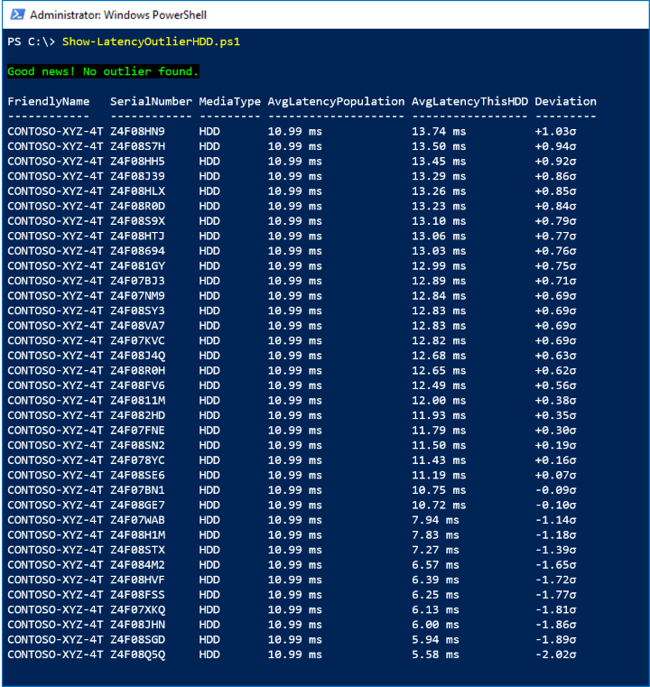
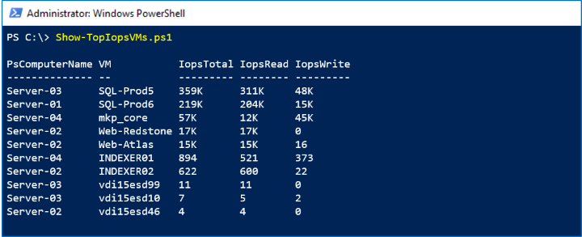
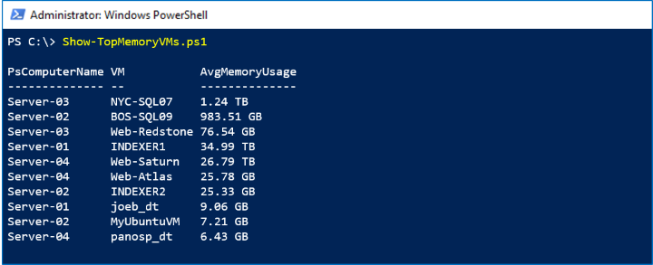

# Scripting with PowerShell and Storage Spaces Direct performance history

> Applies to: Windows Server 2019

In Windows Server 2019, [Storage Spaces Direct](storage-spaces-direct-overview.md) records and stores extensive [performance history](performance-history.md) for virtual machines, servers, drives, volumes, network adapters, and more. Performance history is easy to query and process in PowerShell so you can quickly go from *raw data* to *actual answers* to questions like:

1. Were there any CPU spikes last week?
2. Is any physical disk exhibiting abnormal latency?
3. Which VMs are consuming the most storage IOPS right now?
4. Is my network bandwidth saturated?
5. When will this volume run out of free space?
6. In the past month, which VMs used the most memory?

The `Get-ClusterPerf` cmdlet is built for scripting. It accepts input from cmdlets like `Get-VM` or `Get-PhysicalDisk` by the pipeline to handle association, and you can pipe its output into utility cmdlets like `Sort-Object`, `Where-Object`, and `Measure-Object` to quickly compose powerful queries.

**This topic provides and explains 6 sample scripts that answer the 6 questions above.** They present patterns you can apply to find peaks, find averages, plot trend lines, run outlier detection, and more, across a variety of data and timeframes. They are provided as free starter code for you to copy, extend, and reuse.

   > [!NOTE]
   > For brevity, the sample scripts omit things like error handling that you might expect of high-quality PowerShell code. They are intended primarily for inspiration and education rather than production use.

## Sample 1: CPU, I see you!

This sample uses the `ClusterNode.Cpu.Usage` series from the `LastWeek` timeframe to show the maximum ("high water mark"), minimum, and average CPU usage for every server in the cluster. It also does simple quartile analysis to show how many hours CPU usage was over 25%, 50%, and 75% in the last 8 days.

### Screenshot

In the screenshot below, we see that *Server-02* had an unexplained spike last week:


### How it works

The output from `Get-ClusterPerf` pipes nicely into the built-in `Measure-Object` cmdlet, we just specify the `Value` property. With its `-Maximum`, `-Minimum`, and `-Average` flags, `Measure-Object` gives us the first three columns almost for free. To do the quartile analysis, we can pipe to `Where-Object` and count how many values were `-Gt` (greater than) 25, 50, or 75. The last step is to beautify with `Format-Hours` and `Format-Percent` helper functions – certainly optional.

### Script

Here's the script:

```
Function Format-Hours {
    Param (
        $RawValue
    )
    # Weekly timeframe has frequency 15 minutes = 4 points per hour
    [Math]::Round($RawValue/4)
}

Function Format-Percent {
    Param (
        $RawValue
    )
    [String][Math]::Round($RawValue) + " " + "%"
}

$Output = Get-ClusterNode | ForEach-Object {
    $Data = $_ | Get-ClusterPerf -ClusterNodeSeriesName "ClusterNode.Cpu.Usage" -TimeFrame "LastWeek"

    $Measure = $Data | Measure-Object -Property Value -Minimum -Maximum -Average
    $Min = $Measure.Minimum
    $Max = $Measure.Maximum
    $Avg = $Measure.Average

    [PsCustomObject]@{
        "ClusterNode"    = $_.Name
        "MinCpuObserved" = Format-Percent $Min
        "MaxCpuObserved" = Format-Percent $Max
        "AvgCpuObserved" = Format-Percent $Avg
        "HrsOver25%"     = Format-Hours ($Data | Where-Object Value -Gt 25).Length
        "HrsOver50%"     = Format-Hours ($Data | Where-Object Value -Gt 50).Length
        "HrsOver75%"     = Format-Hours ($Data | Where-Object Value -Gt 75).Length
    }
}

$Output | Sort-Object ClusterNode | Format-Table
```

## Sample 2: Fire, fire, latency outlier

This sample uses the `PhysicalDisk.Latency.Average` series from the `LastHour` timeframe to look for statistical outliers, defined as drives with an hourly average latency exceeding +3σ (three standard deviations) above the population average.

   > [!IMPORTANT]
   > For brevity, this script does not implement safeguards against low variance, does not handle partial missing data, does not distinguish by model or firmware, etc. Please exercise good judgement and do not rely on this script alone to determine whether to replace a hard disk. It is presented here for educational purposes only.

### Screenshot

In the screenshot below, we see there are no outliers:



### How it works

First, we exclude idle or nearly idle drives by checking that `PhysicalDisk.Iops.Total` is consistently `-Gt 1`. For every active HDD, we pipe its `LastHour` timeframe, comprised of 360 measurements at 10 second intervals, to `Measure-Object -Average` to obtain its average latency in the last hour. This sets up our population.

We implement the [widely-known formula](http://www.mathsisfun.com/data/standard-deviation.html) to find the mean `μ` and standard deviation `σ` of the population. For every active HDD, we compare its average latency to the population average and divide by the standard deviation. We keep the raw values, so we can `Sort-Object` our results, but use `Format-Latency` and `Format-StandardDeviation` helper functions to beautify what we'll show – certainly optional.

If any drive is more than +3σ, we `Write-Host` in red; if not, in green.

### Script

Here's the script:

```
Function Format-Latency {
    Param (
        $RawValue
    )
    $i = 0 ; $Labels = ("s", "ms", "μs", "ns") # Petabits, just in case!
    Do { $RawValue *= 1000 ; $i++ } While ( $RawValue -Lt 1 )
    # Return
    [String][Math]::Round($RawValue, 2) + " " + $Labels[$i]
}

Function Format-StandardDeviation {
    Param (
        $RawValue
    )
    If ($RawValue -Gt 0) {
        $Sign = "+"
    }
    Else {
        $Sign = "-"
    }
    # Return
    $Sign + [String][Math]::Round([Math]::Abs($RawValue), 2) + "σ"
}

$HDD = Get-StorageSubSystem Cluster* | Get-PhysicalDisk | Where-Object MediaType -Eq HDD

$Output = $HDD | ForEach-Object {

    $Iops = $_ | Get-ClusterPerf -PhysicalDiskSeriesName "PhysicalDisk.Iops.Total" -TimeFrame "LastHour"
    $AvgIops = ($Iops | Measure-Object -Property Value -Average).Average

    If ($AvgIops -Gt 1) { # Exclude idle or nearly idle drives

        $Latency = $_ | Get-ClusterPerf -PhysicalDiskSeriesName "PhysicalDisk.Latency.Average" -TimeFrame "LastHour"
        $AvgLatency = ($Latency | Measure-Object -Property Value -Average).Average

        [PsCustomObject]@{
            "FriendlyName"  = $_.FriendlyName
            "SerialNumber"  = $_.SerialNumber
            "MediaType"     = $_.MediaType
            "AvgLatencyPopulation" = $null # Set below
            "AvgLatencyThisHDD"    = Format-Latency $AvgLatency
            "RawAvgLatencyThisHDD" = $AvgLatency
            "Deviation"            = $null # Set below
            "RawDeviation"         = $null # Set below
        }
    }
}

If ($Output.Length -Ge 3) { # Minimum population requirement

    # Find mean μ and standard deviation σ
    $μ = ($Output | Measure-Object -Property RawAvgLatencyThisHDD -Average).Average
    $d = $Output | ForEach-Object { ($_.RawAvgLatencyThisHDD - $μ) * ($_.RawAvgLatencyThisHDD - $μ) }
    $σ = [Math]::Sqrt(($d | Measure-Object -Sum).Sum / $Output.Length)

    $FoundOutlier = $False

    $Output | ForEach-Object {
        $Deviation = ($_.RawAvgLatencyThisHDD - $μ) / $σ
        $_.AvgLatencyPopulation = Format-Latency $μ
        $_.Deviation = Format-StandardDeviation $Deviation
        $_.RawDeviation = $Deviation
        # If distribution is Normal, expect >99% within 3σ
        If ($Deviation -Gt 3) {
            $FoundOutlier = $True
        }
    }

    If ($FoundOutlier) {
        Write-Host -BackgroundColor Black -ForegroundColor Red "Oh no! There's an HDD significantly slower than the others."
    }
    Else {
        Write-Host -BackgroundColor Black -ForegroundColor Green "Good news! No outlier found."
    }

    $Output | Sort-Object RawDeviation -Descending | Format-Table FriendlyName, SerialNumber, MediaType, AvgLatencyPopulation, AvgLatencyThisHDD, Deviation

}
Else {
    Write-Warning "There aren't enough active drives to look for outliers right now."
}
```

## Sample 3: Noisy neighbor? That's write!

Performance history can answer questions about *right now*, too. New measurements are available in real-time, every 10 seconds. This sample uses the `VHD.Iops.Total` series from the `MostRecent` timeframe to identify the busiest (some might say "noisiest") virtual machines consuming the most storage IOPS, across every host in the cluster, and show the read/write breakdown of their activity.

### Screenshot

In the screenshot below, we see the Top 10 virtual machines by storage activity:



### How it works

Unlike `Get-PhysicalDisk`, the `Get-VM` cmdlet isn't cluster-aware – it only returns VMs on the local server. To query from every server in parallel, we wrap our call in `Invoke-Command (Get-ClusterNode).Name { ... }`. For every VM, we get the `VHD.Iops.Total`, `VHD.Iops.Read`, and `VHD.Iops.Write` measurements. By not specifying the `-TimeFrame` parameter, we get the `MostRecent` single data point for each.

   > [!TIP]
   > These series reflect the sum of this VM's activity to all its VHD/VHDX files. This is an example where performance history is being automatically aggregated for us. To get the per-VHD/VHDX breakdown, you could pipe an individual `Get-VHD` into `Get-ClusterPerf` instead of the VM.

The results from every server come together as `$Output`, which we can `Sort-Object` and then `Select-Object -First 10`. Notice that `Invoke-Command` decorates results with a `PsComputerName` property indicating where they came from, which we can print to know where the VM is running.

### Script

Here's the script:

```
$Output = Invoke-Command (Get-ClusterNode).Name {
    Function Format-Iops {
        Param (
            $RawValue
        )
        $i = 0 ; $Labels = (" ", "K", "M", "B", "T") # Thousands, millions, billions, trillions...
        Do { if($RawValue -Gt 1000){$RawValue /= 1000 ; $i++ } } While ( $RawValue -Gt 1000 )
        # Return
        [String][Math]::Round($RawValue) + " " + $Labels[$i]
    }

    Get-VM | ForEach-Object {
        $IopsTotal = $_ | Get-ClusterPerf -VMSeriesName "VHD.Iops.Total"
        $IopsRead  = $_ | Get-ClusterPerf -VMSeriesName "VHD.Iops.Read"
        $IopsWrite = $_ | Get-ClusterPerf -VMSeriesName "VHD.Iops.Write"
        [PsCustomObject]@{
            "VM" = $_.Name
            "IopsTotal" = Format-Iops $IopsTotal.Value
            "IopsRead"  = Format-Iops $IopsRead.Value
            "IopsWrite" = Format-Iops $IopsWrite.Value
            "RawIopsTotal" = $IopsTotal.Value # For sorting...
        }
    }
}

$Output | Sort-Object RawIopsTotal -Descending | Select-Object -First 10 | Format-Table PsComputerName, VM, IopsTotal, IopsRead, IopsWrite
```

## Sample 4: As they say, "25-gig is the new 10-gig"

This sample uses the `NetAdapter.Bandwidth.Total` series from the `LastDay` timeframe to look for signs of network saturation, defined as >90% of theoretical maximum bandwidth. For every network adapter in the cluster, it compares the highest observed bandwidth usage in the last day to its stated link speed.

### Screenshot

In the screenshot below, we see that one *Fabrikam NX-4 Pro #2* peaked in the last day:


### How it works

We repeat our `Invoke-Command` trick from above to `Get-NetAdapter` on every server and pipe into `Get-ClusterPerf`. Along the way, we grab two relevant properties: its `LinkSpeed` string like "10 Gbps", and its raw `Speed` integer like 10000000000. We use `Measure-Object` to obtain the average and peak from the last day (reminder: each measurement in the `LastDay` timeframe represents 5 minutes) and multiply by 8 bits per byte to get an apples-to-apples comparison.

   > [!NOTE]
   > Some vendors, like Chelsio, include remote-direct memory access (RDMA) activity in their *Network Adapter* performance counters, so it's included in the `NetAdapter.Bandwidth.Total` series. Others, like Mellanox, may not. If your vendor doesn't, simply add the `NetAdapter.Bandwidth.RDMA.Total` series in your version of this script.

### Script

Here's the script:

```
$Output = Invoke-Command (Get-ClusterNode).Name {

    Function Format-BitsPerSec {
        Param (
            $RawValue
        )
        $i = 0 ; $Labels = ("bps", "kbps", "Mbps", "Gbps", "Tbps", "Pbps") # Petabits, just in case!
        Do { $RawValue /= 1000 ; $i++ } While ( $RawValue -Gt 1000 )
        # Return
        [String][Math]::Round($RawValue) + " " + $Labels[$i]
    }

    Get-NetAdapter | ForEach-Object {

        $Inbound = $_ | Get-ClusterPerf -NetAdapterSeriesName "NetAdapter.Bandwidth.Inbound" -TimeFrame "LastDay"
        $Outbound = $_ | Get-ClusterPerf -NetAdapterSeriesName "NetAdapter.Bandwidth.Outbound" -TimeFrame "LastDay"

        If ($Inbound -Or $Outbound) {

            $InterfaceDescription = $_.InterfaceDescription
            $LinkSpeed = $_.LinkSpeed

            $MeasureInbound = $Inbound | Measure-Object -Property Value -Maximum
            $MaxInbound = $MeasureInbound.Maximum * 8 # Multiply to bits/sec

            $MeasureOutbound = $Outbound | Measure-Object -Property Value -Maximum
            $MaxOutbound = $MeasureOutbound.Maximum * 8 # Multiply to bits/sec

            $Saturated = $False

            # Speed property is Int, e.g. 10000000000
            If (($MaxInbound -Gt (0.90 * $_.Speed)) -Or ($MaxOutbound -Gt (0.90 * $_.Speed))) {
                $Saturated = $True
                Write-Warning "In the last day, adapter '$InterfaceDescription' on server '$Env:ComputerName' exceeded 90% of its '$LinkSpeed' theoretical maximum bandwidth. In general, network saturation leads to higher latency and diminished reliability. Not good!"
            }

            [PsCustomObject]@{
                "NetAdapter"  = $InterfaceDescription
                "LinkSpeed"   = $LinkSpeed
                "MaxInbound"  = Format-BitsPerSec $MaxInbound
                "MaxOutbound" = Format-BitsPerSec $MaxOutbound
                "Saturated"   = $Saturated
            }
        }
    }
}

$Output | Sort-Object PsComputerName, InterfaceDescription | Format-Table PsComputerName, NetAdapter, LinkSpeed, MaxInbound, MaxOutbound, Saturated
```

## Sample 5: Make storage trendy again!

To look at macro trends, performance history is retained for up to 1 year. This sample uses the `Volume.Size.Available` series from the `LastYear` timeframe to determine the rate that storage is filling up and estimate when it will be full.

### Screenshot

In the screenshot below, we see the *Backup* volume is adding about 15 GB per day:


At this rate, it will reach its capacity in another 42 days.

### How it works

The `LastYear` timeframe has one data point per day. Although you only strictly need two points to fit a trend line, in practice it's better to require more, like 14 days. We use `Select-Object -Last 14` to set up an array of *(x, y)* points, for *x* in the range [1, 14]. With these points, we implement the straightforward [linear least squares algorithm](http://mathworld.wolfram.com/LeastSquaresFitting.html) to find `$A` and `$B` that parameterize the line of best fit *y = ax + b*. Welcome to high school all over again.

Dividing the volume's `SizeRemaining` property by the trend (the slope `$A`) lets us crudely estimate how many days, at the current rate of storage growth, until the volume is full. The `Format-Bytes`, `Format-Trend`, and `Format-Days` helper functions beautify the output.

   > [!IMPORTANT]
   > This estimate is linear and based only on the most recent 14 daily measurements. More sophisticated and accurate techniques exist. Please exercise good judgement and do not rely on this script alone to determine whether to invest in expanding your storage. It is presented here for educational purposes only.

### Script

Here's the script:

```

Function Format-Bytes {
    Param (
        $RawValue
    )
    $i = 0 ; $Labels = ("B", "KB", "MB", "GB", "TB", "PB", "EB", "ZB", "YB")
    Do { $RawValue /= 1024 ; $i++ } While ( $RawValue -Gt 1024 )
    # Return
    [String][Math]::Round($RawValue) + " " + $Labels[$i]
}

Function Format-Trend {
    Param (
        $RawValue
    )
    If ($RawValue -Eq 0) {
        "0"
    }
    Else {
        If ($RawValue -Gt 0) {
            $Sign = "+"
        }
        Else {
            $Sign = "-"
        }
        # Return
        $Sign + $(Format-Bytes [Math]::Abs($RawValue)) + "/day"
    }
}

Function Format-Days {
    Param (
        $RawValue
    )
    [Math]::Round($RawValue)
}

$CSV = Get-Volume | Where-Object FileSystem -Like "*CSV*"

$Output = $CSV | ForEach-Object {

    $N = 14 # Require 14 days of history

    $Data = $_ | Get-ClusterPerf -VolumeSeriesName "Volume.Size.Available" -TimeFrame "LastYear" | Sort-Object Time | Select-Object -Last $N

    If ($Data.Length -Ge $N) {

        # Last N days as (x, y) points
        $PointsXY = @()
        1..$N | ForEach-Object {
            $PointsXY += [PsCustomObject]@{ "X" = $_ ; "Y" = $Data[$_-1].Value }
        }

        # Linear (y = ax + b) least squares algorithm
        $MeanX = ($PointsXY | Measure-Object -Property X -Average).Average
        $MeanY = ($PointsXY | Measure-Object -Property Y -Average).Average
        $XX = $PointsXY | ForEach-Object { $_.X * $_.X }
        $XY = $PointsXY | ForEach-Object { $_.X * $_.Y }
        $SSXX = ($XX | Measure-Object -Sum).Sum - $N * $MeanX * $MeanX
        $SSXY = ($XY | Measure-Object -Sum).Sum - $N * $MeanX * $MeanY
        $A = ($SSXY / $SSXX)
        $B = ($MeanY - $A * $MeanX)
        $RawTrend = -$A # Flip to get daily increase in Used (vs decrease in Remaining)
        $Trend = Format-Trend $RawTrend

        If ($RawTrend -Gt 0) {
            $DaysToFull = Format-Days ($_.SizeRemaining / $RawTrend)
        }
        Else {
            $DaysToFull = "-"
        }
    }
    Else {
        $Trend = "InsufficientHistory"
        $DaysToFull = "-"
    }

    [PsCustomObject]@{
        "Volume"     = $_.FileSystemLabel
        "Size"       = Format-Bytes ($_.Size)
        "Used"       = Format-Bytes ($_.Size - $_.SizeRemaining)
        "Trend"      = $Trend
        "DaysToFull" = $DaysToFull
    }
}

$Output | Format-Table
```

## Sample 6: Memory hog, you can run but you can't hide

Because performance history is collected and stored centrally for the whole cluster, you never need to stitch together data from different machines, no matter how many times VMs move between hosts. This sample uses the `VM.Memory.Assigned` series from the `LastMonth` timeframe to identify the virtual machines consuming the most memory over the last 35 days.

### Screenshot

In the screenshot below, we see the Top 10 virtual machines by memory usage last month:



### How it works

We repeat our `Invoke-Command` trick, introduced above, to `Get-VM` on every server. We use `Measure-Object -Average` to obtain the monthly average for every VM, then `Sort-Object` followed by `Select-Object -First 10` to obtain our leaderboard. (Or maybe it's our *Most Wanted* list?)

### Script

Here's the script:

```
$Output = Invoke-Command (Get-ClusterNode).Name {
    Function Format-Bytes {
        Param (
            $RawValue
        )
        $i = 0 ; $Labels = ("B", "KB", "MB", "GB", "TB", "PB", "EB", "ZB", "YB")
        Do { if( $RawValue -Gt 1024 ){ $RawValue /= 1024 ; $i++ } } While ( $RawValue -Gt 1024 )
        # Return
        [String][Math]::Round($RawValue) + " " + $Labels[$i]
    }

    Get-VM | ForEach-Object {
        $Data = $_ | Get-ClusterPerf -VMSeriesName "VM.Memory.Assigned" -TimeFrame "LastMonth"
        If ($Data) {
            $AvgMemoryUsage = ($Data | Measure-Object -Property Value -Average).Average
            [PsCustomObject]@{
                "VM" = $_.Name
                "AvgMemoryUsage" = Format-Bytes $AvgMemoryUsage.Value
                "RawAvgMemoryUsage" = $AvgMemoryUsage.Value # For sorting...
            }
        }
    }
}

$Output | Sort-Object RawAvgMemoryUsage -Descending | Select-Object -First 10 | Format-Table PsComputerName, VM, AvgMemoryUsage
```

That's it! Hopefully these samples inspire you and help you get started. With Storage Spaces Direct performance history and the powerful, scripting-friendly `Get-ClusterPerf` cmdlet, you are empowered to ask – and answer! – complex questions as you manage and monitor your Windows Server 2019 infrastructure.

## Additional References

- [Getting started with Windows PowerShell](https://docs.microsoft.com/powershell/scripting/getting-started/getting-started-with-windows-powershell)
- [Storage Spaces Direct overview](storage-spaces-direct-overview.md)
- [Performance history](performance-history.md)
