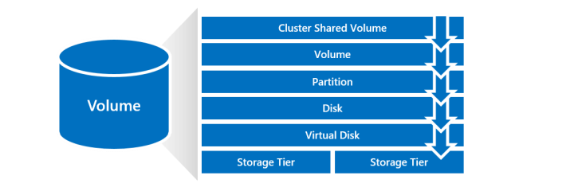

# Extending volumes in Storage Spaces Direct
>Applies to: Windows Server 2022, Windows Server 2019, Windows Server 2016

This topic provides instructions for resizing volumes on a [Storage Spaces Direct](storage-spaces-direct-overview.md) cluster by using Windows Admin Center.

> [!WARNING]
> **Not supported: resizing the underlying storage used by Storage Spaces Direct.** If you are running Storage Spaces Direct in a virtualized storage environment, including in Azure, resizing or changing the characteristics of the storage devices used by the virtual machines isn't supported and will cause data to become inaccessible. Instead, follow the instructions in the [Add servers or drives](add-nodes.md) section to add additional capacity before extending volumes.

Watch a quick video on how to resize a volume.

> [!VIDEO https://www.youtube-nocookie.com/embed/hqyBzipBoTI]

## Extending volumes using Windows Admin Center

1. In Windows Admin Center, connect to a Storage Spaces Direct cluster, and then select **Volumes** from the **Tools** pane.
2. On the Volumes page, select the **Inventory** tab, and then select the volume that you want to resize.

    On the volume detail page, the storage capacity for the volume is indicated. You can also open the volumes detail page directly from the Dashboard. On the Dashboard, in the Alerts pane, select the alert, which notifies you if a volume is running low on storage capacity, and then select **Go To Volume**.

4. At the top of the volumes detail page, select **Resize**.
5. Enter a new larger size, and then select **Resize**.

    On the volumes detail page, the larger storage capacity for the volume is indicated, and the alert on the Dashboard is cleared.

## Extending volumes using PowerShell

### Capacity in the storage pool

Before you resize a volume, make sure you have enough capacity in the storage pool to accommodate its new, larger footprint. For example, when resizing a three-way mirror volume from 1 TB to 2 TB, its footprint would grow from 3 TB to 6 TB. For the resize to succeed, you would need at least (6 - 3) = 3 TB of available capacity in the storage pool.

### Familiarity with volumes in Storage Spaces

In Storage Spaces Direct, every volume is comprised of several stacked objects: the cluster shared volume (CSV), which is a volume; the partition; the disk, which is a virtual disk; and one or more storage tiers (if applicable). To resize a volume, you will need to resize several of these objects.



To familiarize yourself with them, try running **Get-** with the corresponding noun in PowerShell.

For example:

```PowerShell
Get-VirtualDisk
```

To follow associations between objects in the stack, pipe one **Get-** cmdlet into the next.

For example, here's how to get from a virtual disk up to its volume:

```PowerShell
Get-VirtualDisk [friendly_name] | Get-Disk | Get-Partition | Get-Volume
```

### Step 1 – Resize the virtual disk

The virtual disk may use storage tiers, or not, depending on how it was created.

To check, run the following cmdlet:

```PowerShell
Get-VirtualDisk [friendly_name] | Get-StorageTier
```

If the cmdlet returns nothing, the virtual disk doesn't use storage tiers.

#### No storage tiers

If the virtual disk has no storage tiers, you can resize it directly using the **Resize-VirtualDisk** cmdlet.

Provide the new size in the **-Size** parameter.

```PowerShell
Get-VirtualDisk [friendly_name] | Resize-VirtualDisk -Size [size]
```

When you resize the **VirtualDisk**, the **Disk** follows automatically and is resized too.


#### With storage tiers

If the virtual disk uses storage tiers, you can resize each tier separately using the **Resize-StorageTier** cmdlet.

Get the names of the storage tiers by following the associations from the virtual disk.

```PowerShell
Get-VirtualDisk [friendly_name] | Get-StorageTier | Select FriendlyName
```

Then, for each tier, provide the new size in the **-Size** parameter.

```PowerShell
Get-StorageTier [friendly_name] | Resize-StorageTier -Size [size]
```

> [!TIP]
> If your tiers are different physical media types (such as **MediaType = SSD** and **MediaType = HDD**) you need to ensure you have enough capacity of each media type in the storage pool to accommodate the new, larger footprint of each tier.

When you resize the **StorageTier**(s), the **VirtualDisk** and **Disk** follow automatically and are resized too.


### Step 2 – Resize the partition

Next, resize the partition using the **Resize-Partition** cmdlet. The virtual disk is expected to have two partitions: the first is Reserved and should not be modified; the one you need to resize has **PartitionNumber = 2** and **Type = Basic**.

Provide the new size in the **-Size** parameter. We recommend using the maximum supported size, as shown below.

```PowerShell
# Choose virtual disk
$VirtualDisk = Get-VirtualDisk [friendly_name]

# Get its partition
$Partition = $VirtualDisk | Get-Disk | Get-Partition | Where PartitionNumber -Eq 2

# Resize to its maximum supported size
$Partition | Resize-Partition -Size ($Partition | Get-PartitionSupportedSize).SizeMax
```

When you resize the **Partition**, the **Volume** and **ClusterSharedVolume** follow automatically and are resized too.


> [!TIP]
> You can verify the volume has the new size by running **Get-Volume**.

## Additional References

- [Storage Spaces Direct in Windows Server 2016](storage-spaces-direct-overview.md)
- [Planning volumes in Storage Spaces Direct](plan-volumes.md)
- [Creating volumes in Storage Spaces Direct](create-volumes.md)
- [Deleting volumes in Storage Spaces Direct](delete-volumes.md)
