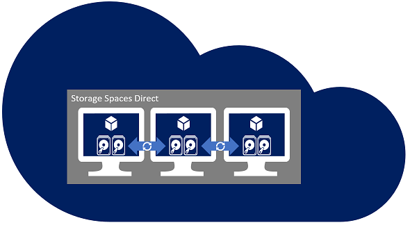

# Using Storage Spaces Direct in guest virtual machine clusters

> Applies to: Windows Server 2019, Windows Server 2016

You can deploy Storage Spaces Direct on a cluster of physical servers or on virtual machine guest clusters as discussed in this topic. This type of deployment delivers virtual shared storage across a set of VMs on top of a private or public cloud so that application high availability solutions can be used to increase the availability of applications.



## Deploying in Azure Iaas VM guest clusters

[Azure
templates](https://github.com/robotechredmond/301-storage-spaces-direct-md) have been published decrease the complexity, configure best practices, and speed of your Storage Spaces Direct deployments in an Azure Iaas VM. This is the recommended solution for deploying in Azure.

<iframe src="https://channel9.msdn.com/Series/Microsoft-Hybrid-Cloud-Best-Practices-for-IT-Pros/Step-by-Step-Deploy-Windows-Server-2016-Storage-Spaces-Direct-S2D-Cluster-in-Microsoft-Azure/player" width="960" height="540" allowfullscreen></iframe>

## Requirements

The following considerations apply when deploying Storage Spaces Direct in a virtualized environment.

> [!TIP]
> Azure templates will automatically configure the below considerations for you and are the recommended solution when deploying in Azure IaaS VMs.

- Minimum of 2 nodes and maximum of 3 nodes

- 2-node deployments must configure a witness (Cloud Witness or File Share Witness)

- 3-node deployments can tolerate 1 node down and the loss of 1 or more disks on another node.  If 2 nodes are shutdown then the virtual disks we be offline until one of the nodes returns.

- Configure the virtual machines to be deployed across fault domains

    - Azure – Configure Availability Set

    - Hyper-V – Configure AntiAffinityClassNames on the VMs to separate the VMs across nodes

    - VMware – Configure VM-VM Anti-Affinity rule by Creating a DRS Rule of type 'Separate Virtual Machines" to separate the VMs across ESX hosts. Disks presented for use with Storage Spaces Direct should use the Paravirtual SCSI (PVSCSI) adapter. For PVSCSI support with Windows Server, consult https://kb.vmware.com/s/article/1010398.

- Leverage low latency / high performance storage - Azure Premium Storage managed disks are required

- Deploy a flat storage design with no caching devices configured

- Minimum of 2 virtual data disks presented to each VM (VHD / VHDX / VMDK)

    This number is different than bare-metal deployments because the virtual disks can be implemented as files that aren't susceptible to physical failures.

- Disable the automatic drive replacement capabilities in the Health Service by running the following PowerShell cmdlet:

    ```powershell
          Get-storagesubsystem clus* | set-storagehealthsetting -name "System.Storage.PhysicalDisk.AutoReplace.Enabled" -value "False"
          ```

- To give greater resiliency to possible VHD / VHDX / VMDK storage latency in guest clusters, increase the Storage Spaces I/O timeout value:

    `HKEY_LOCAL_MACHINE\\SYSTEM\\CurrentControlSet\\Services\\spaceport\\Parameters\\HwTimeout`

    `dword: 00007530`

    The decimal equivalent of Hexadecimal 7530 is 30000, which is 30 seconds. Note that the default value is 1770 Hexadecimal, or 6000 Decimal, which is 6 seconds.

## Not supported

- Host level virtual disk snapshot/restore

    Instead use traditional guest level backup solutions to backup and restore the data on the Storage Spaces Direct volumes.

- Host level virtual disk size change

    The virtual disks exposed through the virtual machine must retain the same size and characteristics. Adding more capacity to the storage pool can be accomplished by adding more virtual disks to each of the virtual machines and adding them to the pool. It's highly recommended to use virtual disks of the same size and characteristics as the current virtual disks.

## Additional References

- [Additional Azure Iaas VM templates for deploying Storage Spaces Direct, videos, and step-by-step guides](https://techcommunity.microsoft.com/t5/Failover-Clustering/Deploying-IaaS-VM-Guest-Clusters-in-Microsoft-Azure/ba-p/372126).

- [Additional Storage Spaces Direct Overview](https://docs.microsoft.com/windows-server/storage/storage-spaces/storage-spaces-direct-overview)
