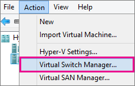
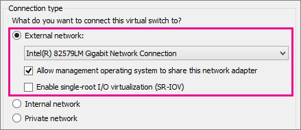
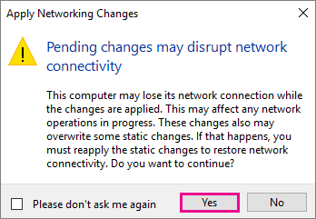

# Create a virtual switch for Hyper-V virtual machines

>Applies To: Windows 10, Windows Server 2016, Microsoft Hyper-V Server 2016, Windows Server 2019, Microsoft Hyper-V Server 2019

A virtual switch allows virtual machines created on Hyper-V hosts to communicate with other computers. You can create a virtual switch when you first install the Hyper-V role on Windows Server. To create additional virtual switches, use Hyper-V Manager or Windows PowerShell. To learn more about virtual switches, see [Hyper-V Virtual Switch](../../hyper-v-virtual-switch/Hyper-V-Virtual-Switch.md).

Virtual machine networking can be a complex subject. And there are several new virtual switch features that you may want to use like [Switch Embedded Teaming (SET)](../../hyper-v-virtual-switch/RDMA-and-Switch-Embedded-Teaming.md#switch-embedded-teaming-set). But basic networking is fairly easy to do. This topic covers just enough so that you can create networked virtual machines in Hyper-V. To learn more about how you can set up your networking infrastructure, review the [Networking](../../../networking/index.yml) documentation.

## Create a virtual switch by using Hyper-V Manager

1.  Open Hyper-V Manager, select the Hyper-V host computer name.

2.  Select **Action** > **Virtual Switch Manager**.

    

3.  Choose the type of virtual switch you want.

    |Connection type|Description|
    |-------------------|---------------|
    |External|Gives virtual machines access to a physical network to communicate with servers and clients on an external network. Allows virtual machines on the same Hyper-V server to communicate with each other.|
    |Internal|Allows communication between virtual machines on the same Hyper-V server, and between the virtual machines and the management host operating system.|
    |Private|Only allows communication between virtual machines on the same Hyper-V server. A private network is isolated from all external network traffic on the Hyper-V server. This type of network is useful when you must create an isolated networking environment, like an isolated test domain.|

4.  Select **Create Virtual Switch**.

5.  Add a name for the virtual switch.

6.  If you select External, choose the network adapter (NIC) that you want to use and any other options described in the following table.

    

    |Setting name|Description|
    |----------------|---------------|
    |Allow management operating system to share this network adapter|Select this option if you want to allow the Hyper-V host to share the use of the virtual switch and NIC or NIC team with the virtual machine. With this enabled, the host can use any of the settings that you configure for the virtual switch like Quality of Service (QoS) settings, security settings, or other features of the Hyper-V virtual switch.|
    |Enable single-root I/O virtualization (SR-IOV)|Select this option only if  you want to allow virtual machine traffic to bypass the virtual machine switch and go directly to the physical NIC. For more information, see [Single-Root I/O Virtualization](/previous-versions/windows/it-pro/windows-server-2012-R2-and-2012/dn641211(v=ws.11)#Sec4) in the Poster Companion Reference: Hyper-V Networking.|

7.  If you want to isolate network traffic from the management Hyper-V host operating system or other virtual machines that share the same virtual switch, select **Enable virtual LAN identification for management operating system**. You can change the VLAN ID to any number or leave the default. This is the virtual LAN identification number that the management operating system will use for all network communication through this virtual switch.

    

8.  Click **OK**.

9. Click **Yes**.

    

## Create a virtual switch by using Windows PowerShell

1.  On the Windows desktop, click the Start button and type any part of the name **Windows PowerShell**.

2.  Right-click Windows PowerShell and select **Run as Administrator**.

3.  Find existing network adapters by running the [Get-NetAdapter](https://technet.microsoft.com/library/jj130867.aspx) cmdlet. Make a note of the network adapter name that you want to use for the virtual switch.

    ```
    Get-NetAdapter
    ```

4.  Create a virtual switch by using the [New-VMSwitch](/powershell/module/hyper-v/new-vmswitch) cmdlet. For example, to create an external virtual switch named ExternalSwitch, using the ethernet network adapter, and with **Allow management operating system to share this network adapter** turned on, run the following command.

    ```
    New-VMSwitch -name ExternalSwitch  -NetAdapterName Ethernet -AllowManagementOS $true
    ```

    To create an internal switch, run the following command.

    ```
    New-VMSwitch -name InternalSwitch -SwitchType Internal
    ```

    To create an private switch, run the following command.

    ```
    New-VMSwitch -name PrivateSwitch -SwitchType Private
    ```

For more advanced Windows PowerShell scripts that cover improved or new virtual switch features in Windows Server 2016, see [Remote Direct Memory Access and Switch Embedded Teaming](../../hyper-v-virtual-switch/RDMA-and-Switch-Embedded-Teaming.md).


## Next step
[Create a virtual machine in Hyper-V](Create-a-virtual-machine-in-Hyper-V.md)
